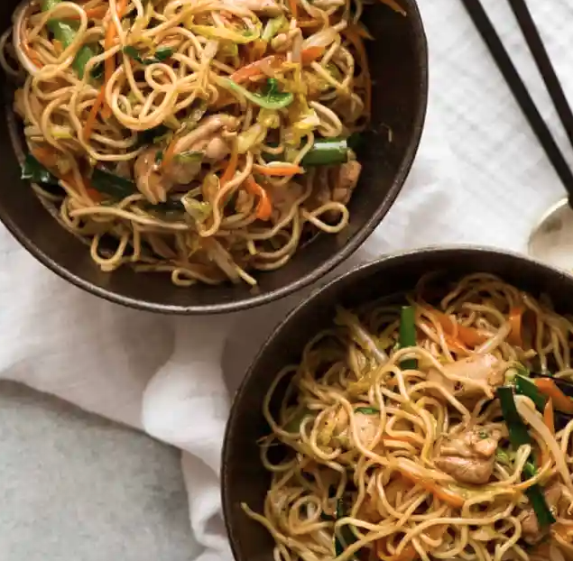
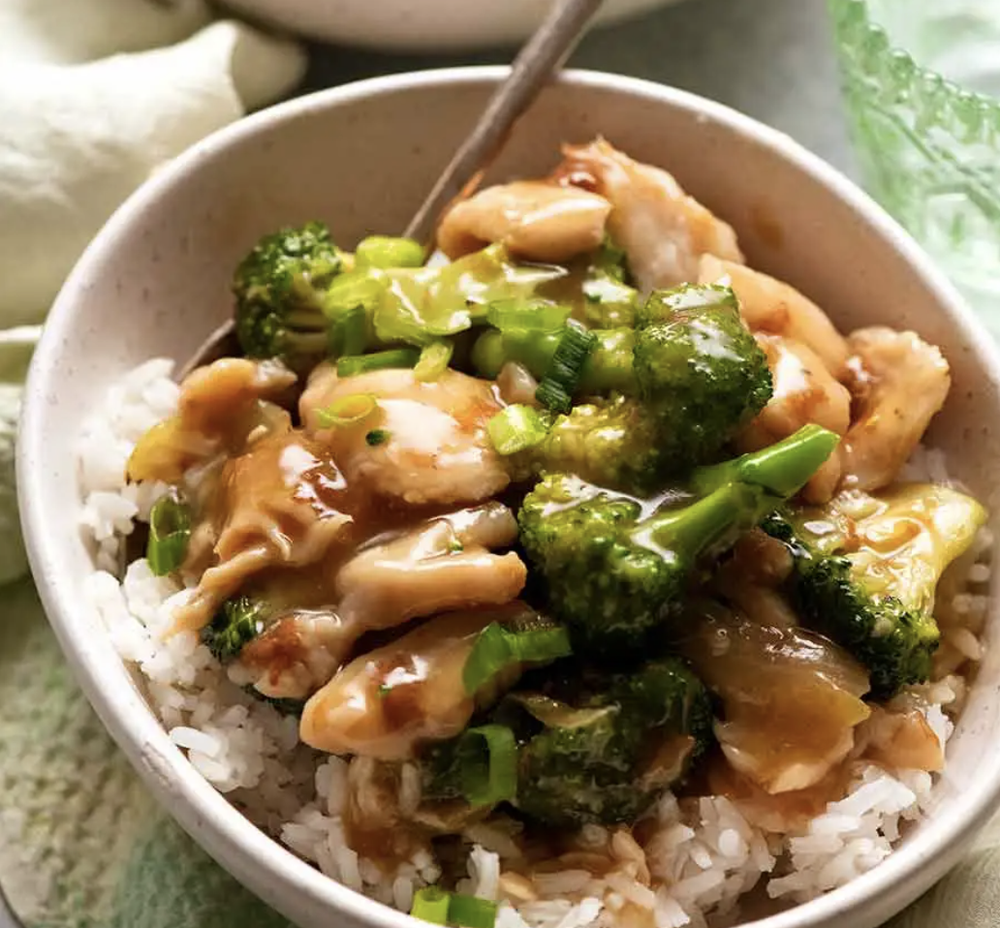
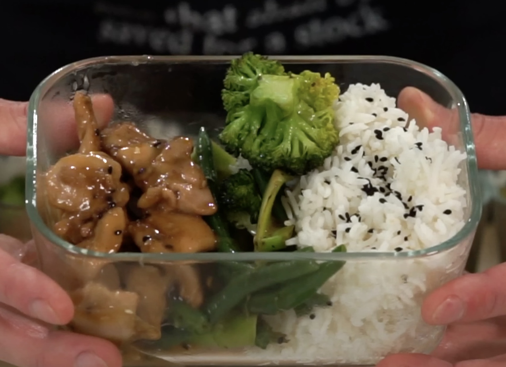

# Japanese & Chinese

## Easy Japanese Curry

#### Serves 3 - 35 mins

- 1 tbsp olive oil

- 5 spring onions

- Finely sliced small bunch of coriander

- 3 cloves garlic

- Finely chopped 3cm fresh ginger

- 1 large potato, peeled and cut into 1.5cm cubes

- 1 large carrot, cut into 1cm cubes

- 8 boneless and skinless chicken thighs, cut into 3cm chunks

- 1 heaped tbsp curry powder

- 1 tsp mild chilli powder

- 1 tbsp soy sauce

- 1 tbsp plain flour

- 300ml chicken stock (one cube)

- rice, to serve

#### Directions

Put the oil in a large saucepan over a medium to high heat. When it is hot, add the spring onions and half of the coriander, garlic, ginger, potato and carrot. Stir-fry for 2 minutes.

Slide in all of the chopped chicken and fry for a further minute. Reduce the heat a little, sprinkle in both the curry powder and the chilli powder and continue to fry, stirring almost constantly for 1 minute. Drop in the flour and continue to stir-fry for a further 30 seconds before pouring in the stock and soy sauce.

Increase the heat and while stirring very regularly, bring the mixture up to the boil. Lower to a simmer and cook for 15 minutes, until the potato and carrots are cooked through, while still holding their shape, and the chicken thigh pieces are fully cooked. Top the curry with the remaining coriander leaves and serve with rice.

## Authentic Chow Mein

#### Serves 3 - Time 20mins

**Fry:**

- 200g chicken sliced into small pieces, or prawns cut into quarters, or beef strips.
- 1/2 a green cabbage , finely shredded
- 1.5 tbsp sunflower oil
- 2 cloves garlic, finely chopped (prevents burning)
- 200g chow mein noodles (sharwoods medium egg are perfect)
- 1 carrot , julienned (thin batons)
- 1.5 cups bean sprouts
- Bunch of spring onions sliced diagonally

**Sauce:**

- 65ml water

- 2 tsp cornflour

- 2 tbsp soy sauce , all purpose or light

- 2 tbsp oyster sauce (sub Hoisin)

- 1 1/2 tbsp Chinese cooking wine OR Mirin

- 2 tsp sugar (reduce to 1 tsp if using Mirin)

- 1/2 tsp sesame oil

- 1/2 - 1/4 tsp White pepper

#### Directions

1. Chop the chicken and marinate in 1 tbs soy sauce for 10 minutes.

2. Chop all the vegetables.

3. Put water on to boil.

4. Heat a pan with the oil on medium. Fry garlic for 20 seconds, then add the chicken, cooking until it's almost cooked through.

5. Throw the noodles into the water and set a timer to cook them 1 minute under done (they will cook further when added to the vegetables).

6. Add all the other vegetables with some water and steam/fry for 3-4 minutes or until noodles are done.

7. Make the sauce.

8. Drain noodles, but keep some of the water. Add the noodles, sauce, and bean sprouts into the fried vegetables and mix. If needed, add noodle water until the noodle mixture is slippery. Done.

## Beef Stir Fry Noodles with Honey Pepper Sauce

#### Serves 3 - Time 30mins

**Sauce**

- 2 1/2 tbsp soy sauce
- 3 tbsp honey
- 1 1/2 tbsp Oyster sauce
- 1 1/2 tbsp Chinese cooking wine or Mirin
- 2 tbsp water
- 1 tsp black pepper

**Stir Fry**

- 2 tbsp oil
- 1 garlic clove , chopped finely
- 1 onion , peeled and sliced
- 500g decent beef, cut into small strips
- 1 bunch of spring onions chopped diagonally

**To Serve**

- Rice (leave on beef side), or noodles (mix in)

#### Directions

1. Put on rice if doing rice

2. Mix the Sauce ingredients in a bowl.

3. Put on noodles if doing noodles

4. Heat the oil until very hot.

5. Add the onion and garlic and cook for 1 minute or until the onion becomes translucent. Keep it moving so the garlic doesn't burn.

6. Add the beef and stir fry for 1 minute until just cooked to your liking. **do not overcook**.

7. Turn the heat down to medium high, pour in Sauce, and add most of the spring onions - it will start simmering very quickly! Let it cook for 1 minute or so until it becomes syrupy - the bubbles will be larger and caramel colour. **do not overcook the beef**

8. Serve beside white rice, or mix in noodles, top with rest of spring onions

## Japanese Garlic Butter Rice

#### Serves 1 - Time 15mins

- 1 portion of Japanese white rice

- 3 garlic cloves, minced

- 1 tbsp butter

**Sauce:**

- 1 tbsp mirin

- 1 tbsp light soy sauce

- A few shakes of ajinomoto

- 1/2 tsp pepper (be generous)

**To Serve:**

- Chives, negi (optional) chopped

- Small knob of butter and greens (broccoli etc) to serve

#### Directions

1. Put on the rice, mix the sauce ingredients together, and prepare the garlic

2. On low heat add the butter and garlic and gently fry until golden

3. Add the rice, and pour over the sauce, mix well for a minute

4. Serve with a small knob of butter, the chives, and greens on the side

## Matsuya Umatoma

#### Serves 2 - Time 20mins

- 4 cloves garlic chopped finely

- 1 large onion diced finely

- 1 tablespoon extra virgin olive oil

- 1/2 teaspoon of salt

- 4 teaspoons of miso

- 1 teaspoon of teriyaki sauce

- 1 can of chopped tomatoes

- 1 large tomato chopped

- 4 burgers

- Japanese white rice to serve

- Optional soft boiled eggs

#### Directions

- Fry the oil, onion and garlic on low heat until transparent

- Add the miso, salt, and teriyaki, mixing it all together

- Add the chopped tomatoes and chopped tomato and simmer

- Fry the burgers and serve when done

## Japanese Chinese-style Fried Rice (チャーハン)

#### Serves 1 - Time 15mins

- 1 tbs of vegetable oil

- 2-3 strips of (preferably non-smoked and low salted) bacon, finely chopped

- Thumb sized piece of ginger, finely chopped

- 1 clove of garlic, finely chopped

- 5cm of leek, finely chopped

- Optional: a few spears of asparagus cut lengthways and into small sections

- 2 eggs, beaten

- 1 serving of Japanese white rice (hot)

- 1/2 tsp salt

- A few shakes of ajinomoto (msg)

- 1 tbsp of light soy sauce

- 1/4 tsp of white pepper

- 1 tbs of mirin (alternatively sushi vinegar)

- A good knob of butter

- Pinch of benishouga to serve

#### Directions

- Have everything ready before you begin cooking, as it must be done fast. Mix the mirin, salt, ajinomoto, soy sauce and pepper together in a small saucer or bowl.

- In a non-stick pan, fry the bacon in the oil on medium-high heat until it has some color on it, then push to edge of the pan

- Add the garlic and ginger, fry until garlic is translucent

- Add the leek and any other greens and fry them for a minute or so

- Make sure the pan is medium hot, and add the egg, then the rice, and when the egg is pretty much set, mix everything together with a chopping motion

- Add add the mirin mix and butter, mix well, adding more pepper if needed

- Serve with benishouga

## Chinese Satay Chicken

#### Serves 4 - 30 mins

- 500g chicken, sliced into small strip pieces

- Rice to serve

**Satay Seasoning**

- 1 tsp coriander powder
- 1 tsp cumin powder
- 0.5 tsp turmeric powder
- 0.5 tsp chilli powder
- 3 tsp curry Powder
- 1 tsp salt
- 0.5 tsp white pepper

**Satay Sauce**

- 3 tbsp smooth peanut butter
- 1.3 tbsp brown sugar
- 1.3 tbsp light soy sauce
- 1.3 tbsp rice (wine) vinegar
- 1 scant tbsp Sriracha (or other hot sauce)
- 1 tsp lemongrass paste, or dash of demon juice
- 1 can cup coconut milk (full fat)

**Stir Fry**

- 2 tbsp plain oil (vegetable, sunflower)
- 2 onion, finely chopped
- 4 garlic cloves, minced
- Spring onions (garnish)

#### Directions

1. Put the rice on

2. Mix together seasoning and sprinkle 1 tsp of it over chicken. Mix to coat and put aside.

3. Place all the sauce ingredients in a bowl **separate to the chicken**, add the remaining Seasoning and mix

4. Heat oil in a skillet over high heat. Add the chicken and fry for 1 minute on each side, then transfer to a plate.

5. Reduce to medium and fry the onion until translucent, then add the garlic and fry until the onion is soft.

6. Lower the heat, then add Sauce and chicken. Stir until it reduce down and becomes thicker - 1 to 1 1/2 minutes. Add water if too thick.
- Serve immediately with rice and garnish with sliced spring onions.

## Chinese Pepper Steak

#### Serves 3 - 30 mins

**Beef Marinade:**

- 500g beef sirloin / rump, cut into small flat strips
- 1 tbsp cooking oil
- 1 tbsp honey
- 1 tbsp soy sauce (regular)
- 1 tsp of black pepper

**Vegetables:**

- 1 large onion, cut into eighths, and those eights cut into small squares
- Generous piece of ginger, chopped finely
- 3 garlic cloves, chopped finely
- 1 green and red bell pepper, cut into small squares
- 1 bag of sugar snaps, chopped roughly (optional)
- 2 sticks of celery, chopped (optional)
- 1-2 tbsp of cooking oil

**Sauce/Slurry:**

- 150ml of water (possibly more)
- 2 tbsp cornstarch
- 3 tbsp soy sauce (1.5 dark and 1.5 regular)
- 1 tbsp Shaoxing Chinese rice wine
- 1 tbsp honey
- 2 tsp+ of black pepper
- 2 tsp sesame oil
- 1 tsp ajinomoto

**To Serve:**

- Rice or noodles

#### Directions

1. Chop the beef, removing the fat, and mix it together in a bowl with the marinade ingredients. Set aside.

2. If doing rice, prepare and put rice on.

3. Prepare the vegetables. Mix the sauce ingredients in a bowl.

4. Add oil to a skillet and heat on medium high, then fry the beef in two batches until there is a touch of brown. **Do not** overcook. Put aside with all the juices in a bowl.

5. Turn the heat down to medium, add a bit more oil, and add the onion, breaking up the onion into petals. If doing noodles, boil water now. After the onion has softened a bit, add the garlic and ginger, peppers, and sugar snaps, frying until they soften a bit but still crunch.

6. Add beef and the sauce, mixing quickly. Add more water if you want it more saucy. Check the taste, adding more pepper, soy sauce, and honey if required.

7. Serve with the rice or noodles.

## Quick and Easy Stir-Fry

#### Serves 4 - 20 mins

- Rice or noodles to serve

**Sauce**

- 2+ tbsp cornflour
- 3 tbsp soy sauce (regular)
- 250 ml water
- 1 1/2 tbsp Shaoxing wine (Chinese cooking wine) / Mirin
- 3 tbsp oyster sauce (Note 3)
- 2 tsp sesame oil
- 1 tsp honey
- 1 tsp white pepper (sub black)

**Stir-fry**

- 2 tbsp oil, peanut, vegetable or canola
- 1 onion, halved, cut down the middle, and then sliced
- 3 garlic cloves, finely chopped (not minced)
- 400g chicken thighs or breast, thinly sliced / prawns (cut into pieces) / 50/50 mix of chicken and prawns / beef
- 400g broccoli florets, cut into small bite size pieces (2 medium heads)

#### Directions

1. Put the rice on if doing rice

2. Boil the broccoli for 3 mins

3. While the broccoli boils, mix cornflour and some of the water to make a slurry, then mix in remaining sauce ingredients.

4. Put the water on for the noodles if doing them

5. Heat oil in a large skillet on medium high heat (7). Add garlic and onion, stir  until it starts to soften (1 minute or so), then push it to the side of the pan. Add chicken and cook for 2-3 minutes until just cooked through. Add the prawns for the last minute if doing 50/50

6. Turn heat to medium, add broccoli, Sauce, and water, stir well and cook for 1 to 2 minutes until the Sauce thickens and becomes glossy, and coats the ingredients. Add more cornflower if it needs it by mixing first with a little water then adding it.

## Salmon Teriyaki Noodles

#### Serves 2 - 20 mins

**Teriyaki Sauce**

- 2 1/2 tbsp soy sauce
- 2 tbsp mirin
- 2 tbsp cooking sake, or Chinese cooking wine
- 1 tsp white sugar

**Other**

- 1 tbsp oil (veg or canola)
- 250g salmon fillet(s), skinless, sliced into 2cm wide pieces down their length
- 2 instant noodle / ramen noodle cakes (discard seasoning packs) (Note 2 other noodles)
- 1 onion , cut into quarters and sliced
- 2 garlic clove , finely minced
- 1 small bunch Chinese of stem greens like tenderstem broccoli cut in half lengthways

#### Directions

- Mix the Teriyaki sauce and coat salmon with 1 tablespoon of it in a bowl, then set aside while you cook the noodles.

- Cook the noodles as per the packet directions but without the seasoning sachet, then set aside.

- Heat 1/2 tablespoon oil in a large **non-stick** pan over high heat. Cook the salmon for 1 - 1.5 minutes on each side or until golden, then remove to a plate. Pour any remaining sauce in the skillet over the salmon.

- Heat 1 tablespoon of the remaining oil on medium and cook the onion and garlic for 30 seconds. Add the stem greens and cook for 1 minute.

- Add noodles and half the sauce. Toss for 2 minutes until the Sauce is absorbed. Add the remaining sauce and toss to disperse. Then spread the noodles out in the pan, cook for 30 seconds un-disturbed. Repeat again 3 to 4 times (~3 min total) – a trick for nice caramelisation on the noodles (which = flavour!).

- Serve with salmon on top, breaking it into large chunks

## Kung Pao Chicken

#### Serves 4 - 30 mins

**Stir fry**

- 1 tbsp oil

- 500g diced chicken

- 1 onion, cut in half, then those halves cut in half horizontally, then vertically cut into squares

- 2 garlic cloves, chopped

- 1 red, 1 yellow pepper, cut into small squares

- 1 pack of mange tout, chopped roughly

- 50g cashew nuts / peanuts

**Sauce**

- 2 tbsp soy sauce (1 dark, 1 regular)

- 200ml chicken stock

- 2 tbsp sweet chilli sauce

- 2 tbsp tomato puree

- 1 tbsp rice wine vinegar

- 1 tbsp shaoxing rice wine?

- 2 tsp sesame oil?

- 1 tsp honey

- 1/2 tsp chilli powder (1/4 if audience doesn't like spice)

- 1 tbsp cornflower and 50ml of water to add right at the end

**To serve**

- Rice

- Coriander, chopped

#### Directions

1. Put the rice on

2. Chop everything

3. Put a large skillet on medium-high with the oil, and when hot enough fry the chicken for 2 mins, then put it aside

4. Add a bit more oil and fry the onion and peppers for a few minutes, reducing to medium heat if too hot. Add the mange tout and garlic, frying for a further few minutes. If using stainless steel, add a bit of water if looking like the bottom is burning.

5. While the veg is frying, boil the kettle for the stock, make the stock, then mix the sauce ingredients in, then add it to the skillet. Also add the chicken back.

6. Cook for 5-10 mins, then add the cashews and cornflower slurry, stir for a minute more until thickened, and serve when the rice is done, garnishing with the coriander.

## Lemon Chicken

#### Serves 4 - 30 mins

**Chicken**

- 2 tbsp (50ml) - Vegetable Oil

- ~650g (2.2lbs) - Chicken Thigh, Boneless & Skinless, diced into bite sized chunks

**Sauce**

- 1/2 Cup (125m) - Chicken Stock

- 1 1/2 tbsp (12g) - Corn Flour

- 1 Lemon, Juiced (last time was 2 and was a bit sour)

- 1 tsp (2.5g) - Onion Powder

- 3 - Garlic Cloves, Minced

- 3 tbsp - Soy Sauce

- 2 tsp - Sesame Oil

- 2 tbsp shaoxing rice wine

- 3 tbsp - Honey (last time was 4)

- 1/2 tsp white pepper

- Optional: 1 tsp each of black and white sesame seeds

**To Serve**

- 2 tbsp olive oil

- 2 - Large Heads Broccoli, Florets & Stems Trimmed

- 250g (8.82oz) - Green Beans, Top & Tailed

- Rice

#### Directions

1. Put on the rice

2. Chop the chicken and veg

3. Mix the sauce minus sesame seeds together

4. Heat 2 tbsp of olive oil in a pan on medium high heat, add the broccoli florets and a good pinch of salt, and saute for 3-4 mins. After this, add in the green beans with 80ml of water and a good few grinds of pepper, cook for 2 minutes with the lid on then put the veg aside in a plate.

5. In the same pan, heat 2 tbsp of vegetable oil on high heat, add the chicken, season with salt, cook for 2-3 mins, mix, then cook for another 2-3 mins. Reduce to medium heat, add in the sauce and sesame seeds, then cook for 2-3 mins until it thickens. Check for seasoning and serve

## Firecracker Rice

#### Serves 4 - 30 mins

- 3 cups of Japanese rice

- 3 tbsp vegetable oil

- 1 onion, finely chopped

- 1 carrot, peeled and finely diced

- 1 red, and 1 yellow pepper, deseeded and diced

- 2 garlic cloves, minced

- Thumb sized piece of ginger, finely sliced

- 125ml (1/2 cup) of green peas

- 2 tsp toasted sesame oil

- 1 tbsp mirin?

- 5-6 tablespoons light soy sauce

- 0.5 tsp freshly ground white pepper

- 1 tsp shichimi tougarashi (Japanese seven spice)

#### Directions

1. Put on the rice and then chop all the vegetables

2. Heat a large frying pan over a medium-high heat and add 2 tablespoons of vegetable oil, then add onion when hot stir-frying for 2-3 minutes.

3. Add the carrot, red and yellow peppers, garlic, ginger and peas cooking for 3 minutes.

4. Add the remaining vegetable oil together with the sesame oil, and add the rice, separating the grains with a wooden spatula so that there are no large lumps, and stir-fry for two to three minutes.

5. Pour the soy sauce (and mirin?) along the edge of the pan and mix. Season with the white pepper and shichimi tougarashi and stir to mix well. Serve
