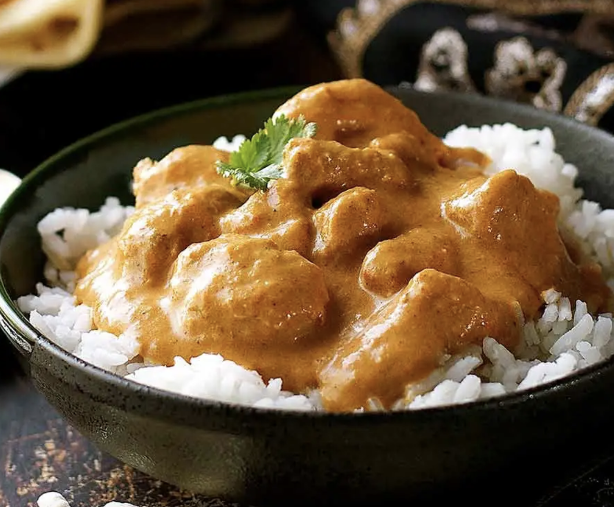
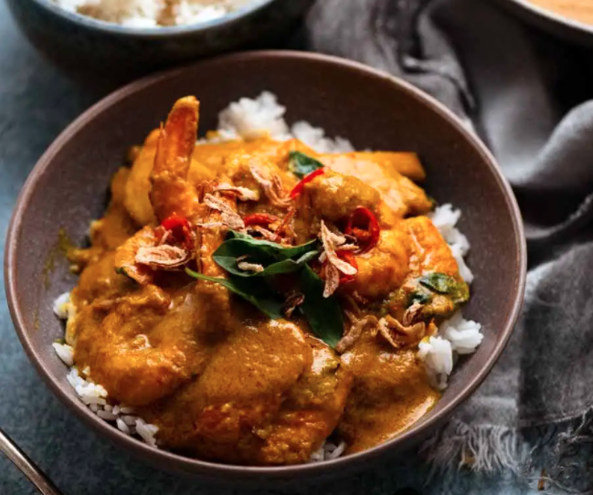
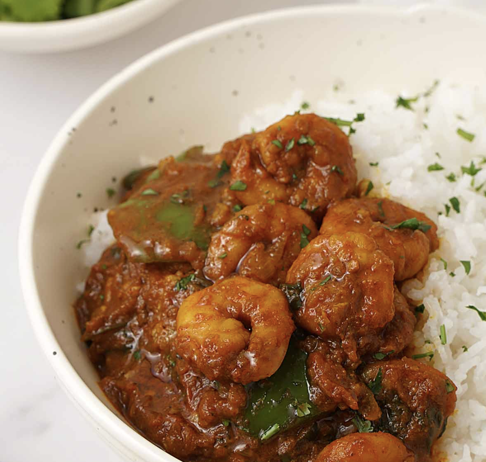
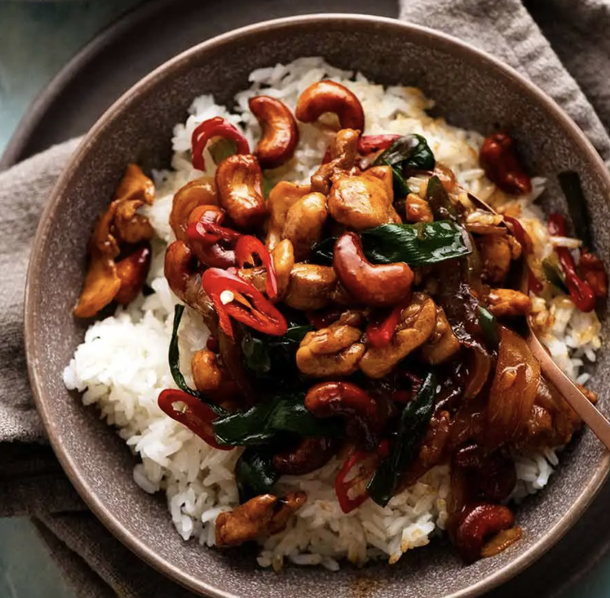

# Asian Other

## Goan Fish Curry

#### SERVES 4 - Prep 20mins, Cook 15mins

**CURRY PASTE:**

- 2 tbs smoked paprika 1/2 tsp chilli powder
- 1 tbsp coriander
- 2 tsp cumin
- 1 tsp turmeric
- 3/8 tsp cloves
- 6 cloves garlic ,chopped in half
- 1 tbsp fresh ginger ,chopped a bit
- 1 1/2 tbsp tamarind puree (Note 3)
- 1/2 red onion , chopped
- 90 ml water (plus more, as needed)

**CURRY:**

- 3 tbsp vegetable oil
- 1/2 tsp black mustard seeds (Note 4)
- 1/2 red onion , cut in half again (like a quartered orange) and thinly sliced
- 1 tbsp tomato paste
- 1/2 can tinned tomatoes
- 165 ml water
- 400ml/ 14oz coconut milk , full fat (Note 6)
- 2 tsp cornflower as needed
- 1 1/2 tsp salt , cooking/kosher (or 3/4 tsp fine table salt)
- 1 1/2 tsp sugar
- 1/4 tsp chilli powder
- 2 long green chillies , cut into half lengthwise and deseeded, optional (Note 8)
- 1 tomato , cut into 8 wedges then into 2.5cm chunks
- 600g firm-fleshed white fish , cut into 3cm cubes

**GARNISHES / SERVING:**

- 1/4 cup fresh coriander/cilantro leaves
- Basmati rice

#### DIRECTIONS

**CURRY PASTE**

- Place the dry curry paste ingredients in a micro blender and whizz until fine, then add the water and tamarind and whizz to a pulp

**CURRY**

- **Sizzle black mustard seeds:** Heat oil over medium heat in a large pot. Add black mustard seeds and let them sizzle for 30 seconds - careful, they might pop!

- **Saute onion:** Add red onion and cook for 3 minutes until edges start to tinge with gold.

- **Cook off curry paste:** Add curry paste and cook for 3 minutes - to evaporate water, make spices bloom and cook garlic & ginger.

- **Cook off tomato:** Turn heat up to medium high. Add tomato paste and tomato pulp, cook for 2 minutes.

- **Coconut milk:** Add water, coconut milk, sugar, salt and chilli powder if using. Stir, then bring to simmer, low heat so it's bubbling gently.

- **Simmer 2 minutes, add tomato & green chilli:** Simmer for 2 minutes, add tomato and green chilli.

- **Simmer 3 minutes:** Simmer for another 3 minutes, stirring every now and then - sauce should be thickened (not watery), it gets looser again when fish is added (because fish will drop some juices = even more flavour!).

- **Add fish:** Add fish, stir, cook for 3 to 4 minutes until fish easily flakes.

- **Garnish & serve:** Remove from stove and transfer to serving bowl. Garnish with coriander/cilantro and fresh green chillies if desired. Serve with [basmati rice](https://www.recipetineats.com/how-to-cook-basmati-rice/)!

## Butter Chicken

#### Serves 3 - Time 30mins

**Marinade**

- 120ml cup plain yoghurt , full fat
- 1 tbsp lemon juice
- 1 tsp tumeric powder
- 2 tsp garam masala
- 1/2 tsp chilli powder or cayenne pepper powder
- 1 tsp ground cumin
- 1 tbsp ginger, freshly grated
- 2 cloves garlic, crushed
- 750 g chicken or pheasant thigh fillets, cut into small pieces (2cm)

**Curry**

- 2 tbsp (30 g) butter
- 1 cup tomato passata
- 1 cup heavy / thickened cream
- 1 tbsp sugar
- 1 1/4 tsp salt
- 2+ teaspoons of cornflower as necessary

**To Serve**

- Basmati rice

- Chopped corriander

#### Directions

1. **Marinade:** Combine the Marinade ingredients with the chicken in a bowl. Cover and refrigerate, preferably overnight, but not necessary

2. **Cook chicken:** Heat the butter over high heat in a large fry pan. Take the chicken out of the Marinade and place chicken in the fry pan and cook for around 3 minutes, or until the chicken is white all over (it doesn't really brown because of the Marinade). If there is marinade left, add in next stage.

3. **Sauce:** Add the tomato passata, cream, sugar and salt. Also add any remaining marinade left in the bowl. Turn down to low and simmer for 20 minutes. Do a taste test to see if it needs more salt. Add cornflower if necessary

4. Garnish with coriander/cilantro leaves if using. Serve with Basmati rice

## Thai Yellow Curry

#### Serves 3-4 - 1hr+

**Paste**

- 2 medium spice chillis, finely chopped
- 2 lemongrass stems (chop off bottom, and top green, peel outside layer, chop very finely
- 2 shallots , roughly chopped
- 1.5 tbsp ground turmeric
- 2 tbsp galangal, finely grated
- 8 cloves garlic , roughly chopped
- 1 1/2 tbsp Thai shrimp paste (essential. In bean oil if available)
- 1 tsp ground coriander
- 1 tsp ground cumin
- 1/4 tsp ground cardamom (if only have pods, crush 2-3 pods in pestle and mortar, removing husks)
- 1/2 tsp fenugreek powder (non essential)
- 1/8 tsp white pepper (sub black)

**Curry**

- 3 tbsp vegetable oil

- 200ml chicken stock (half a cube)

- 4 tsp fish sauce , plus more to taste

- 5 tsp white sugar

- 2 tsp tamarind puree (Note 12)

- 300 ml coconut cream (thicker than coconut milk, but can use milk if you have to, but add 1-2tsp cornflour)

- 1 small carrot , peeled, sliced into 5mm thick slices on the diagonal, then cut in half

- 1 medium potato, peeled, cut into small slices, 5mm thick (if thicker, will not cook)

- 350g uncooked king prawns, (can be substituted with fish or chicken cut into small 4cm pieces)

- 1 small can of bamboo shoots (around 150g drained weight)

**To Serve**

- Thai basil leaves

- Crispy onion pieces

- Jasmine rice

#### Directions

- Prepare the curry paste ingredients
- Put the rice on
- Putting all the paste ingredients in a small food processor, add a bit of water, and blitz until smooth
- Cook the paste on medium heat for 4 minutes in a large skillet, meanwhile, prepare the carrot and potato
- Add the chicken stock, stir in, and simmer for 1 minute
- Add the tamarind, fish sauce, and sugar, stirring everything in, then add the coconut cream, carrot and potato.
- Simmer for 15 minutes until potato is soft, add 1-2 tsp cornflour if not thick enough.
- Add the prawns and bamboo shoots, cook for 3 minutes (do **not** overcook), then adjust sauce with fish sauce and salt to taste.
- Serve with rice, topping curry with torn Thai basil leaves, and crispy onion pieces

## King Prawn Bhuna

#### Serves 4 - Time 30 mins

- 600 - 800g raw king prawns (or small prawns)
- 2 green peppers cut into small 1cm squares
- 6-8 shallot onions (preferable as softer) / 3 onions finely diced
- 8 cloves garlic finely chopped / minced
- 3cm piece of ginger?
- 1 can (400g) chopped tomatoes
- 4 tsp tomato puree
- 3 tbsp vegetable oil
- Coriander roughly chopped
- 250 - 350ml of water
- Basmati rice to serve

**Spices**

- 2 tsp chilli powder
- 1 tsp turmeric
- 2 tsp curry powder (mild)
- 1 tsp coriander powder
- 0.5 tsp cumin powder
- 2 tsp salt

#### Directions

1. Chop the onions and garlic, mix the spices in a small bowl, then put the rice on

2. Heat the pan on medium heat with 3 tablespoons of oil, and sauté the onions for 3 minutes until soft, then add garlic and cook for 2 minutes .**Do not** brown the garlic, it should be yellow / golden.

3. While cooking the onions, chop the green peppers, and cut the prawns in half at their mid point so they are more evenly distributed in the curry (can do while in next step as well)

4. Add the spice mix, cooking for 3-4 minutes. Add some water if it gets too dry. Should bloom the spices and brown everything.

5. Add the chopped tomatoes and tomato puree, and cook for 3-4 minutes.

6. Pour the water in, and bring it to simmer, then add the chopped green pepper and cook for another 3-4 minutes and follow with the prawns for a further 3-4 minutes.

7. Taste test and add more salt or water according to your preference.

8. Serve with chopped coriander and rice.

# Thai Cashew Chicken Stir Fry

#### Serves 4 - 30 mins

**Stir Fry**

- 2 tbsp plain oil
- 1 cup raw cashews, unsalted
- 2 garlic clove, minced
- 1 brown onion, cut into wedges (halved, cut lengthways 4-5 times into segments, then cut across) 
- 400g chicken thighs, skinless and boneless, sliced into 1cm thin strips
- 4 green onions, cut into 2.5cm lengths (not sliced), white part separated from green part
- 1 red chilli, deseeded and finely sliced

**Sauce**

- 2 tbsp oyster sauce
- 1 tbsp **dark** soy sauce
- 4 tsp fish sauce
- 2 tsp white sugar
- 50ml water (add more if too dry or if you want it more saucy)

**To Serve**

- Red chilli, finely sliced (optional garnish)
- Rice

#### Directions

1. Chop all the ingredients and mix all the Sauce ingredients in a small bowl.

2. Heat oil over medium heat in a wok or large skillet. Add cashews and cook for 5 minutes until they become a dark golden colour and crunchy (be careful not to burn them!). Remove from skillet with a slotted spoon.

3. Add the onion and cook for 1 min. Add the chicken and cook for 1 minute until the outside changes from pink to white.

4. Add the white part of the green onion, garlic, and chilli. Cook for 1 minute until chicken is just cooked through.

5. Add the sauce, cooking for 1 minute until it reduces down to a syrup, coating the chicken nicely.

6. Add green part of green onions and cashews. Toss for 30 seconds.

7. Transfer to serving dish. Serve with rice and garnish with extra red chilli.
