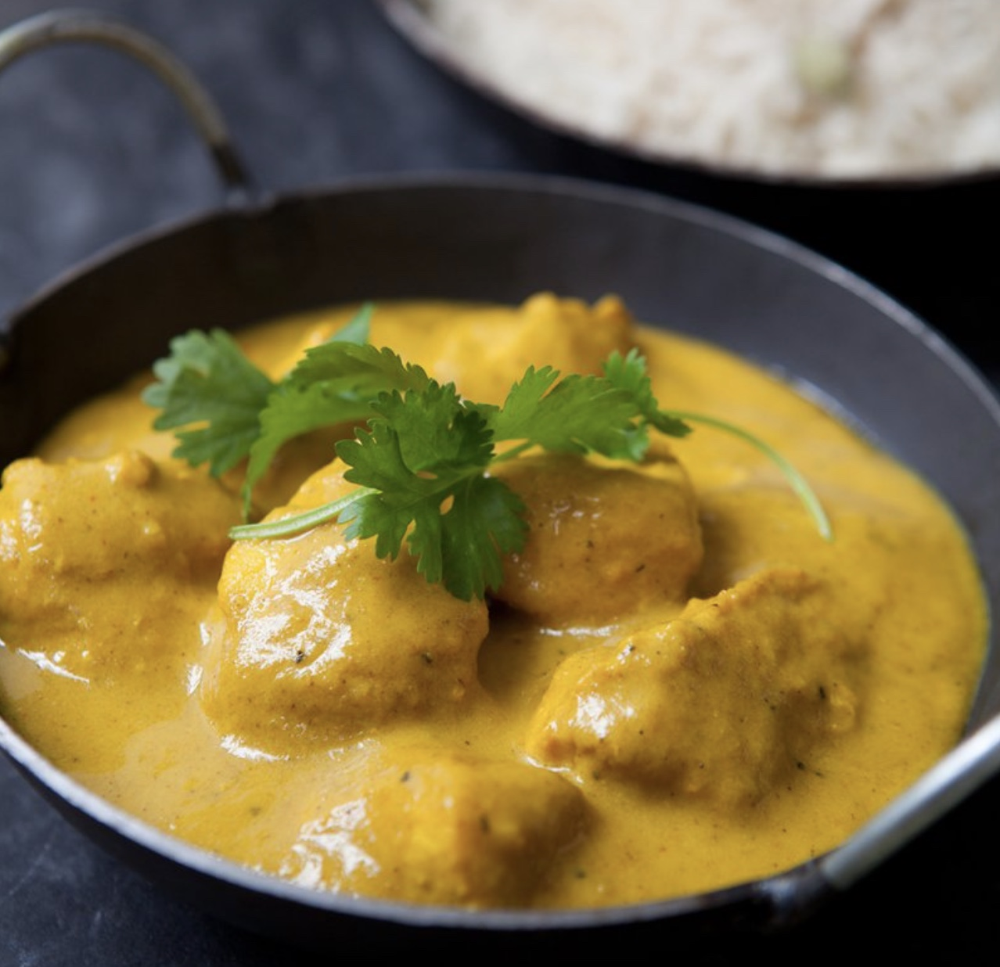
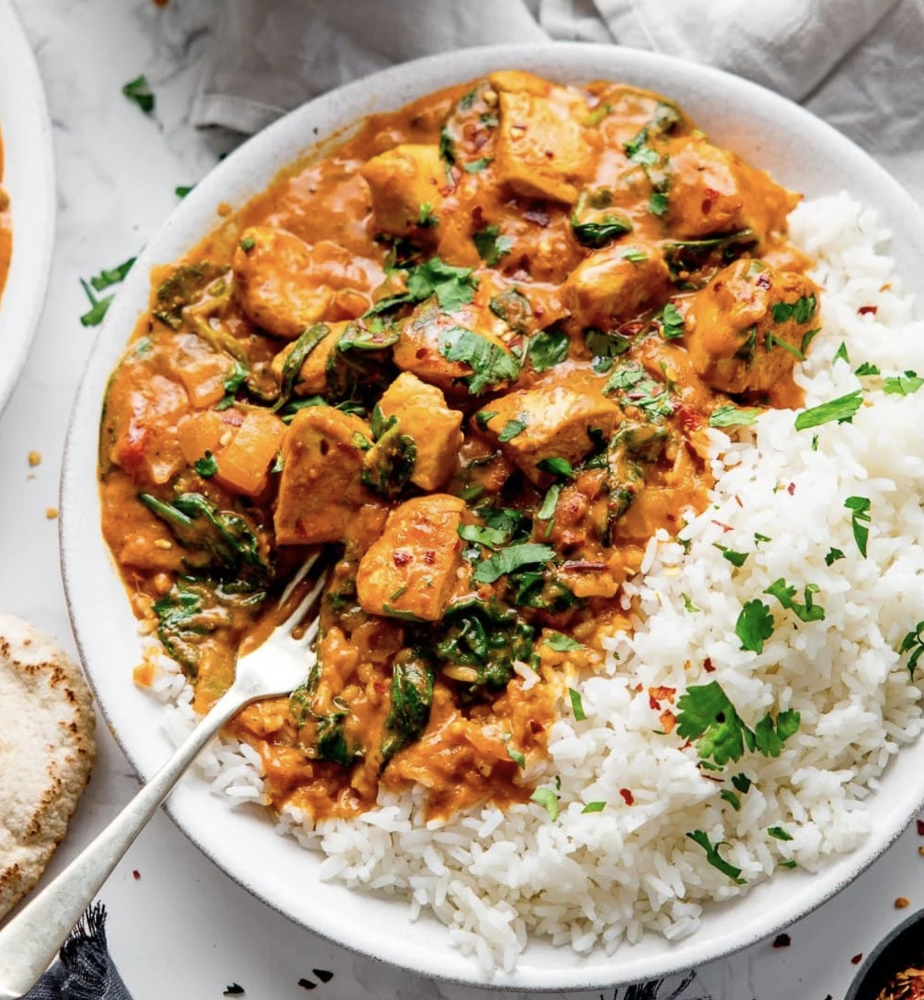
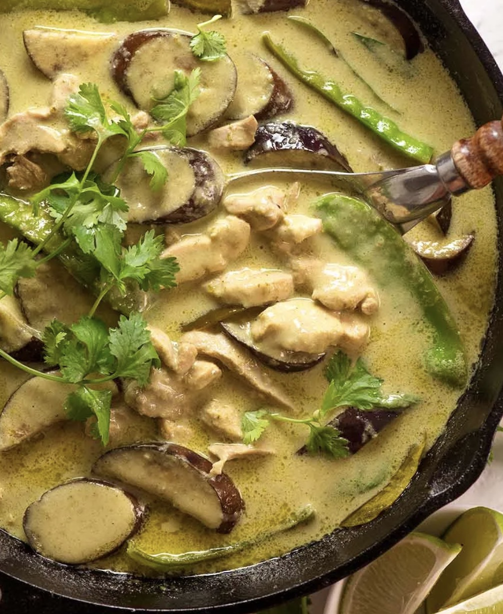
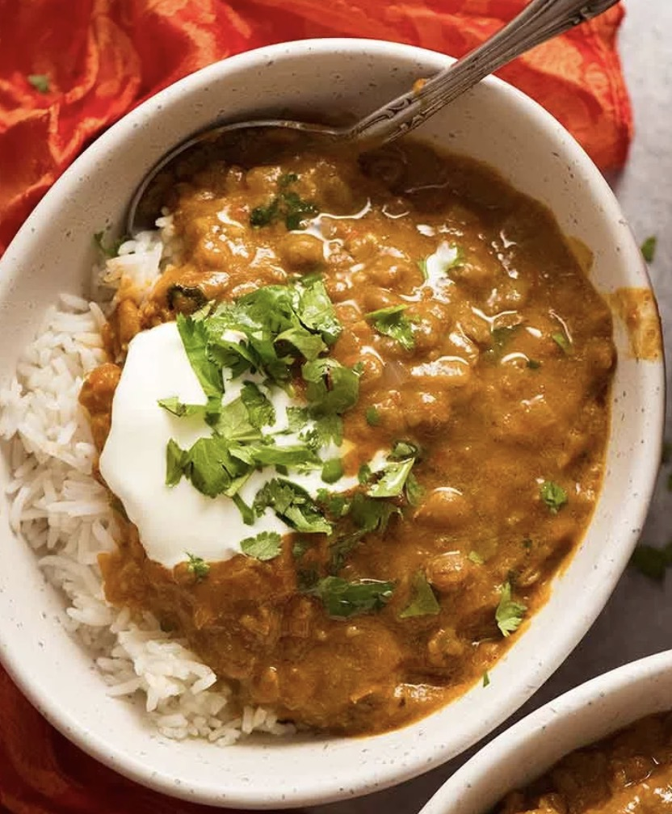
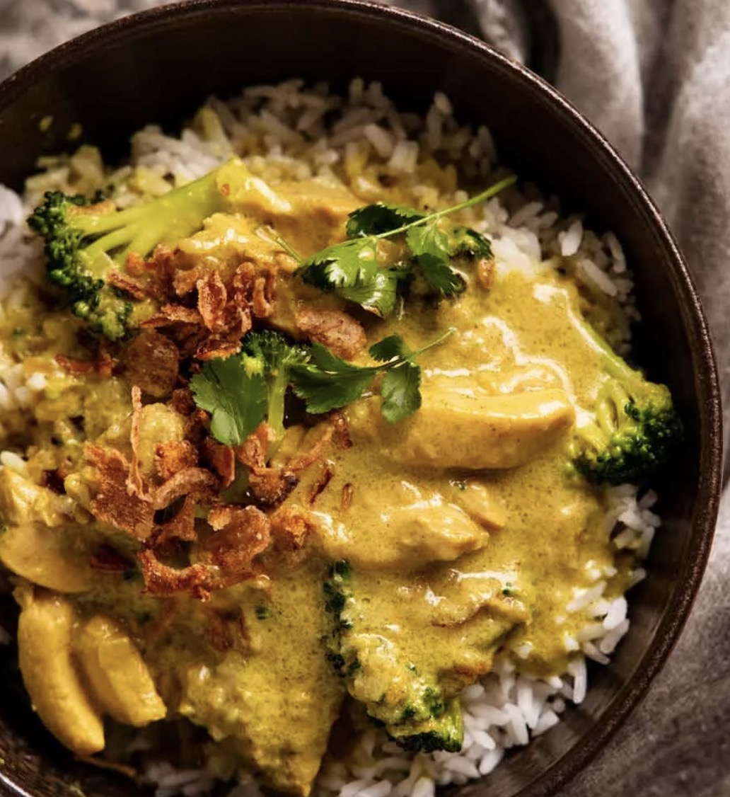

# Asian Other

## Goan Fish Curry

#### Serves 4 - 1 hr

**Curry Paste**

- 2 tbs smoked paprika 
- 1/2 tsp chilli powder
- 1 tbsp coriander
- 2 tsp cumin
- 1 tsp turmeric
- 4 cloves, round bits on the end pinched off with fingers and crushed, long bits discarded
- 6 cloves garlic ,chopped in half
- 1 tbsp fresh ginger ,chopped a bit
- 1 1/2 tbsp tamarind puree (Note 3)
- 1/2 red onion , chopped
- 90 ml water (plus more, as needed)

**Curry**

- 3 tbsp vegetable oil
- 1/2 tsp black mustard seeds (Note 4)
- 1/2 red onion , cut in half again (like a quartered orange) and thinly sliced
- 1 tbsp tomato paste
- 1/2 can tinned tomatoes
- 165 ml water
- 400ml/ 14oz coconut milk , full fat (Note 6)
- 2 tsp cornflower as needed
- 1 1/2 tsp salt , cooking/kosher (or 3/4 tsp fine table salt)
- 1 1/2 tsp sugar
- 1/4 tsp chilli powder
- 2 long green chillies , cut into half lengthwise and deseeded, optional (Note 8)
- 1 tomato , cut into 8 wedges then into 2.5cm chunks
- 600g firm-fleshed white fish , cut into 3cm cubes

**To Serve**

- Chopped coriander
- Basmati rice

#### Directions

1. **Make the paste** Place the dry curry paste ingredients in a micro blender and whizz until fine, then add the water and tamarind and whizz to a pulp.

2. **Sizzle black mustard seeds:** Heat oil over medium heat in a large pot. Add black mustard seeds and let them sizzle for 30 seconds - careful, they might pop!

3. **Saute onion:** Add red onion and cook for 3 minutes until edges start to tinge with gold.

4. **Cook off curry paste:** Add curry paste and cook for 3 minutes - to evaporate water, make spices bloom and cook garlic & ginger.

5. **Cook off tomato:** Turn heat up to medium high. Add tomato paste and tomato pulp, cook for 2 minutes.

6. **Coconut milk:** Add water, coconut milk, sugar, salt and chilli powder if using. Stir, then bring to simmer, low heat so it's bubbling gently.

7. **Simmer 2 minutes, add tomato & green chilli:** Simmer for 2 minutes, add tomato and green chilli.

8. **Simmer 3 minutes:** Simmer for another 3 minutes, stirring every now and then - sauce should be thickened (not watery), it gets looser again when fish is added (because fish will drop some juices = even more flavour!).

9. **Add fish:** Add fish, stir, cook for 3 to 4 minutes until fish easily flakes.

10. **Garnish & serve:** Remove from stove and transfer to serving bowl. Garnish with coriander/cilantro and fresh green chillies if desired. Serve with [basmati rice](https://www.recipetineats.com/how-to-cook-basmati-rice/)!

## Butter Chicken

#### Serves 3 - Time 30mins

**Marinade**

- 120ml cup plain yoghurt , full fat
- 1 tbsp lemon juice
- 1 tsp tumeric powder
- 2 tsp garam masala
- 1/2 tsp chilli powder or cayenne pepper powder
- 1 tsp ground cumin
- 1 tbsp ginger, freshly grated
- 2 cloves garlic, crushed
- 750 g chicken or pheasant thigh fillets, cut into small pieces (2cm)

**Curry**

- 2 tbsp (30 g) butter
- 1 cup tomato passata
- 1 cup heavy / thickened cream
- 1 tbsp sugar
- 1 1/4 tsp salt
- 2+ teaspoons of cornflower as necessary

**To Serve**

- Basmati rice

- Chopped corriander

#### Directions

1. **Marinade:** Combine the Marinade ingredients with the chicken in a bowl. Cover and refrigerate, preferably overnight, but not necessary

2. **Cook chicken:** Heat the butter over high heat in a large fry pan. Take the chicken out of the Marinade and place chicken in the fry pan and cook for around 3 minutes, or until the chicken is white all over (it doesn't really brown because of the Marinade). If there is marinade left, add in next stage.

3. **Sauce:** Add the tomato passata, cream, sugar and salt. Also add any remaining marinade left in the bowl. Turn down to low and simmer for 20 minutes. Do a taste test to see if it needs more salt. Add cornflower if necessary

4. Garnish with coriander/cilantro leaves if using. Serve with Basmati rice

## Thai Yellow Curry

#### Serves 3-4 - 1hr+

**Paste**

- 2 medium spice red chillis, finely chopped
- 2 lemongrass stems (chop off bottom, and top green, peel outside layer, chop very finely
- 2 shallots , roughly chopped
- 1.5 tbsp ground turmeric
- 2 tbsp galangal, finely grated
- 8 cloves garlic , roughly chopped
- 1 1/2 tbsp Thai shrimp paste (essential. In bean oil if available)
- 1 tsp ground coriander
- 1 tsp ground cumin
- 1/4 tsp ground cardamom (if only have pods, crush 2-3 pods in pestle and mortar, removing husks)
- 1/2 tsp fenugreek powder (non essential)
- 1/8 tsp white pepper (sub black)

**Curry**

- 3 tbsp vegetable oil

- 200ml chicken stock (half a cube)

- 4 tsp fish sauce , plus more to taste

- 5 tsp white sugar

- 2 tsp tamarind puree (Note 12)

- 300 ml coconut cream (thicker than coconut milk, but can use milk if you have to, but add 1-2tsp cornflour)

- 1 small carrot , peeled, sliced into 5mm thick slices on the diagonal, then cut in half

- 1 medium potato, peeled, cut into small slices, 5mm thick (if thicker, will not cook)

- 350g uncooked king prawns, (can be substituted with fish or chicken cut into small 4cm pieces)

- 1 small can of bamboo shoots (around 150g drained weight)

**To Serve**

- Thai basil leaves

- Crispy onion pieces

- Jasmine rice

#### Directions

1. Prepare the curry paste ingredients.

2. Put the rice on.

3. Putting all the paste ingredients in a small food processor, add a bit of water, and blitz until smooth.

4. Cook the paste on medium heat for 4 minutes in a large skillet, meanwhile, prepare the carrot and potato.

5. Add the chicken stock, stir in, and simmer for 1 minute.

6. Add the tamarind, fish sauce, and sugar, stirring everything in, then add the coconut cream, carrot and potato.

7. Simmer for 15 minutes until potato is soft, add 1-2 tsp cornflour if not thick enough.

8. Add the prawns and bamboo shoots, cook for 3 minutes (do **not** overcook), then adjust sauce with fish sauce and salt to taste.

9. Serve with rice, topping curry with torn Thai basil leaves, and crispy onion pieces.

## King Prawn Bhuna

#### Serves 4 - Time 30 mins

- 600 - 800g raw king prawns (or small prawns)
- 2 green peppers cut into small 1cm squares
- 6-8 shallot onions (preferable as softer) / 2 onions finely diced
- 1.5 tsp garlic (5 cloves or so)s
- 1.5 tsp ginger
- 1 can (400g) chopped tomatoes
- 1 tbsp tomato puree
- 3 tbsp vegetable oil
- Coriander roughly chopped
- 250 - 350ml of water
- Basmati rice to serve

**Spices**

- 1 tsp chilli powder
- 1 tsp paprika
- 1 tsp turmeric
- 2 tsp curry powder
- 1 tsp coriander powder
- 1/2 tsp cumin powder
- 1/2 tsp salt
- 1 tsp sugar?

#### Directions

1. Chop the onions and garlic, mix the spices in a small bowl, then put the rice on

2. Heat the pan on medium heat with 3 tablespoons of oil, and sauté the onions for 3 minutes until soft, then add garlic and cook for 2 minutes .**Do not** brown the garlic, it should be yellow / golden.

3. While cooking the onions, chop the green peppers, and cut the prawns in half at their mid point so they are more evenly distributed in the curry (can do while in next step as well)

4. Add the spice mix, cooking for 3-4 minutes. Add some water if it gets too dry. Should bloom the spices and brown everything.

5. Add the chopped tomatoes and tomato puree, and cook for 3-4 minutes.

6. Pour the water in, and bring it to simmer, then add the chopped green pepper and cook for another 3-4 minutes and follow with the prawns for a further 3-4 minutes.

7. Taste test and add more salt or water according to your preference.

8. Serve with chopped coriander and rice.

# Thai Cashew Chicken Stir Fry

#### Serves 4 - 30 mins

**Stir Fry**

- 2 tbsp plain oil
- 1 cup raw cashews, unsalted
- 2 garlic clove, minced
- 1 brown onion, cut into wedges (halved, cut lengthways 4-5 times into segments, then cut across) 
- 400g chicken thighs, skinless and boneless, sliced into 1cm thin strips
- 4 green onions, cut into 2.5cm lengths (not sliced), white part separated from green part
- 1 red chilli, deseeded and finely sliced

**Sauce**

- 2 tbsp oyster sauce
- 1 tbsp **dark** soy sauce
- 4 tsp fish sauce
- 2 tsp white sugar
- ~100ml water (add more if too dry or if you want it more saucy)
- 1 tbsp cornflower

**To Serve**

- Red chilli, finely sliced (optional garnish)
- Rice

#### Directions

1. Chop all the ingredients and mix all the Sauce ingredients in a small bowl.

2. Heat oil over medium heat in a wok or large skillet. Add cashews and cook for 5 minutes until they become a dark golden colour and crunchy (be careful not to burn them!). Remove from skillet with a slotted spoon.

3. Add the onion and cook for 1 min. Add the chicken and cook for 1 minute until the outside changes from pink to white.

4. Add the white part of the green onion, garlic, and chilli. Cook for 1 minute until chicken is just cooked through.

5. Add the sauce, cooking for 1 minute until it reduces down to a syrup, coating the chicken nicely.

6. Add green part of green onions and cashews. Toss for 30 seconds.

7. Transfer to serving dish. Serve with rice and garnish with extra red chilli.

## Chicken Korma

#### Serves 4 - 40 mins

- 2 tbsp cooking oil

- 2 brown onions, diced finely

- 4 garlic cloves, chopped finely (not minced)

- 1 tsp ginger paste

**Spices**

- 6 cardamom pods, seeds taken out of pods and crushed / chopped

- 1 tbsp ground cumin

- 1 tbsp ground coriander

- 3/4 tsp ground turmeric

- 1/2 tsp mild chilli powder - trial 1 tsp?

- 1 bay leaf

- 4 cloves, round bits on the end pinched off with fingers and crushed, long bits discarded

**Simmer**

- 1 tbsp plain flour

- 50g finely chopped almonds

- 300ml water

- small pinch of saffron

- 1 tbsp light brown sugar

- 1/2 tsp fine sea salt - trial 3/4 tsp?

**Chicken**

- 1 tbsp oil

- 600g chicken (breast or thigh), chopped into bite sized pieces

- 2 tbsp plain yoghurt (greek or natural)

**Finish**

- 60ml double cream

- fresh coriander, roughly chopped, to garnish (optional)

- Rice to serve.

#### Directions

1. Dice the onions, put a medium sized pan on medium low, add the oil, and fry the onions with a bit of salt covered for 5 minutes until softening, stirring every few minutes. Add the garlic and ginger and fry for another 5 minutes covered.

2. Prepare all the spices, then when the onion mixture is done, add them and cook for 5 minutes uncovered. Add the plain flower and chopped almonds and cook for 2 minutes. Slowly add the water, stirring constantly to dissolve the fond on the bottom of the pan, and add the saffron, sugar, and salt. Simmer covered for 10 minutes.

3. While the sauce simmers, put the rice on, and then chop the chicken.

4. When the sauce is done, remove the bay leaf and transfer it to a bowl / jug suitable for a stick blender (I use the jug I measure the water with), scraping the pan as clean as you can with a spatula. Put the pan back on the burner on medium high heat with oil, add the chicken when hot, and spoon on and mix in the yoghurt. Cook the chicken until almost cooked through with a little color if you can, but it's not necessary.

5. While the chicken cooks, use a stick blender to blend the sauce until a grainy consistency.

6. When the chicken is cooked, reduce the heat to medium low, wait for the pan to reach that temperature, then add the blended sauce back. Simmer covered for 10 minutes. While simmering, chop the coriander. Once simmered, add the cream and stir through for a minute or so, then serve with rice and the coriander. 

## Chicken Curry

#### Serves 5 - 45 mins

- 2 tbsp vegetable oil
- 3-4 chicken breasts, chopped into bite-size chunks
- 1 large onion (or 2 small), finely chopped

**Spices**

- 1 tsp sugar
- 2 tbsp mild curry powder go hotter if you prefer
- 1 tbsp ground coriander
- 1/2 tbsp ground cumin
- 1 tsp paprika
- 1/2 tsp ground cinnamon
- 1/2 tsp salt
- 1/2 tsp black pepper
- 2 cloves garlic minced / 1tsp garlic paste
- 2 tsp minced ginger / paste

**Stewing**

- 1 tbsp soy sauce
- 2 tbsp tomato paste
- 1 tin chopped tomatoes
- 250ml chicken stock
- 1 can (400ml) coconut milk

**To Finish**

- 1 tbsp cornflower mixed with water to make a slurry
- 1 pack baby spinach
- Rice

#### Directions

1. Put the rice on

2. Heat the oil in a large pan on medium high, add the chicken and onion, cook for 5 minutes.

3. Add all the spices and cook for a minute or so.

4. Add all the stewing ingredients and simmer for 10 minutes.

5. Add the cornflour if it needs thickening, then stir in the spinach until it wilts and serve with the rice.

## Thai Green Curry

#### Serves 4 - 30 mins

- ~200g Jar of Thai green curry paste

- 1 tsp garlic paste / 2 cloves minced

- 2 tsp ginger paste

- 2 tsp lemon grass paste

- 400ml coconut milk

- 250ml chicken stock

- 1 tbsp fish sauce

- 1 tsp sugar

- 6 makrut / kaffir lime leaves

- ~600g chicken thigh, chopped into small pieces (or another large aubergine for a vegetarian version)

- 1 large aubergine, chopped into small strips (chop into layers vertically, chop them in half vertically, and then each layer across into strips)

- 1 pack of mangetout, roughly chopped in half

- 20 basil leaves

- 1.5 tsp lime / lemon juice

- Rice to serve

#### Directions

1. Put the rice on

2. Heat the oil in a large pan over medium heat, add the curry paste, garlic, ginger, and lemon grass, frying them for 2-3 mins until reduced a bit. While that's cooking, chop the chicken.

3. Add the coconut milk, chicken stock, fish sauce, sugar, lime leaves, and chicken pieces, and simmer for 7 minutes with the lid on. While that's cooking, chop the aubergines.

4. Add the aubergines and cook for 5 minutes with the lid on, and while that's cooking, pinch the tough stems off the mangetout.

5. Add the mangetout, and cook for 2 minutes.

6. Turn off the heat, stir in the basil leaves and lime / lemon juice. The sauce should be on the thin side. Serve with the rice.

## Lentil Dal

#### Serves 5 - 1 hour

- 50g butter
- 4 garlic cloves, finely minced
- 1.5 tbsp ginger, finely minced
- 1 onion, finely chopped
- 2 tbsp mild curry powder
- 1/2 tsp turmeric powder
- 1/4 tsp cayenne pepper
- 1/2 tsp salt
- 1/2 tsp black pepper
- 1.5 cup dried split lentils, brown, red, or green (NOT french green)
- 1 can coconut milk, full fat
- 1 can chopped tomatoes
- 750ml vegetable stock

**Serving**

- coriander, finely chopped
- Yogurt, optional
- Basmati rice

#### Directions

1. Melt butter in a pot over medium heat. Add onion, garlic and ginger. Slowly cook, stirring every now and then for 10 minutes until tinged with gold and the onion is sweet. Put the rice on while cooking.

2. Turn heat up to high, add curry powder, turmeric, and cayenne peppe, stir for 1.5 mins to bloom the spices.

3. Lower to medium heat, add remaining ingredients and stir, bring to simmer, then place lid on, simmering for 30 mins. After 30 mins, lentils should be soft, sauce should be thickened and creamy. Too thick, add water. Too thin, simmer with lid off for 10 mins. Serve with coriander, rice, and yoghurt.

## Golden Coconut Curry

#### Serves 4 - 45 mins

- 2 tbsp vegetable oil
- 3 star anise
- 0.5 tsp cinnamon powder
- 1 onion, finely diced
- 500g chicken, cut into bitesized pieces
- 1 tsp garlic, finely grated or use paste
- 1 tsp ginger, finely grated or use paste
- 1.5 tsp turmeric powder
- 500ml chicken stock
- 400g (1 can) coconut cream
- Large head of broccoli, florets cut small
- 2 tbsp cornflower
- Lime juice: start with 1tsp as still testing (brings something more to the recipe)
- Optional: 1 cup chopped coriander leaves, lightly packed, plus extra for garnish
- Optional: crispy fried onions
- Rice to serve

**Spice Mix**

- 1 tsp cooking/kosher salt
- 2 tsp garam masala
- 1.5 tsp coriander powder
- 0.5 tsp cumin powder

#### Directions

1. Chop the chicken and onion, and mix the spices from the spice mix in a small bowl. Put the rice on.

2. Heat the oil in a large pan over medium high heat. Toast the star anise and cinnamon for 2 minutes. Add onion, cook for 2 minutes. Add chicken, cook for 3 minutes or it's no longer pink on the outside (still raw inside). Add garlic, ginger and turmeric, cook for 1 minute. Add spice mix and stir for 30 seconds.

3. Add stock and coconut cream, stir and bring to a simmer, and cook for 12 minutes.

4. Add broccoli, chopping into small florets, add the cornflower as a slurry to thicken, and add the lime juice, bring back to a simmer and cook for 3 minutes or until softened and thickened. Add more cornflower if necessary and lime (still testing amount).

5. Cool for 5 minutes, this will allow the sauce to thicken slightly. Then stir in coriander and serve with rice. Garnish with extra coriander and crispy fried onions.
