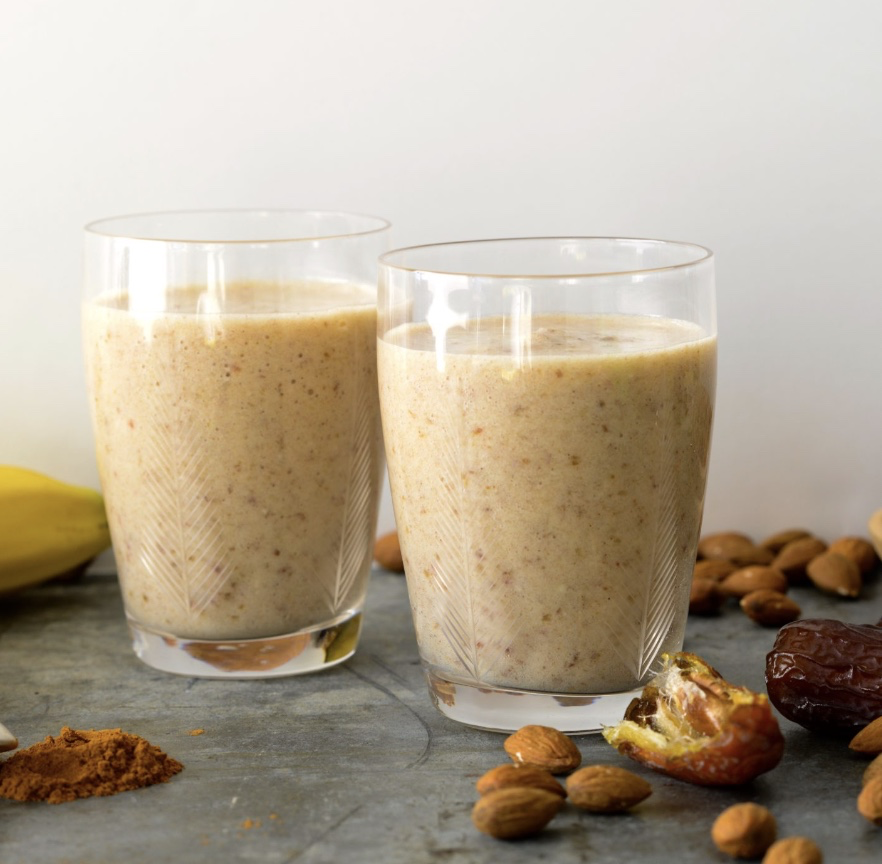
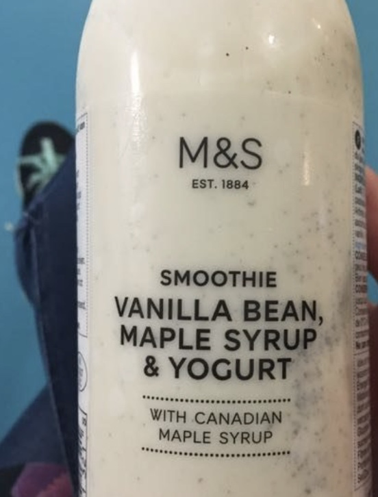

# Drinks

## Banana, Oats, and Medjool Dates

##### Serves 2

##### Ingredients

- 200ml apple juice

- 1/2 a banana

- 2 tsp honey

- 3 medjool dates

- 200ml natural yoghurt

- 20g oats

##### Directions

- Add the apple juice, banana, honey, and dates into the blender, whizzing until smooth

- Add the yoghurt and oats and pulse 4 times

## Yoghurt, Vanilla Bean, and Honey

##### Serves 1

##### Ingredients

- 200ml apple juice

- 1 tsp honey

- 4 tbsp natural yoghurt

- 1/4 vanilla pod

##### Directions

- Add everything into the blender, scraping in the vanilla pod seeds and pulse twice
