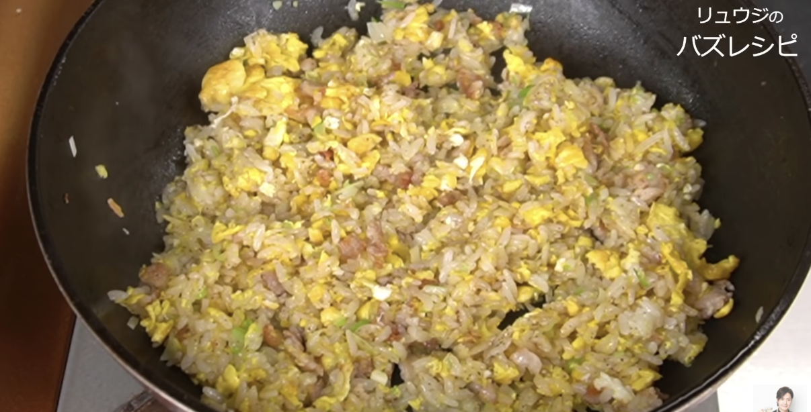
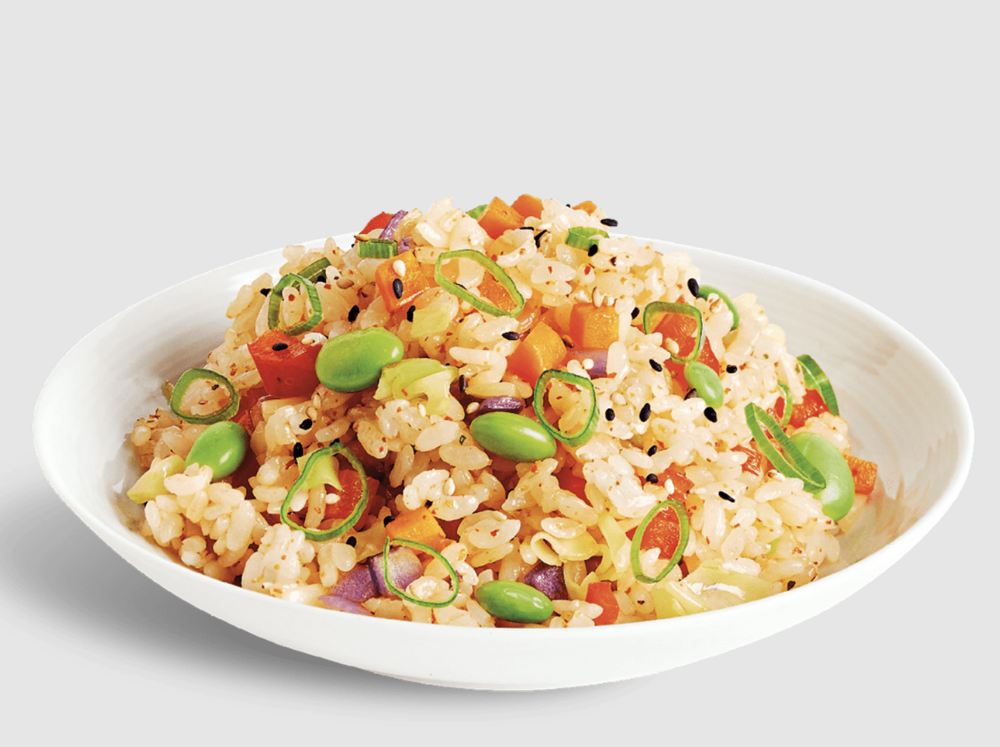

# Japanese & Chinese

## Japanese Curry

#### Serves 8 - 35 mins

- 2tbsp Vegetable oil

- 500g chicken, chopped into bite sized pieces

- 500g potatoes, chopped into bite sized pieces

- 3 brown onions, chopped into ~2cm pieces

- 250g carrots

- 1440ml (6 cups) of water

- 200g Japanese curry roux blocks (S&B Torokeru etc)

- Rice, to serve

#### Directions

1. Chop the chicken, potatoes, carrots, and brown onions.

2. Heat a large saucepan on medium heat, and stir fry the chopped ingredients for 5 minutes.

3. Add the water and bring to a boil, then reduce the heat, cover, and simmer for 20 minutes.

4. Add the roux blocks, stirring until melted, and simmer for 5 minutes stirring constantly.

5. Serve with rice.

## Japanese Garlic Butter Rice

#### Serves 1 - Time 15mins

- 1 portion of Japanese white rice

- 3 garlic cloves, minced

- 1 tbsp butter

**Sauce:**

- 1 tbsp mirin

- 1 tbsp light soy sauce

- A few shakes of ajinomoto

- 1/4 tsp pepperp

**To Serve:**

- Chives, negi (optional) chopped

- Small knob of butter and greens (broccoli etc) to serve

#### Directions

1. Put on the rice, mix the sauce ingredients together, and prepare the garlic

2. On low heat add the butter and garlic and gently fry until golden

3. Add the rice, and pour over the sauce, mix well for a minute

4. Serve with a small knob of butter, the chives, and greens on the side

## Matsuya Umatoma

#### Serves 2 - Time 20mins

- 4 cloves garlic chopped finely

- 1 large onion diced finely

- 1 tbs oil

**Sauce**

- 1 can of chopped tomatoes

- 1 tbsp of miso

- 1 tsp hot paprika powder / mild chilli powder

- 1 tbsp of teriyaki sauce

- ~100ml water

**Finishing**

- 4 burgers

- Japanese white rice to serve

- Optional: 2 eggs

#### Directions

- Put the rice on

- Fry the oil, onion, and garlic on medium heat until transparent

- Add the sauce ingredients, mix well, and simmer with a lid on

- 5 minutes before the rice is done, fry the burgers and serve when done. 3 minutes before the rice is done make two wells in the sauce and crack an egg into each, and replace the lid.

## Japanese Chinese-style Fried Rice (チャーハン)

#### Serves 1 - Time 15mins

- 1 tbs of vegetable oil

- 2-3 strips of (preferably non-smoked and low salted) bacon, finely chopped

- Thumb sized piece of ginger, finely chopped

- 1 clove of garlic, finely chopped

- 5cm of leek, finely chopped

- Optional: a few spears of asparagus cut lengthways and into small sections

- 2 eggs, beaten

- 1 serving of Japanese white rice (hot)

- 1/2 tsp salt

- A few shakes of ajinomoto (msg)

- 1 tbsp of light soy sauce

- 1/4 tsp of white pepper

- 1 tbs of mirin (alternatively sushi vinegar)

- A good knob of butter

- Pinch of benishouga to serve

#### Directions

- Have everything ready before you begin cooking, as it must be done fast. Mix the mirin, salt, ajinomoto, soy sauce and pepper together in a small saucer or bowl.

- In a non-stick pan, fry the bacon in the oil on medium-high heat until it has some color on it, then push to edge of the pan

- Add the garlic and ginger, fry until garlic is translucent

- Add the leek and any other greens and fry them for a minute or so

- Make sure the pan is medium hot, and add the egg, then the rice, and when the egg is pretty much set, mix everything together with a chopping motion

- Add add the mirin mix and butter, mix well, adding more pepper if needed

- Serve with benishouga

## Salmon Teriyaki Noodles

#### Serves 2 - 20 mins

**Teriyaki Sauce**

- 2 1/2 tbsp soy sauce
- 2 tbsp mirin
- 2 tbsp cooking sake, or Chinese cooking wine
- 1 tsp white sugar

**Other**

- 1 tbsp oil (veg or canola)
- 250g salmon fillet(s), skinless, sliced into 2cm wide pieces down their length
- 2 instant noodle / ramen noodle cakes (discard seasoning packs) (Note 2 other noodles)
- 1 onion , cut into quarters and sliced
- 2 garlic clove , finely minced
- 1 small bunch Chinese of stem greens like tenderstem broccoli cut in half lengthways

#### Directions

- Mix the Teriyaki sauce and coat salmon with 1 tablespoon of it in a bowl, then set aside while you cook the noodles.

- Cook the noodles as per the packet directions but without the seasoning sachet, then set aside.

- Heat 1/2 tablespoon oil in a large **non-stick** pan over high heat. Cook the salmon for 1 - 1.5 minutes on each side or until golden, then remove to a plate. Pour any remaining sauce in the skillet over the salmon.

- Heat 1 tablespoon of the remaining oil on medium and cook the onion and garlic for 30 seconds. Add the stem greens and cook for 1 minute.

- Add noodles and half the sauce. Toss for 2 minutes until the Sauce is absorbed. Add the remaining sauce and toss to disperse. Then spread the noodles out in the pan, cook for 30 seconds un-disturbed. Repeat again 3 to 4 times (~3 min total) – a trick for nice caramelisation on the noodles (which = flavour!).

- Serve with salmon on top, breaking it into large chunks

## Firecracker Rice

#### Serves 4 - 30 mins

- 3 cups of Japanese rice

- 3 tbsp vegetable oil

- 1 onion, finely chopped

- 1 carrot, peeled and finely diced

- 1 red, and 1 yellow pepper, deseeded and diced

- 2 garlic cloves, minced

- Thumb sized piece of ginger, finely sliced

- 125ml (1/2 cup) of green peas

- 2 tsp toasted sesame oil

- 1 tbsp mirin?

- 5-6 tablespoons light soy sauce

- 0.5 tsp freshly ground white pepper

- 1 tsp shichimi tougarashi (Japanese seven spice)

#### Directions

1. Put on the rice and then chop all the vegetables

2. Heat a large frying pan over a medium-high heat and add 2 tablespoons of vegetable oil, then add onion when hot stir-frying for 2-3 minutes.

3. Add the carrot, red and yellow peppers, garlic, ginger and peas cooking for 3 minutes.

4. Add the remaining vegetable oil together with the sesame oil, and add the rice, separating the grains with a wooden spatula so that there are no large lumps, and stir-fry for two to three minutes.

5. Pour the soy sauce (and mirin?) along the edge of the pan and mix. Season with the white pepper and shichimi tougarashi and stir to mix well. Serve

## Niku Jaga (Japanese stew)

#### Serves 4 - 1 hr

**Prepare**

- ~700g of all purpose potatoes, randomly chopped

- 2 large carrots, randomly chopped

- 2 onions, petal cut

- ~400g of pork (medallions do fine), sliced thinly

**Broth**

- 1000ml water

- 2 tbsp sugar

- 5 tbsp soy sauce

- 2 tbsp hontsuyu

- 4 tbsp cooking sake (sub shaoxing wine)

- 4 tbsp mirin

- 10g (1/2 tbsp) grandulated dashi

**Finish**

- 150g of greens (beans, snow peas, midget trees etc)

- Rice

#### Directions

1. Chop the potatoes, carrots, and onions, putting them aside into a large bowl, then slice the pork.

2. Heat oil in a large skillet pan to medium, then cook the pork for 1 minute each side with the lid on.

3. Add the vegetables, mixing to cover them with oil from the pork, and fry for a few minutes with the lid on. While frying, mix and then add the broth ingredients.

4. Put the rice on, and when it's 5 minutes from being done, add the greens to the pan.

## Japanese Salmon

#### Serves 2-4 - 10 mins

- 2 - 4 salmon fillets (marinade amount doesn't change)

- 1 tbsp soy sauce

- 2 tbsp mirin

- 1 tbsp cooking sake

- 0.5 tbsp vegetable oil

#### Directions

- Add everything to a sealable bag / container, mix well, and marinade for a minimum of 3 hours, preferably overnight.

- Heat a non stick pan on medium heat (no higher as the sugar in the mirin will burn) and cook the salmon skin side down first until colour appears (2-3 mins), then drizzle over the marinade and cook each of the remaining 3 sides in turn until coral.

## Yakisoba

#### Serves 2 - 30 mins

- 1 pack unsmoked streaky bacon, sliced into 2cm strips

- 1 cabbage (savoy / hakusai), halved, core removed, chopped lengthways, and then chopped across into squares. Make sure all the chunks are broken up.

- 1 bunch of spring onions, green part cut into 4cm segments, white part finely sliced

- 2 tsp (4 cloves) garlic, minced

- 1 tsp ginger paste

- 1 tsp chilli paste

- 2 tbsp cooking sake

- 400g straight to wok noodles

**Sauce**

- 1.5 tbsp soy sauce

- 1 tbsp oyster sauce

- 1 tbsp ketchup

- 1 tbsp sake

- 1 tbsp lea and perins

- 1 tsp sugar

#### Directions

1. Slice the bacon and put it in a cold non-stick pan on medium high heat, grind a good amount of pepper all over it.

2. While the bacon is frying, chop the cabbage and spring onions, and put the garlic, ginger paste, and chilli paste into a small dish.

3. Once the bacon has good colour (not full crispy though), still on medium high add the cabbage, spring onion, and the paste mix and fry for a few mins until the cabbage wilts a bit, mixing regularly. While waiting, mix everything in the sauce into a small bowl. Once the veg has wilted a bit, add the sake and mix in for 20 secs to burn off the alcohol, then put everything aside onto a plate.

4. Put the pan back on the heat (still medium high) with 1-2 tbsp of oil, and add the noodles, swirling them around to coat in oil. Keep frying on one side until they go partially golden brown (this is key), then flip them and fry the other side. Once fried, separate the noodles, add the bacon and veg mixture back, mix together, then add the sauce mixture, stirring for 30 secs to reduce it a bit. Serve.

## Oyakodon

#### Serves 2 - 30 mins

- 300g chicken thigh - chopped into bite sized pieces

- 1 onion - chopped into 1cm thin petals

- 1 tsp ginger

- 4 eggs

- Rice to serve

**Sauce**

- 100ml water

- 2 tsp Sugar

- 2.5 tbsp soy sauce

- 1.5 tbsp sake

- 2 tsp mirin

#### Directions

1. Put the rice on

2. Mix the sauce, then chop the chicken and marinade it in the sauce

3. Chop the onion, then add it with the ginger to a medium non-stick pan with some oil. Cook until it starts to soften for 4 mins or so.

4. Add the chicken and boil for 7-8 mins until cooked, whilst the chicken is cooking whisk the eggs.

5. Add half the egg making sure to pour it evenly around the pan, wait till it has gone solid, then add the rest of the egg, wait until it is half solid, then serve on top of the rice.

## Simple Side Dishes

#### Serves 2 each - 10 mins

These are useful side dishes to eat with a rice bowl for lunch.

#### Marinaded Tomatoes

- 250g medium tomatoes, chopped into quarters

- 1/2 clove of garlic, minced

- 1 tsp sugar

- 2 tsp rice vinegar

- 2 tsp soy sauce

- 1 tsp olive oil

- 10 or so basil leaves - chopped medium

Mix the sauce, add the tomatoes and basil, then mix again.

#### Pickled Cucumber

- 1 cucumber - crushed (so the flavours get into the cracks), then chopped into half moons

- 1/4 tsp salt

- 2 spring onions (white and pale green parts), sliced with the tip of a knife in both diagonals not all the way through, then horizontal all the way through so it becomes minced.

- 1 tsp sesame seeds

- 1/2 clove of garlic

- 1 tsp ginger

- 1 tsp chilli paste

- 2 tbsp sesame oil

- 2 tsp soy sauce

- 1 tsp rice wine vinegar

- 1 sheet of nori - cut into small pieces with scissors  

Crush the cucumber with something flat, chop the cucumber, then in a bowl add it with the salt. Mix the onion, sesame seeds, garlic, ginger, and chilli paste into a small heat proof bowl. Heat the sesame oil in a small pan until just smoking then pour into the bowl, it should sizzle. Leave for 10 secs or so, then add the soy sauce and vinegar. Add it to the cucumber with the nori pieces and mix well.

#### Melty Aubergine

- 1 aubergine, cut into batons like thick cut chips about a finger in length 

- 2 tbsp sesame oil

- 1 tsp dashi powder

- 1 tbsp sugar

- 1 tbsp vinegar

- 1 tbsp mirin

- 1 tbsp soy sauce

- 1 tsp grated ginger

- 1 spring onion, chopped

- 1 tsp sesame seeds

Chop the aubergine, and fry with the sesame oil on medium heat in a non stick pan until slightly brown and soft. While frying, mix the sauce ingredients. Once fried, reduce to low heat and add the sauce along with the spring onion and sesame seeds.

## Cream Stew

#### Serves 6 - 1 hour

- 500g chicken thighs, chopped into bite sized pieces

- 100g bacon, diced

- 1 tbsp oil

- Untested: 1 glug of white wine to deglaze?

- 1 Onion ~200g, halved, cut 3 times lengthways, then into 1.5cm thick pieces

- 2 Carrots ~300g, rangiri, bite size

- 3 Potatoes ~500g, rangiri, bite size

- 750ml chicken stock

- 1.5 tsp soy sauce

- 1/4 tsp white pepper

- 1/4 tsp nutmeg?

- 2 bayleaves

- 60g butter

- 60g plain flour

- 500ml milk

- 1 head of broccoli, chopped into bite sized pieces

- Black pepper

- 1/2 tsp salt

- To serve: rice or buttered sourdough toast

#### Directions

1. Peel the carrots and potatoes, and peel the onion, then put the rice on.

2. Chop the chicken and bacon. Put a large skillet on high heat with a tablespoon of oil. Add the chicken and bacon when hot,  and fry until they have some colour. While the chicken and bacon is frying, chop the vegetables and prepare the stock.

3. Add the vegetables, mix well, and fry for a few minutes. Reduce the heat to medium, add the stock, soy sauce, white pepper and bayleaves, put the lid on, and set a timer for 10 minutes.

4. Chop the broccoli into bite sized pieces and add it to the stew when the 10 minute timer is done. Add another five minutes to the timer and replace the lid.

5. Melt the butter in a small saucepan on low heat, add the flour, and then slowly add the milk stirring vigorously to create a roux.

6. When the stew timer is done, check the potatoes are cooked through, and then add the roux, mixing well. Check for seasoning, likely adding the 1/2 tsp of salt, and a good few grids of black pepper. Add the double cream if using, and serve with rice.

## Omurice

#### Serves 2 - 30 mins

- 1 cup of Japanese rice

- 3 good knobs of butter

- 1 small brown onion, diced

- 200g cooked chicken breast, chopped into small pieces

- Optional: 1/2 tsp tube garlic

**Sauce**

- 100ml water

- 1 tsp sugar

- 1 chicken stock cube

- 2 tbsp ketchup

- 1 tsp Worcestershire sauce (?)

- 1 tsp soy sauce (?)

**Finishing**

- Black pepper

- 1 cup of frozen peas

- 2 x 1/5 tsp salt

- 6 eggs

- Broccoli / salad to serve

#### Directions

1. Put on the rice to cook

2. Heat a knob of butter on medium heat in a non stick frying pan, then add the onion and fry until translucent. While the onion is frying, add all the sauce ingredients together in a small bowl.

3. Add the chopped chicken and garlic, fry for a minute, then add the sauce ingredients. Boil off most of the water to leave a thick mixture, then add the peas and a good amount of black pepper.

4. While the rice is finishing, whisk together 3 eggs and 1/5 tsp salt for the first omelette.

5. When the rice is done, add it to the frying pan and fold through until coated with the mixture. Pour it out on a plate and set it aside.

6. Put the broccoli on

7. Rinse the frying pan, and follow the instructions to make an omelette from the `lasta-light.md` file (make scrambled egg first etc). When the scrambled egg mixture is custardy has mostly been moved to the far third of the pan, put half of the rice mixture on that far third in a roughly almond shape. Then when the omelette starts to set, fold the near side up on top of the rice with a spatula, then tilt the pan away from you and keep rolling and shuffling everything towards the far edge of the pan with a spatula, tucking in the corners to make the almond shape. When it's been rolled so that it's resting on the far edge of the pan and the pan is at a high angle of tilt, make sure with the spatula that it is ready to release, and then flip it onto a plate, hoping it will keep its shape!

8. Repeat with the rest of the egg and rice, and serve with broccoli / salad
