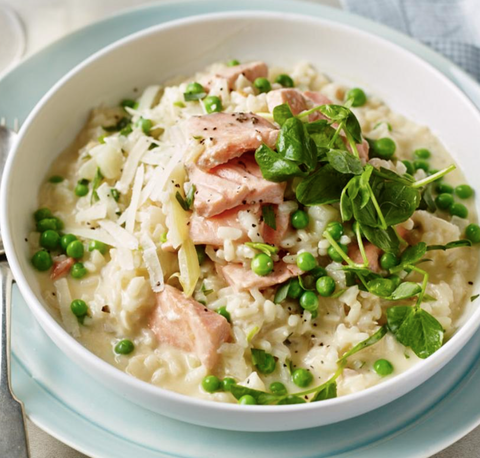
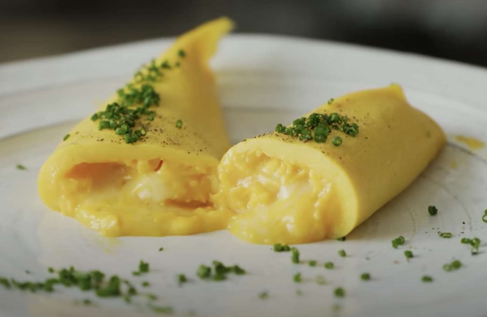

# Light

## Salmon & Tarragon Risotto

##### Serves 4 - 30 mins

##### Ingredients

- 1250ml stock (3 cube vegetable and 2 cube fish)
- 400ml dry white wine
- 2 tbsp sunflower oil
- 1 fennel bulb, trimmed and chopped into small pieces
- 2 garlic cloves, minced
- 500g risotto rice
- ~150g asparagus, chopped into 5cm lengths
- 300g frozen petits pois
- Juice of half a lemon
- 300g salmon fillet, skinned, chopped into large chunks (will fall apart a bit while cooking)
- 4 generous tbsp full-fat crème fraîche
- 60g Parmesan, grated, plus extra for sprinkling
- Fresh tarragon, stems removed and coarsely chopped (about half of a tesco 20g bag)
- salt and freshly ground black pepper

##### Directions

1. Make stock and pour it into a saucepan with the wine and keep warm over a low heat.

2. Chop the fennel, and add it into a large frying pan with oil over a medium-high heat, frying for about 4 minutes, or until softened, but not browned, stirring often. Chop the garlic and measure the rice. Add the garlic and rice and fry for a minute, stirring constantly, until the grains of rice are coated in the oil.

3. Recruit someone to do this: Add a ladleful of the hot stock mixture to the rice and simmer, stirring continuously. Wait until the stock is almost fully absorbed before adding the next ladleful. This should take 15–20 minutes, or until you are left with about 250ml stock in the saucepan and the rice is nearly cooked.

4. While step 3 is being done, skin and chop the salmon, chop the asparagus, and weigh out the petit pois.

5. When step 3 is done, add the asparagus and cook for 2 mins, adding a generous amount of pepper while cooking. Then add the petits pois, lemon juice, and the remaining stock and keep stirring for 2 mins of minutes. Add the salmon slices, crème fraîche, tarragon and Parmesan. Stir, test for seasoning, and continue to cook until the salmon is done to your liking, then serve.

## Ratatouille

##### Serves 3 (as main) - 45 mins

##### Ingredients

**Frying Ingredients**

- 1 large / 2 small aubergines, cut into 1.5cm (~450g)
- 1/2 tsp salt for sweating the aubergine
- 2 tbsp vegetable oil
- 4 tbsp extra virgin olive oil
- 1 red and 1 yellow bell pepper, diced into 2cm pieces
- 2 medium courgettes, diced into 1.5cm pieces (~200g each)
- 4 garlic cloves, minced
- 2 brown onions, chopped coarsely into 1.5cm pieces

**Stewing Ingredients**

- 1 can of chopped tomatoes
- 2 tsp dried/fresh thyme leaves
- 1 tsp salt
- 1/3 tsp black pepper
- 1 tsp balsamic vinegar
- 1 tbsp tomato paste
- 1 tsp white sugar
- 1/4 tsp oregano
- Optional garnish: handful of chopped basil
- To serve: garlic bread / rustic bread

##### Directions

1. Chop and then sweat the aubergine by placing it in a colander and sprinkling with the half tsp of salt. This will soften the flesh, allowing it to cook faster, and absorb less oil)

2. Chop all of the other frying ingredients

3. Heat 2 tbsp vegetable oil in a large skillet over high heat. Add the courgette and cook until a bit coloured, then add the aubergine and cook for 4 minutes, stirring occasionally, trying to get a bit of colour on everything.

4. Add another 1 tbsp of olive oil and cook the peppers with a pinch of salt for 3 minutes.

5. Reduce to a medium heat, add another 1 tbsp olive oil, then add the onion with a pinch of the salt, cooking it for 2 minutes, then add the garlic and cook for a further minute.

6. Add another tbsp of olive oil and all the stewing ingredients into the large pot and mix. Once the mixture is hot, reduce heat to a low simmer, and cook for 20 minutes with the pot lid off, stirring every now and then until all the vegetables are cooked through and the liquid has reduced, adding water if it gets too thick. The mixture should be thick enough so you can pile it on a plate (ie. not watery), but still very moist and juicy.

7. Once stewed, taste and add more salt if needed, then serve immediately, drizzled with extra virgin olive oil and a sprinkle of extra basil on top, if being fancy.

## Vinaigrette

#### Serves 4 - 5 mins

- 5 tbsp extra virgin olive oil

- 1 tbsp apple cider vinegar

- 0.5 tbsp lemon juice

- 1 tsp smooth dijon mustard

- 0.75 tsp sugar

- 0.5 tsp salt

- 0.5 tsp pepper

#### Directions

1. Mix everything together in a container that can be shaken and shake

## Vibrant Crunchy Wild Rice Salad

#### Serves 4 - 40 mins

- 2 cups of black rice (possibly can get away with the white and black mix)

- 100g each of midget trees, snow peas, and green beans (2 packs of the Tesco's tenderstem mix is perfect)

- 300g asparagus

- 50g toasted and crushed hazelnuts

- 50g sunflower seeds

- 2 sprigs of mint (untested) roughly chopped

- 1 portion of vinaigrette (see recipe above)

- 2 spring onions sliced diagonally

#### Goes well with

- Japanese Salmon (see jpn cn recipes)

#### Directions

1. Put the rice on.

2. Chop the vegetables diagonally into 2-3cm pieces (discard the tough stems), and slice the spring onions diagonally and thinly.

3. Put the some water on to boil (salt with 0.5 tbsp) and make the vinaigrette

4. Once the water boils, boil the vegetables for 5 minutes or until tender, then plunge into cold water. Drain and repeat until they are cold, then drain.

5. Cook the salmon if making it.

6. Once the rice is done, combine everything apart from the spring onions in a large bowl, transfer to a serving plate, and top with the spring onions.

## French Omelette

#### Serves 1 - 10 mins

- 4 eggs

- Just under 1/4 tsp salt

- Butter

- Optional: fillings (go easy on the cheese), chopped chives

#### Directions

1. Crack the eggs, add the salt, and then beat them well until completely homogenised with no whites.

2. Put a non-stick pan on medium-low heat with a good nob of butter. Once the butter is just about completely melted (it should not be bubbling) add the egg and start scraping the bottom quickly around and around with a silicone spatula.

3. The idea is to make a runny scrambled egg first. The curds should not form too quickly; if they are forming too quickly, reduce the heat / take the pan off of the heat. See [this video](https://www.youtube.com/watch?v=p3EwVIpzFjI&t=212s) for technique. Once the egg is at a custardy consistency, reduce the heat to low, tip most of it towards the far edge of the pan, and spread out the rest in a thin layer over the rest of the pan. Add the fillings where most of the egg is at the edge of the pan, and then gently start to roll the thin layer towards that edge.

4. Once rolled all the way to the edge, tip onto a plate, grind over pepper, add the chopped chives and serve.

## Spanish Omelette

#### Serves 3 - 30 mins

- 700g peeled potatoes, cut in half, and cut into 0.5cm thick slices
- 1 onion, quartered and sliced
- 100ml olive oil
- 1/2 tsp salt
- 1 cup of peas
- 8 eggs
- 1/2 tsp salt
- 1/4 tsp pepper
- To serve: garlic mayo

#### Directions

1. Heat oil in a non stick fry pan over medium heat. Add the onion, potatoes, and 1/4 tsp of salt, then place a lid on and stew the potatoes gently for 15 minutes or so, turning the potatoes 3 or 4 times until soft and cooked through.

2. Meanwhile, whisk eggs then season with salt and pepper.

3. When potatoes are ready, pour in the peas to defrost them, then pour away most of the oil in the skillet using a plate/lid to hold back the mixture, leaving behind about 1 1/2 - 2 tbsp of oil.

4. Return the mixture to the skillet, then pour over the egg. Cook for 5 minutes or until the underside is light golden.

5. Put the pan under the grill/broiler (not too hot as it's non stick) for a couple of minutes until the centre is just set, and then invert onto a plate and serve.

## Shakshuka

#### Serves 4 - 30 mins

- 2 tbsp olive oil
- 2 small red onions, quartered and sliced
- 2 garlic cloves, minced
- 2 red bell peppers, sliced into 0.5cm strips and halved horizontally

**Simmer**

- 2x400g tins crushed tomatoes
- 2 tbsp tomato paste
- 1 tbsp soy sauce
- 1 cup / 250 ml chicken or vegetable stock
- 2 tsp paprika
- 2 tsp cumin
- 1 tsp sugar
- 1/2 tsp cayenne pepper
- 1/2 tsp salt
- 1/4 tsp black pepper

**Finish**

- Optional: spinach
- 8 eggs
- Coriander, roughly chopped
- Crusty bread / pasta to serve
- Optional: cheese

#### Directions

1. Heat oil in a large pan with a lid over medium high heat (keep the lid off for now). Add garlic and onion, fry for 2 minutes until onion is translucent, then add the pepper, fry for 1 minute. Prepare the stock while frying.

2. Add the simmer ingredients, mix to combine well, then lower stove to medium low and simmer for 5 minutes until just thickened enough to make indentations (don't want dry sludge, needs to still be saucy).

3. Make indentations in the mixture and carefully crack the eggs in. Put the lid on the pan and leave to cook for for a few minutes (~3) until almost set (they will likely continue cooking).

4. Scattered with the coriander, and serve with crusty bread or pasta.

## Josh's Bird Food

#### Serves 3 as a side - 15 mins

- 1 cup of short grain brown rice (or brown rice in general)

**Dice**

- 1 beetroot

- 1/2 cucumber

- 1 red/yellow pepper

- 2 sticks of celery

- 1/2 pack of greek feta (sub 1/2 block halloumi)

- 1/2 a jar of black olives (can do green)

- 2 tomatoes

- 1/2 red onion

**Seasoning**

- 4 tbsp extra virgin olive oil

- 1/2 tsp paprika

- 1 tsp of ginger powder

- 1/2 tsp garlic granules

- 1 tsp mixed herbs

- 1/4 tsp of black pepper 

**Directions**

1. Put the rice on

2. Finely dice all the **dice** ingredients into 1cm cubes

3. Once cooked, add the rice and **seasoning** ingredients, mix well and serve

## Mushroom Risotto

#### Serves 4 - 30 mins

- 1 pack mushrooms, sliced and halved
- 25g butter
- 2 garlic cloves, minced
- 1/4 tsp each salt and pepper

**Risotto**

- 2 garlic clove, minced
- 1 onion, finely chopped
- 120 ml dry white wine
- 500g risotto rice
- 1750ml marigold vegetable stock
- 1 cup peas
- 50g butter
- 100g parmesan cheese
- 1/4 tsp pepper

**To Serve**

- Chives
- Parmesan cheese

#### Directions

1. Add the butter in a large pot over medium heat, then once melted, add the mushrooms and cook until almost golden brown (~4 min) (chop the garlic and onion while waiting), then add the garlic, S+P, and continue to cook until golden brown (~1.5 min). Then remove into a bowl.

2. Turn heat down to medium. In the same pot, melt risotto butter, garlic, and onion, and cook 2 minutes until onion is translucent.

3. Add the wine to deglaze, and allow to simmer rapidly for 2 minutes, scraping the base of the pot, until mostly evaporated.

4. Add the rice and stir for 1 minute until semi translucent. Then add stock ladle by ladle until fully absorbed, stirring occasionally. This should take 15-20 mins. Add all the stock, or until the rice is soft enough.

5. To finish, add the set aside mushrooms, peas, butter, parmesan, and pepper, and stir to incorporate. Serve with chives on top and extra parmesan.

## Bacon Risotto

#### Serves 4 - 30 mins

- 1 pack bacon, sliced into small pieces
- 25g butter
- 2 garlic cloves, minced
- 1/4 tsp pepper

**Risotto**

- 2 garlic clove, minced
- 1 onion, finely chopped
- 120 ml dry white wine
- 500g risotto rice
- 1750ml marigold vegetable stock
- 1 cup peas
- 1 cup sweetcorn
- 50g butter
- 100g parmesan cheese
- 1/4 tsp pepper

**To Serve**

- Chives
- Parmesan cheese

#### Directions

1. Add the butter in a large pot over medium heat, then once melted, add the bacon and cook until crispy (developing a good fond on the bottom of the pan). (chop the garlic and onion while waiting), then add the garlic and pepper, and continue to cook for a minute until the garlic is cooked. Then remove into a bowl.

2. Turn heat down to medium. In the same pot, melt risotto butter, garlic, and onion, and cook 2 minutes until onion is translucent.

3. Add the wine to deglaze, and allow to simmer rapidly for 2 minutes, scraping the base of the pot, until mostly evaporated.

4. Add the rice and stir for 1 minute until semi translucent. Then add stock ladle by ladle until fully absorbed, stirring occasionally. This should take 15-20 mins. Add all the stock, or until the rice is soft enough.

5. To finish, add the set aside bacon, peas, sweetcorn, butter, parmesan, and pepper, and stir to incorporate. Serve with chives on top and extra parmesan.

## Bacon, Spinach, and Mozzarella Frittata

#### Serves 4 - 45 mins

- 10 eggs
- 1/4 tsp salt (lots of salt from bacon)
- 1/2 tsp pepper
- 1 tsp oil
- 300g smoked bacon, chopped
- 2 garlic cloves, minced
- 1 tbsp butter
- 2 big handfuls baby spinach
- 150g grated mozzarella cheese (not soft)
- To serve: hash browns

#### Directions

1. Chop the bacon and add to a medium sized non stick pan, cooking until golden. While cooking, preheat oven to 180C, and whisk the eggs, salt, and pepper.
2. Turn the heat down to medium, add the garlic to the pan, and cook for 30 seconds. Then add the spinach and toss until wilted, then remove about 1/3 of the bacon spinach into a bowl.
3. Add the butter into the pan with the bacon mixture, melt, then Pour in about 2/3 of the egg mixture, then scatter over half the cheese. Then pour over remaining egg mixture and scatter the reserved bacon and spinach and then the cheese.
4. Cook for about 3 minutes until the sides are just set but not golden, then transfer to oven and cook for 8 minutes until the centre is just set and the cheese is melted on top. Finish with the grill for a bit of brown on top.
5. Rest for a few minutes then slice and serve.
