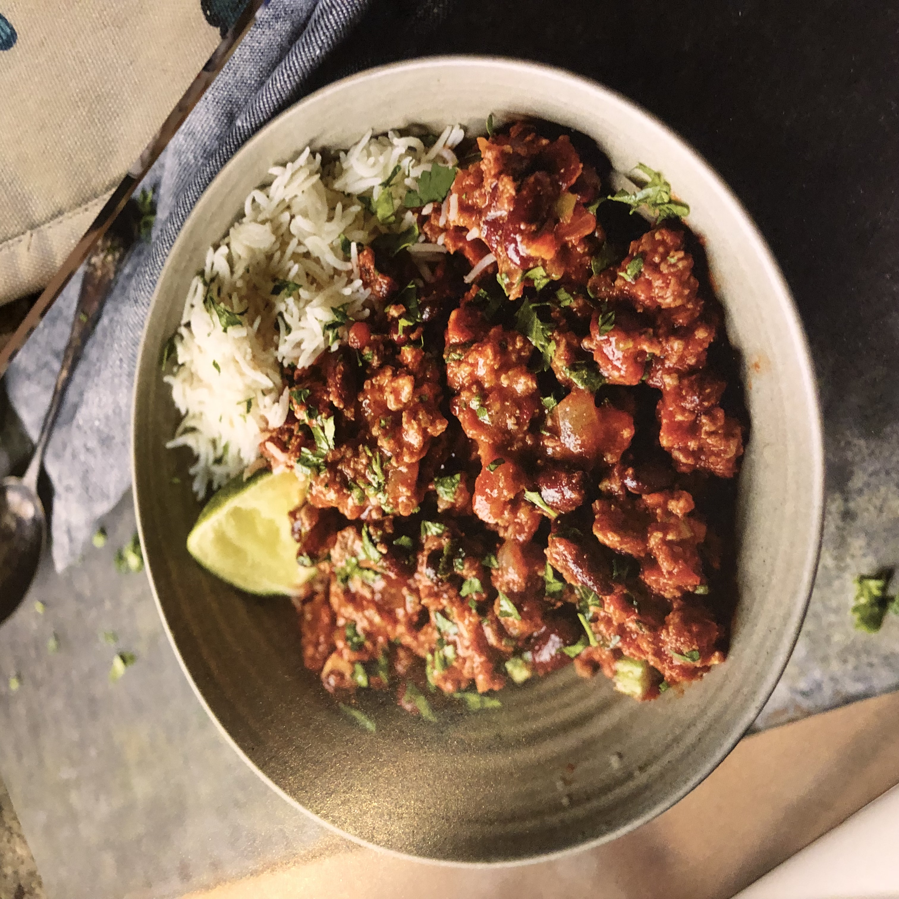
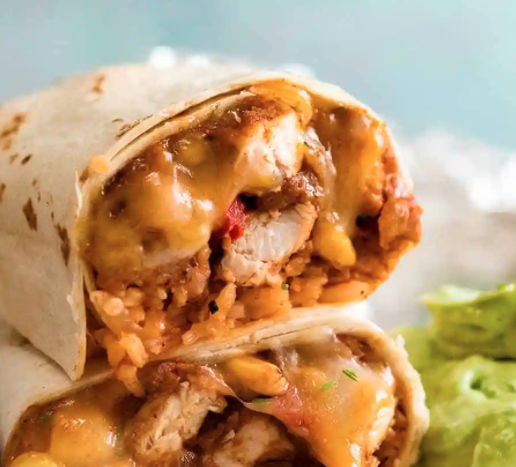
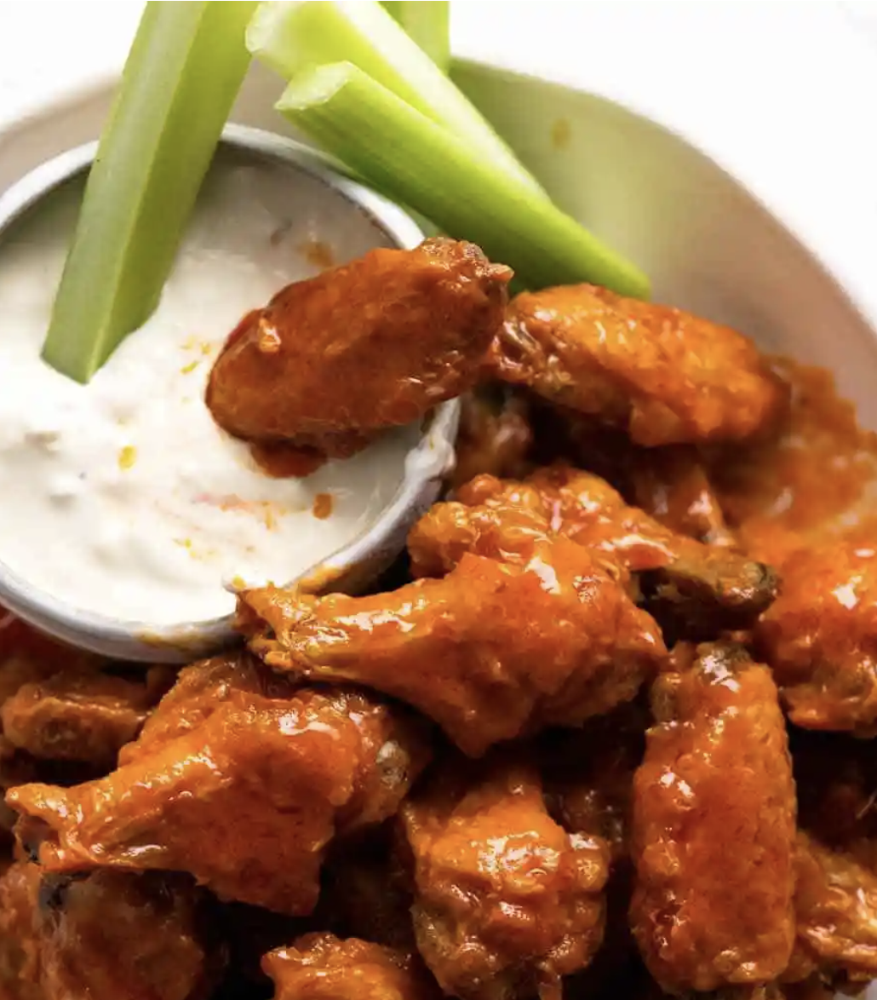
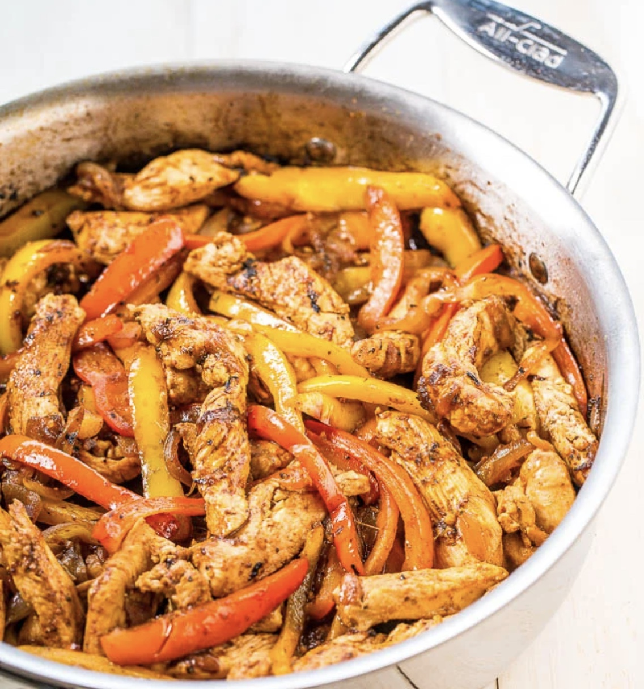

# Mexican

## Chilli Con Carne

#### Serves 5, time 40mins

**Chilli Spice Mix**

- 2 tsp cayenne pepper
- 4 tsp paprika powder (smoked, regular, or sweet)
- 5 tsp cumin powder
- 2 tsp garlic powder
- 2 tsp onion powder (sub Aromat)
- 2 tsp oregano

**Chilli**

- 1 tbsp olive oil

- 3 garlic cloves , minced

- 1 brown onion, diced

- 1 red bell pepper, diced

- 500g beef mince / ground beef

- 3 tbsp tomato paste

- 800g can crushed tomato

- 420g can red kidney beans , drained

- 2 beef bouillon cubes , crumbled

- 1 1/2 tsp sugar

- 1/2 – 1 1/2 cups / 125 – 375 ml water

- Salt and pepper

**To Serve**

- Rice, corn chips, tortillas (Note 5 for more)
- Sour cream, yoghurt, grated cheese, coriander (Note 6 for more)

#### Directions

- Put the rice on
- Heat oil in a large skillet over medium high heat. Add garlic and onion, cook for 1 minute, until onion is translucent.
- Turn heat up to high and add beef and bell pepper. Cook, breaking it up as you go by chopping it with a wooden spoon until mostly browned.
- Add Chilli Spice Mix. Cook until beef is browned all over. (This step helps release extra flavour from the spices)
- Add remaining ingredients, with 1/2 cup of water for Quick Cook or 1 1/2 cups for Slow Cook. Bring to simmer, then adjust heat per step below:
- Quick Cook – 20 to 40 minutes, uncovered, on medium low heat so it’s bubbling gently; OR
- Slow Cook – 1.5 hours to 2 hours, covered, on low heat so it’s bubbling very gently. (Note 3 Slow Cooker)
- Adjust salt and pepper to taste in the last few mins of cooking.
- Serve over rice, or ladle into bowls and serve with corn chips or warm tortillas on the side with Toppings of choice (Note 6). See Note 7 for more serving options. My usual: Either over rice or with corn chips, always with sour cream, cheese and coriander.

## Chicken Burritos

#### Serves 4 - Time 30 mins

**Burrito seasoning:**

- 1 tsp each onion powder, dried oregano, salt
- 2 tsp each dried cumin powder, paprika
- 1/4 tsp black pepper
- 3/4 tsp cayenne pepper (optional, adjust to taste)

**Chicken Filling:**

- 600g chicken breast , sliced in half horizontally (butterflied)
- 2 tbsp olive oil , separated
- 1 onion, diced
- 2 garlic cloves, finely minced
- 1 red bell pepper, diced small
- 1 can (400g) refried beans
- 60ml water

**Assembling:**

- 7-8 flour tortillas, (approx 20cm wide)
- 2 packets of Uncle Ben's Mexican Rice
- 400g/14oz canned corn , drained (or 280g/9oz frozen thawed)
- 150g cheese (cheddar is fine)
- A good amount of coriander , finely chopped

**Sauces:**

- Guacamole
- Sour cream
- Salsa (restaurant style, smooth)

#### Directions

- **Burrito Seasoning** - Mix Seasoning ingredients. Drizzle 1 tbsp oil over chicken, mix to coat. Sprinkle with Seasoning, toss to coat.

- **Cook chicken -** Heat 1 tbsp oil in a large skillet over high heat. Add chicken, cook 2 minutes. Turn and cook 1.5 minutes. Remove, rest 2 minutes then chop.

- **Sauté onion -** In the same skillet, add onion and garlic, cook 1 minute. Add capsicum, cook 2 minutes until onion is translucent.

- **Finish Filling -** Add refried beans, diced chicken and water. Stir and cook for 2 minutes until reduces slightly. Should be thick and juicy, not  watery and not dry/stodgy! Let cool 5 minutes - will thicken.

**Assembling the Burritos:**

- Gently warm tortillas in microwave (makes them pliable), lay on work surface.

- Place rice on lower third, top with Chicken Filling, corn, cheese then sprinkle with coriander. Fold up, burrito style.

- **Toasting:** Either pan fry over medium high heat (no oil) for 2 minutes each side to make tortilla crispy and melt cheese a bit OR wrap tightly in foil and bake in oven 10 minutes at 180°C/350°F.

## Hot Wings

#### Serves 8 - 1.5 hrs

**Chicken Bake**

- 2kgs chicken wingettes & drumettes (if can only get whole wings, spread into a v, cut at the joint, and cut off and discard the wing tip)
- 5 teaspoons baking powder (NOT baking soda / bi-carb soda)
- 3/4 teaspoons salt

**Hot Sauce**

- 4 tbsp (60g) unsalted butter, melted
- 120ml Frank’s Original Red Hot Sauce, or in a pinch: sriracha with 1tsp of sugar
- 1 tbsp brown sugar
- 1/4 tsp salt

**Blue Cheese Dip**

- 120g crumbled blue cheese, softened (I use gorgonzola)
- 5 tbsp (120ml) sour cream
- 5 tbsp (110ml) mayonnaise
- 1 clove small garlic, minced
- 1 - 3 tbsp milk
- 2 tbsp lemon juice
- 1/2 tsp salt
- Black pepper

**To Serve**

- Celery sticks

#### Directions

1. Process the wings into wingettes and drumettes
2. If you plan ahead, lay the wings on a rack on a rimmed baking tray and let them dry uncovered in the fridge overnight. Alternatively, pat them dry with paper towels.
3. Preheat the oven to 120°C (all oven types). Put one oven shelf in the lower quarter of the oven and one in the top quarter.
4. Place the dried wings in a large bowl. Sprinkle over baking powder and salt. Use hands to toss well and coat wings evenly.
5. Place the wings skin side up on a tray with a rack (ok if snug, they shrink), coating the rack with oil. Bake on the lower shelf in the oven for 30 minutes.
6. Move the tray up to the higher shelf and turn the oven up to 220°C. Bake for a further 40 to 50 minutes, rotating the tray halfway through. The wings do not need to be turned over. The wings are ready when they are dark golden brown and the skin is very crispy.
7. While the chicken is baking:
   1. Whisk together the Sauce ingredients. Keep warm or reheat just prior to using.
   2. Mash the blue cheese with sour cream until smooth (or to your taste), then add the remaining ingredients and mix well until combined, using milk to get it to the consistency you want.
8. When the chicken is done, toss with the hot sauce and serve immediately with Blue Cheese Dip and celery sticks. They can be served plain, with a dipping sauce or tossed in sauce. Wings also reheat crispy!

## Chicken Fajitas

#### Serves 4 - 30 mins

- 2 tbsp oil

- 500g chicken breast, sliced into thin strips 

- 1 red onion, quartered and sliced

- 1 red and 1 yellow pepper, sliced

- 1 pack of Old El Passo smokey bbq seasoning

**To Serve**

- 8 Tortillas (in pack)

- Sour cream

- Grated cheese

- Guacamole (in pack)

- Salsa (in pack)

#### Directions

1. Heat a large stainless steel pan on high with 2 tablespoons of oil and then sear the chicken for a few minutes until a bit browned. Remove to a plate.

2. Reduce to medium high, add the onions, and when they are starting to soften add the pepper, cooking until they soften.

3. Add the chicken back, tip in the BBQ seasoning, stir, and add a bit of water to make in a touch saucy.

4. Serve with toppings.
