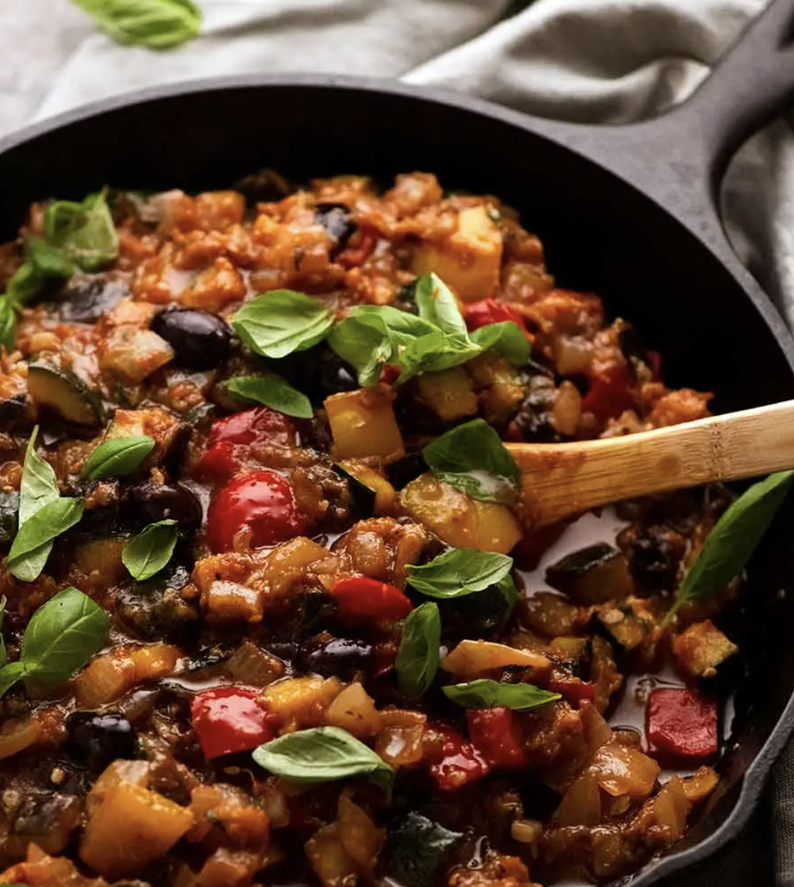

# Pasta and Light

## Potato and Pea Frittata

Time: 30mins, Serves 3

- 6 small potatoes, (3 medium)

- 1 large onion, (2 small) diced

- 75g frozen peas

- 10 large eggs, (16 bantam)

- salt and pepper

- 4 tablespoons freshly grated parmesan

- 3 tablespoons olive oil

- Assorted toppings (ham, blue cheese)

Bring the diced potatoes to the boil in salted water and boil briskly for 5 minutes, then drain, using the water to boil the peas.

Fry the onion until it begins to soften, then add the potatoes and cook for about 10 minutes.

Add the drained peas for the last couple of minutes of cooking. Break the eggs into the bowl, and beat to mix. Season with salt and pepper and add the parmesan. Pour egg mixture into the frying pan; it should still be nice and oily.

Add any other toppings lying around like ham and blue cheese

Then cook over a medium heat for about 8 minutes, or until the frittata is set more or less, save for a still-gooey top.

Then grill on medium until the top is brown

## Pasta Putanesca

Serves 4, Time 30 mins

- 400g spaghetti

**Sauce**

- 4 tablespoons extra virgin olive oil

- 4 cloves garlic chopped

- 1 fresh red chilli, de-seeded and chopped

- 2 dessertspoon chopped fresh basil

- 2 heaped tablespoons of capers

- 2 cans of chopped tinned tomatoes

- 2 rounded tablespoons of tomato purée

- 100g of anchovies,

- 175g pitted black olives (optional) chopped

- Garnish fresh basil chopped lots of freshly grated Parmesan cheese

Heat the oil in a medium saucepan, then add the garlic, chilli and basil and cook these briefly till the garlic is pale gold. Then add all the other sauce ingredients, stir and season with pepper. Turn the heat to low and let the sauce simmer very gently without a lid for 40 minutes, by which time it will have reduced.

When there is 15 mins left for the sauce, put the spaghetti on. When ready, serve with Basil garnish if you want to be fancy, and grated Parmesan to sprinkle over.

## Spaghetti Bolognese

**Serves 3**

- 1 1/2 tbsp olive oil
- 2 garlic cloves , minced
- 1 onion , finely chopped (brown, yellow or white)
- 500g beef mince (ground beef) OR half pork, half beef (Note 1)
- 2 beef stock cubes
- 2 cans tinned tomatoes
- 2 tbsp tomato paste
- 2 tsp white sugar , if needed (Note 3)
- 2 tsp Worcestershire sauce
- 2 dried bay leaves
- 2 sprigs fresh thyme (or 1/2 tsp dried thyme or oregano)
- Salt and pepper

#### TO SERVE

- 400 g / 13 oz spaghetti , dried
- Parmesan cheese and finely chopped parsley (optional)

#### Directions

- Heat oil in a large pot or deep skillet over medium high heat. Add onion and garlic, cook for 3 minutes or until light golden and softened.

- Turn heat up to high and add beef. Cook, breaking it up as your go, until browned.

- Add remaining ingredients except salt and pepper. Stir, bring to a simmer then turn down to medium so it bubbles gently. Cook for 20 – 30 minutes (no lid), adding water if the sauce gets too thick for your taste. Stir occasionally.

- Adjust salt and pepper to taste right at the end. Serve over spaghetti – though if you have the time, I recommend tossing the sauce and pasta per steps below.

## LINGUINE WITH CHILLI, CRAB AND WATERCRESS

**Serves 4**

- 3 cloves garlic, roughly chopped
- 1 scant tablespoon maldon salt
- 1 large red chilli
- 200 grams white crab meat
- 100 grams brown crab meat
- 125 millilitres extra virgin olive oil
- zest and juice of 1 lemon
- 2 packs fresh, or 500g grams dry linguine
- 1 handful watercress (roughly torn)

Put a large pan of water on to boil for the pasta.

In a large pestle and mortar pulverise the peeled garlic cloves with the salt, so that it makes a smooth paste. Then add the chopped and seeded chilli and crush again until you have a gloriously red-tinged mixture. Tip in the crab meat, breaking it up gently with a fork, and pour in the oil. Zest the lemon into the mortar and then add the juice. Mix.

Cook the pasta, reserving some of the water. Pour over the crab sauce, parmesan, and toss the pasta about in it, adding some pasta water if needs be, then throw in the watercress and toss again.

## Carbonara

**Serves 4**

- 3 tablespoons garlic infused olive oil (light if none)
- 2 cloves of garlic (5 if no garlic oil)
- 1 pack of bacon, sliced
- 2 packs of fresh linguine, or 500g dry
- 4 egg and 2 egg yolks
- lots of parmesan

Tip: Put water on, then chop bacon

**Method**

1. Fill a large saucepan with water and bring to the boil
2. Fry bacon until coloured
3. Add garlic and garlic oil and fry until garlic cooked
4. Add drained linguine into the dish and toss well, save some of the water
5. Turn off the heat, add some of the hot water to the egg mixture to temper it, then add it to the pasta. Be **very** careful it isn't too hot that it curdles the egg
6. adding some of the pasta-cooking water (and optional egg), drop by cautious drop, for lubrication as you need it.
7. Mix in parmesan to taste with S&P.
8. Add a sprinkling of roughly scissored parsley

## Creamy Chicken Pasta

##### Serves 4 - 30mins

##### Ingredients

- 30g / 2 tbsp butter
- 2 chicken breasts, cut in half lengthways to make them half as thin
- 120g bacon
- 1/2 tsp each salt and pepper
- 300g dry or 600g fresh fettuccine/linguine
- 2 garlic cloves , minced
- 125ml white wine

##### Sauce

- 200ml chicken stock (1 stock cube)
- 315ml double cream
- 75g parmesan , grated, and some to serve
- 70g baby spinach
- 100g sun dried tomato cut into small strips

##### Directions

- Cut the chicken, and sprinkle with S&P, melt half the butter in a large pan on high heat, and cook chicken each side 2 mins until golden. While chicken is cooking, chop the garlic and tomatoes, and make the stock. Put chicken aside on a plate when cooked, then cook the bacon until slightly crispy, then put with chicken. Take off the heat.

- Put the pasta water on to boil

- In the chicken bacon juices of the pan on medium heat, add the remaining butter, and fry the garlic for 30 seconds, then add the wine until mostly evaporated, stirring to scrape the brown bits off the bottom of the pan. Then add all of the sauce ingredients and simmer for 3-5 mins until it thickens.

- While the sauce is simmering, shred the chicken with 2 forks, and chop bacon into bits.

- Drain the pasta, keeping a mug full, just in case it needs more lubrication.

- Add the pasta, chicken, and bacon to the sauce, and toss well. Add some of the pasta water if more lubrication is needed. Serve with parmesan.

## Lively Prawn & Crab Pasta

##### Serves 4 - 20 mins

##### Ingredients

- 400g dry pene pasta
- 1 brown onion diced
- 6 garlic cloves , minced
- 2 tbsp butter
- ~400g large raw prawns, peeled and cut in half for better distribution (keep the shrimp juice in the tomato can)
- 2 tsp dried basil / Italian mixed herbs

**Sauce:**

- 1 tin (400g) chopped tomatoes
- 1/2 tsp salt
- 1/2 chicken stock cube
- A few shakes of ajinomoto
- 1 tsp freshly-ground black pepper
- Sriracha to taste
- 1/2 tsp granulated sugar

**Finish:**

- 1 tin of crab meat
- A few handfuls of spinach (chopped so it disperses) (optional)
- Grated Parmesan cheese
- Chopped basil

##### Directions

1. Boil the water and put the pasta on for 1 minute less than cooking instructions say so (do next steps while boiling)

2. Heat the butter in a large skillet or pan over medium heat. Add the onion and fry until transparent. Stir in the garlic and fry until fragrant (about 30 seconds), then add in the shrimp with the basil. Sauté shrimp for 3 minutes

3. Add in the sauce ingredients to heat through for another few minutes.

4. Remove the pasta, drain, and save some of the water

5. Then add the crab, and spinach. Continue cooking for a few minutes or until everything is hot. Then add the pasta, and some of the pasta water, stirring until glossy. Add in a generous amount of parmesan and stir once more.

6. Just before serving stir in some chopped basil, keeping some to garnish

## Salmon & Tarragon Risotto

##### Serves 3 - Time 30 mins

##### Ingredients

- 750ml stock (1 cube vegetable and 1 cube fish)
- 2 tbsp sunflower oil
- 1 small fennel bulb, trimmed and finely chopped
- 2 garlic cloves, minced
- 225g risotto rice
- 300ml dry white wine
- 150g frozen petits pois
- Juice of half a lemon
- 2 x 150g salmon fillets, skinned
- 3 tbsp full-fat crème fraîche
- 3 sprigs fresh tarragon, coarsely chopped
- 30g Parmesan, grated, plus extra for sprinkling
- salt and freshly ground black pepper
- Optional: courgettes cut into slices and quartered, or asparagus tips

##### Directions

1. Make stock and pour it into a saucepan and keep warm over a low heat.

2. Pour the oil into a large frying pan over a medium-high heat. Add the fennel and fry for about 4 minutes, or until softened, but not browned, stirring often. Add the garlic and rice and fry for a minute, stirring constantly, until the grains of rice are coated in the oil.

3. Pour the wine into the stock, stir and bring to a gentle simmer. Add a ladleful of the hot stock mixture to the rice and simmer, stirring continuously. Wait until the stock is almost fully absorbed before adding the next ladleful. Continue to add the stock, a ladleful at a time, and cook the risotto for 15–20 minutes, or until you are left with about 250ml stock in the saucepan and the rice is nearly cooked.

4. Add the petits pois and lemon juice. Ladle in some of the remaining stock and keep stirring for a couple of minutes. Add the salmon slices, crème fraîche, tarragon and Parmesan. Stir and continue to cook until the salmon is done to your liking.

5. Season to taste with salt and pepper and serve immediately, sprinkled with extra parmesan and garnished with pea shoots.

## Ratatouille

##### Serves 3 (as main) - 45 mins

##### Ingredients

**Frying Ingredients**

- 1 aubergine, cut into 1.5cm (~450g)
- 1/2 tsp salt for sweating the aubergine
- 6 tbsp extra virgin olive oil
- 1 red and 1 yellow bell pepper, diced into 2cm pieces
- 2 medium courgettes, diced into 1.5cm pieces (~200g each)
- 4 garlic cloves (~3 tsp), finely chopped (not minced as will burn)
- 2 brown onions, chopped coarsely into 1.5cm pieces

**Stewing Ingredients**

- 1 can of chopped tomatoes
- 20 black olives, pitted, halved (about 4 tbsp of pre sliced)
- 2 tsp fresh thyme leaves, chopped (more if can't taste, be generous)
- 1 tsp salt, cooking/kosher salt
- black pepper
- 1 tbsp balsamic vinegar
- 1 tbsp tomato paste
- 1 tsp white sugar
- 1 tsp sweet paprika?
- 1/4 tsp oregano?
- For serving consider the following: rustic bread / fried egg / fish

##### Directions

1. Chop and then sweat the aubergine by placing it in a colander and sprinkling with the half tsp of salt. This will soften the flesh, allowing it to cook faster, and absorb less oil)

2. Chop all of the other frying ingredients

3. Heat 2 tbsp oil in a large skillet over medium high heat (8). Add the aubergine and courgette, and cook for 4 minutes, stirring occasionally, trying to get a bit of colour on the vegetables. Transfer to a large pot (**important** as otherwise won't stew properly).

4. Add another 1 tbsp of olive oil and cook the peppers with a pinch of salt for 3 minutes. Add to pot.

5. Reduce to a medium heat, add another 1 tbsp olive oil, then add the onion with a pinch of the salt, cooking it for 2 minutes, then add the garlic and cook for a further minute.

6. Add all the stewing ingredients into the large pot and mix. Once the mixture is hot, reduce heat to a low simmer, and cook for 20 – 25 minutes with the pot lid off, stirring every now and then, until all the vegetables are cooked through and the liquid has reduced. The mixture should be thick enough so you can pile it on a plate (ie. not watery), but still very moist and juicy.

7. Once stewed, taste and add more salt if needed. Stir through basil then serve immediately, drizzled with extra virgin olive oil and a sprinkle of extra basil on top, if desired

## Creamy Tuna Pasta Bake

#### Serves 4 - 30 mins

- 400g dried pasta

- 1 tbsp vegetable oil

- 1 onion, diced

- 250g mushrooms, sliced and halved

- 2 cloves garlic, finely chopped

- 800g (2 tins) tinned chopped tomatoes

- 1 tsp salt, 1/2 tsp pepper, 1tsp sugar

- 2 tbsp tomato puree

- Sriracha to taste

- 1 tsp dried oregano / Italian mixed herbs

- 100g (1/2 tin) sweetcorn

- 300g (2 tins) canned tuna

- 120ml double cream

- 100g cheddar cheese - grated

- Panko breadcrumbs

- Chopped parsley / basil to garnish

#### Directions

1. Prepare the onion, mushrooms, and garlic, and grate the cheese.

2. In a 30cm stainless steel pan fry the onion on medium-high heat for 2-3 minutes.

3. While frying, open a can of tomatoes and add the salt, pepper, sugar, tomato puree, sriracha, and herbs so they are ready to add. Put the pasta water on to boil.

4. When the onion is done, add the mushrooms and garlic and fry for another 2-3 minutes.

5. Add the pasta to the water, and set a timer for 3 minutes less than the pasta's directions.

6. Turn the heat on the pan down a touch to medium and add the tomato mix, and simmer it until the pasta is done. Drain the pasta, and then preheat the oven on fan grill at medium low (door closed).

7. When the pasta is done, turn the pan down to medium low and mix in the sweetcorn, tuna, cream, and some cheese, simmer for another minute or two, and then add the pasta, mixing it in well.

8. Sprinkle the cheese on top, and panko on top of that, then put the pan in the oven under the grill. Grill until brown with the door closed.

9. Garnish with the chopped parsley / basil and serve.
