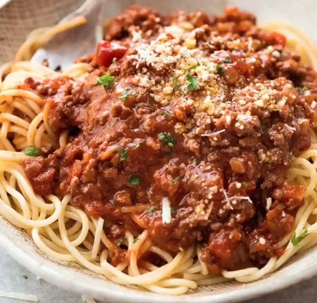
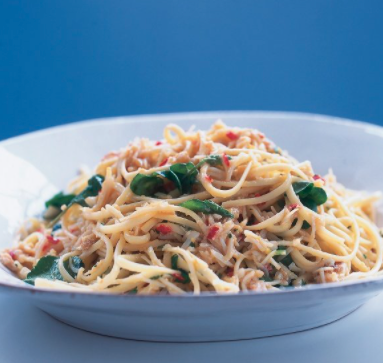
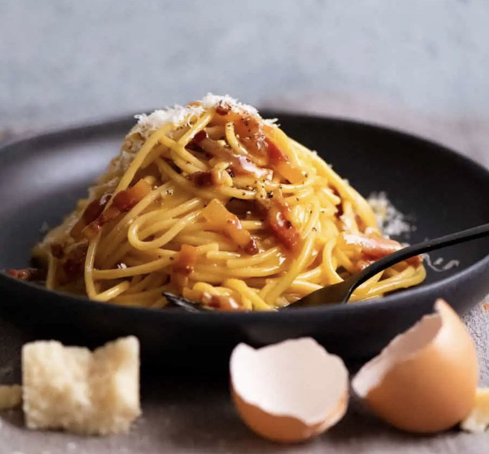
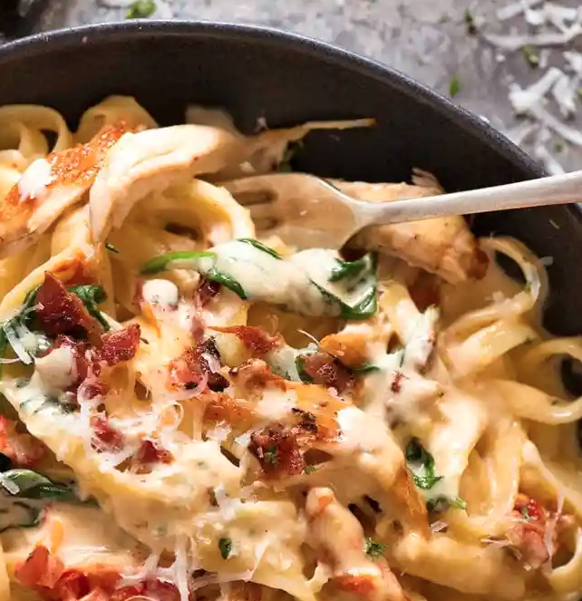
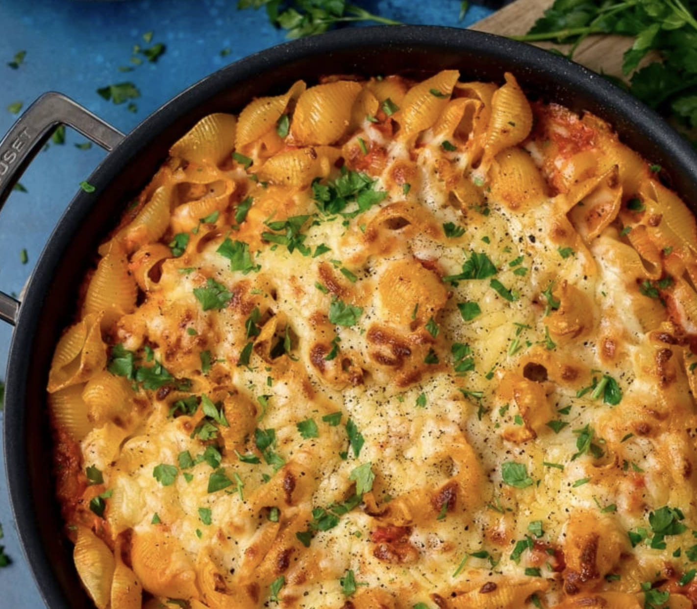
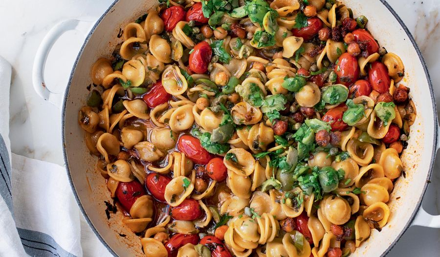
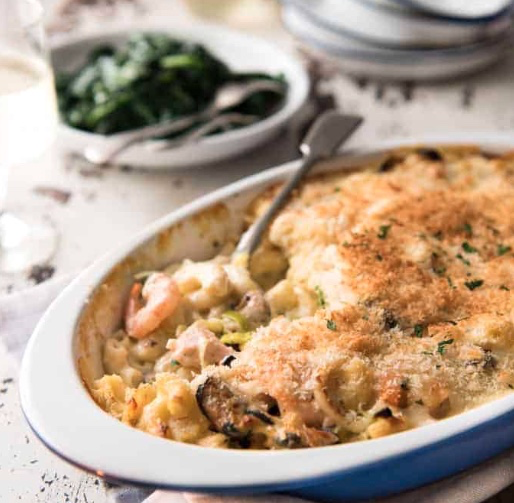

# Pasta and Light

## Pasta Putanesca

#### Serves 4 - 30 mins

- 400g spaghetti

**Sauce**

- 4 tablespoons extra virgin olive oil

- 4 cloves garlic chopped

- 1/4 tsp chilli flakes / 1 fresh red chilli, de-seeded and chopped

- 2 tbsp fresh basil, chopped

- 2 heaped tablespoons of capers

- 2 x 400g tins of chopped tinned tomatoes

- 2 rounded tablespoons of tomato purée

- 100g of anchovies, (a jar / tin)

- 175g pitted black olives (optional) chopped

- Garnish fresh basil chopped lots of freshly grated Parmesan cheese

Heat the oil in a medium saucepan, then add the garlic, chilli and basil and cook these briefly till the garlic is pale gold. Then add all the other sauce ingredients, stir and season with pepper. Turn the heat to low and let the sauce simmer very gently without a lid for 40 minutes, by which time it will have reduced.

When there is 15 mins left for the sauce, put the spaghetti on. When ready, serve with Basil garnish if you want to be fancy, and grated Parmesan to sprinkle over.

## Spaghetti Bolognese

#### Serves 3 - 1 hr

- 1 1/2 tbsp olive oil
- 2 garlic cloves , minced
- 1 onion , finely chopped (brown, yellow or white)
- 500g beef mince (ground beef) OR half pork, half beef (Note 1)
- 125ml (1/2 cup) of red wine
- 2 beef stock cubes
- 2 cans tinned tomatoes
- 2 tbsp tomato paste
- 2 tsp white sugar , if needed (Note 3)
- 2 tsp Worcestershire sauce
- 2 dried bay leaves
- 2 sprigs fresh thyme (or 1/2 tsp dried thyme or oregano)
- 1/2 tsp smoked paprika
- 1/2 tsp chilli flakes
- 3/4 tsp salt
- Good grind of pepper

#### TO SERVE

- 400 g / 13 oz spaghetti , dried
- Parmesan cheese and finely chopped parsley (optional)

#### Directions

- Heat oil in a large pot or deep skillet over medium high heat. Add onion and garlic, cook for 3 minutes or until light golden and softened.

- Turn heat up to high and add beef. Cook, breaking it up as your go, until browned.

- Add remaining ingredients except salt and pepper. Stir, bring to a simmer then turn down to medium so it bubbles gently. Cook for 20 – 30 minutes (no lid), adding water if the sauce gets too thick for your taste. Stir occasionally.

- Adjust salt and pepper to taste right at the end. Serve over spaghetti – though if you have the time, I recommend tossing the sauce and pasta per steps below.

## LINGUINE WITH CHILLI, CRAB AND WATERCRESS

**Serves 4**

- 3 cloves garlic, roughly chopped
- 1 scant tablespoon maldon salt
- 1 large red chilli
- 200 grams white crab meat (do not use canned)
- 100 grams brown crab meat (do not use canned)
- 125 millilitres extra virgin olive oil
- zest and juice of 1 lemon
- 2 packs fresh, or 500g grams dry linguine
- 1 handful watercress (roughly torn)

Put a large pan of water on to boil for the pasta.

In a large pestle and mortar pulverise the peeled garlic cloves with the salt, so that it makes a smooth paste. Then add the chopped and seeded chilli and crush again until you have a gloriously red-tinged mixture. Tip in the crab meat, breaking it up gently with a fork, and pour in the oil. Zest the lemon into the mortar and then add the juice. Mix.

Cook the pasta, reserving some of the water. Pour over the crab sauce, parmesan, and toss the pasta about in it, adding some pasta water if needs be, then throw in the watercress and toss again.

## Carbonara

**Serves 3**

- 300g of streaky bacon, or 175g of guanciale or pancetta if you have it
- 3 garlic cloves, minced / 1 tsp garlic paste
- 2 large eggs and 2 egg yolks
- 100g pecorino
- 1/2 tsp black pepper
- 400g spaghetti

**Method**

1. Place the eggs and yolks in a large bowl and whisk to combine, then grate and stir in the cheese and pepper.

2. Put 2 litres of water on to boil with 1/2 tbsp of salt, and chop the guanciale.

3. Place guanciale in a cool non stick pan and bring up to medium high heat. Cook for 4 to 5 minutes until golden. If using bacon, add a touch of oil. Turn off the heat and add the garlic, stirring to combine.

4. While the guanciale is frying, put on the pasta, and once done, scoop out 1 cup of pasta cooking water, then drain the pasta, letting it sit for 30 secs so it's not too hot. Add some of the pasta water to the sauce mix to temper it (makes it less likely to curdle)

5. Tip the pasta into the pan and mix to coat in the guanciale / garlic fat. Quickly transfer the pasta to the large bowl with the sauce mix, along with 1/2 a cup of the pasta water (do not transfer the mix to the pan as it will likely be too hot and scramble). Stir vigorously using the handle of a wooden spoon for 1 minute and watch as the sauce transforms from watery to creamy. Add more pasta water if required and check for seasoning.

6. Serve immediately, garnished with a little extra parmigiana reggiano, some pepper, and finely chopped parsley.

## Creamy Chicken Pasta

##### Serves 4 - 30mins

##### Ingredients

- 15g / 1 tbsp butter
- 2 chicken breasts, chopped into small pieces
- 120g smoked streaky bacon, chopped into small pieces
- 300g dry or 600g fresh fettuccine/linguine
- 2 garlic cloves, minced
- 125ml white wine

##### Sauce

- 200ml chicken stock (1 stock cube)
- 315ml double cream
- 75g parmesan, grated
- 1/2 tsp salt
- 1/3 tsp pepper
- 70g baby spinach
- 100g sun dried tomato cut into small strips

##### Directions

1. Chop the chicken, melt half the butter in a large stainless steel pan (needed to develop a fond) on high heat, and cook chicken until cooked through. While chicken is cooking, chop the bacon, then when the chicken is done, put it aside on a plate, cook the bacon until crispy, and put that with the chicken. 

2. While the bacon is cooking, put the pasta water on to boil, chop the garlic and tomatoes, make the stock, and grate the parmesan.

3. Put the pasta on.

4. When the bacon is done, in the chicken bacon juices of the pan on medium heat, add the garlic and fry for 30 seconds, then remove the bacon to the chicken plate, and add the wine until mostly evaporated, stirring to scrape the brown bits off the bottom of the pan. Then add all of the sauce ingredients apart from the baby spinach and tomato, mix until incorporated, then add the chicken, bacon, baby spinach and tomato.

5. Drain the pasta, keeping a mug full, just in case it needs more lubrication. Add it to the sauce and mix in.

## Lively Prawn & Crab Pasta

##### Serves 4 - 20 mins

##### Ingredients

- 400g dry pene pasta
- 1 brown onion diced
- 6 garlic cloves , minced
- 2 tbsp butter
- ~400g large raw prawns, peeled and cut in half for better distribution (keep the shrimp juice in the tomato can)
- 2 tsp dried basil / Italian mixed herbs

**Sauce:**

- 1 tin (400g) chopped tomatoes
- 1/2 tsp salt
- 1/2 chicken stock cube
- A few shakes of ajinomoto
- 1 tsp freshly-ground black pepper
- Sriracha to taste
- 1/2 tsp granulated sugar

**Finish:**

- 1 tin of crab meat
- A few handfuls of spinach (chopped so it disperses) (optional)
- Grated Parmesan cheese
- Chopped basil

##### Directions

1. Boil the water and put the pasta on for 1 minute less than cooking instructions say so (do next steps while boiling)

2. Heat the butter in a large skillet or pan over medium heat. Add the onion and fry until transparent. Stir in the garlic and fry until fragrant (about 30 seconds), then add in the shrimp with the basil. Sauté shrimp for 3 minutes

3. Add in the sauce ingredients to heat through for another few minutes.

4. Remove the pasta, drain, and save some of the water

5. Then add the crab, and spinach. Continue cooking for a few minutes or until everything is hot. Then add the pasta, and some of the pasta water, stirring until glossy. Add in a generous amount of parmesan and stir once more.

6. Just before serving stir in some chopped basil, keeping some to garnish

## Creamy Tuna Pasta Bake

#### Serves 4 - 30 mins

- 400g dried pasta

- 1 tbsp vegetable oil

- 1 onion, diced

- 250g mushrooms, sliced and halved

- 2 cloves garlic, finely chopped

- 800g (2 tins) tinned chopped tomatoes

- 1 tsp salt, 1/2 tsp pepper, 1tsp sugar

- 2 tbsp tomato puree

- Sriracha to taste

- 1 tsp dried oregano / Italian mixed herbs

- 100g (1/2 tin) sweetcorn

- 300g (2 tins) canned tuna

- 120ml double cream

- 100g cheddar cheese - grated

- Panko breadcrumbs

- Chopped parsley / basil to garnish

#### Directions

1. Prepare the onion, mushrooms, and garlic, and grate the cheese.

2. In a 30cm stainless steel pan fry the onion on medium-high heat for 2-3 minutes.

3. While frying, open a can of tomatoes and add the salt, pepper, sugar, tomato puree, sriracha, and herbs so they are ready to add. Put the pasta water on to boil.

4. When the onion is done, add the mushrooms and garlic and fry for another 2-3 minutes.

5. Add the pasta to the water, and set a timer for 3 minutes less than the pasta's directions.

6. Turn the heat on the pan down a touch to medium and add the tomato mix, and simmer it until the pasta is done. Drain the pasta, and then preheat the oven on fan grill at medium low (door closed).

7. When the pasta is done, turn the pan down to medium low and mix in the sweetcorn, tuna, cream, and some cheese, simmer for another minute or two, and then add the pasta, mixing it in well.

8. Sprinkle the cheese on top, and panko on top of that, then put the pan in the oven under the grill. Grill until brown with the door closed.

9. Garnish with the chopped parsley / basil and serve.

## One-pot Orecchiette Puttanesca

#### Serves 4 - 30 mins

- 50ml olive oil, plus 2 tbsp to serve

- 6 garlic cloves, crushed

- 1 x 400g tin of chickpeas, drained well and patted dry (240g)

- 2 tsp hot smoked paprika

- 2 tsp ground cumin

- ¾ tbsp tomato paste

- 40g parsley, roughly chopped

- 2 tsp lemon zest

- 3 tbsp baby capers

- 125g Nocellara olives (or another green olive), pitted and roughly chopped in half (80g)

- 250g small, sweet cherry tomatoes

- 2 tsp caster sugar

- ½ tbsp caraway seeds, lightly toasted and crushed

- 250g dried orecchiette

- 500ml vegetable or chicken stock

- salt and black pepper

#### Directions

1. Put the first six ingredients (to fry) and a half teaspoon of salt into a large sauté pan, for which you have a lid, and place on a medium-high heat. Fry for 12 minutes, stirring every now and then, until the chickpeas are slightly crisp – you may need to turn the heat down a little if they start to colour too much. Remove one-third of the chickpeas and set aside to use as a garnish.

2. In a small bowl, combine the parsley, lemon zest, capers and olives. Add two-thirds of this parsley mixture to the sauté pan, along with the cherry tomatoes, sugar and caraway seeds, and cook for 2 minutes on a medium high heat, stirring often.

3. Add the pasta, stock, ¾ teaspoon of salt and 200ml of water, and bring to a simmer. Reduce the heat to medium, cover with the lid and cook for 12–14 minutes, or until the pasta is al dente.

4. Stir in the remaining parsley mixture, drizzle with the remaining 2 tablespoons of oil and garnish with the reserved chickpeas and a good grind of pepper.

## Seafood Gratin Pasta Bake

#### Serves 4 - 1 hr

**Fry**

- 300g pasta (macaroni is fine)
- 1.5 tbsp olive oil
- ~500g of mixed seafood: salmon, smoked haddock, prawns etc. Small prawns preferred as they disperse better. I usually use 400g bag of mixed fish, and 250g bag of small prawns 
- 3 leeks, sliced into semi-circles
- 3 garlic cloves, minced

**White Sauce**

- 50g butter
- 3 tbsp flour
- 2.5 cups milk
- 1 chicken stock cube (could try 1 cube of fish stock as well?)
- 0.5 cups of double cream
- 1/3 tsp Salt and 1/3 tsp Pepper

**Topping**

- Panko breadcrumbs
- Grated parmesan cheese

#### Directions

1. Chop the the leeks and drain the seafood. Put the pasta water on to boil with 1/2 a tbsp of salt.

2. Heat 1 tbsp of oil in a non stick pan over high heat, and sear the seafood for 30 seconds on each side, put aside in the baking dish, then fry the leeks and garlic until they are soft (3-5 mins), and put them with the seafood in the baking dish

3. Put the pasta on when the water is boiling, and cook it for 4 minutes less than the instructions say. Once it is done, add it to the baking dish.

4. Preheat the oven to 180c.

5. Melt the butter in the pan on low heat, then add the flour, cooking for 1 minute. Add the milk slowly to make the white sauce, then add the stock cube crumbled.  Cook for around 5 minutes, stirring regularly until it thickens (coats the back of a spoon). Add the cream, check for seasoning and add the salt and pepper, then pour it into the baking dish.

6. Mix everything together, and top with the panko and then parmesan.

7. Bake for 20 minutes, then finish in the grill.

## Meatless Bolognaise

#### Serves 6-8 - 1.5 hrs

- 3 carrots, peeled and chopped into large chunks (250g)
- 2 onions, peeled and chopped into quarters (300g)
- 4 garlic cloves, crushed
- 300g oyster mushrooms, roughly chopped
- 40g dried porcini
- 1 tin of chopped tomatoes (350g)
- 120ml olive oil
- 70g white miso paste
- 40g rose harissa (adjust according to the brand you are using)
- 4 tbsp tomato paste
- 90ml soy sauce
- 2 tsp cumin powder
- 180g dried brown or green lentils
- 100g pearl barley
- 1 litre vegetable stock (about 4 cubes)
- 160g coconut cream
- 100ml red wine
- salt and black pepper
- Fresh tagliatelle pasta

#### Directions

1. Preheat the oven to 190°C fan.

2. Put the carrot, onion, and garlic into a food processor and pulse until everything is very finely chopped (similar in size to bits of mince) and tip out into a large, 36cm x 28cm (it's very important that it's this size of larger as it allows proper browning) high-sided baking tray. Then do the same for the oyster mushrooms and dried porcini.

3. Add to the tray the chopped tomatoes, oil, miso, harissa, tomato paste, soy sauce and cumin, and mix very well. Bake for 20 minutes, take out and stir, then bake for another 20 minutes until browned around the edges and bubbling.

4. Reduce the heat to 180°C fan.

5. Add all the remaining ingredients to the tray, along with 150ml of water, 1/3 teaspoon of salt and a very generous grind of black pepper. Stir very well, scraping the crispy sides and bottom with a spatula. Cover tightly with foil and bake for another 40 minutes. Remove the foil and bake for a final 5 minutes. Set aside to rest for 15 minutes for the sauce to be absorbed a little before serving. While resting, cook the fresh pasta.

## Tomato, Bacon & Butter Fusilli

#### Serves 3 - 30 mins

- 400g fusilli pasta
- 150g (half a pack) of smoked streaky bacon, finely sliced
- 1 can tinned tomatoes
- 1/2 (3/4?) tsp sugar
- 1/2 tsp salt
- 1 tsp oregano
- 1 tsp smoked paprika
- 1/2 tsp chilli flakes?
- 1/2 tsp black pepper, freshly cracked
- 1 tsp garlic paste / 4 cloves minced
- 45g butter
- Cheese and chopped basil to serve

#### Directions

1. Finely chop the bacon and add it to a cold non stick pan on medium high heat with a tbsp of oil, making sure to break it up evenly. Fry until crispy.

2. Put the water on to boil, and open the can of tomatoes, adding the sugar, salt, oregano, paprika, chilli flakes, and garlic paste to it, so it's ready to pour into the pan.

3. If using minced garlic, just before the bacon is crispy, lower the heat and add it to the pan, cooking it until translucent. Add the tomato mix and butter, and simmer covered on low heat until the pasta is done.

4. When the pasta is done, reserve 250ml of pasta water, drain the pasta, and then add it to the tomato sauce, stirring well. Judiciously add the pasta water, to add silkiness (usually only need 125ml). Mix well again and serve with the cheese and basil.

## Garlicy Mac 'n' Cheese

#### Serves 4 - 30 mins

- 50g butter

- 30g flour

- 1 tsp minced garlic (tube garlic is fine)

- 500ml milk

- 750ml hot water

- 1 tsp salt

- 1/4 tsp pepper

- 1 tsp garlic powder

- 1 tsp english mustard / 1/2 tsp mustard powder

- 300g macaroni pasta

- 250g grated cheese - 1 Tesco pre-grated bag is good

- Optional: 1 cup of peas / 1/2 head broccoli

**Topping**

- 30g panko breadcrumbs

- 2 tsp dried parsley

- 2 tbsp extra virgin olive oil

- 1/4 tsp salt

#### Directions

1. Melt the butter in a casserole pot, add the flour (and garlic if raw) and cook it for 1 minute. Add the milk slowly, stirring to avoid lumps, then add the garlic (if tube), salt, pepper, garlic powder, mustard, and bring the mixture up to temperature, but not quite boiling, then add the pasta and set a timer for 8 mins.

2. While the pasta cooks, make the topping, and put the broccoli on if adding. Once the pasta is done, add the cheese, stir until melted, then add the peas / broccoli. Check the pasta is pretty much cooked, then add the topping, and put it under the grill until ready.

## Vodka Pasta

#### Serves 4 - 30 mins

- 500g penne or fuselli
- 1/2 tbsp salt, for pasta water
- 1.5 tbsp olive oil
- 1 onion, finely diced
- 2 garlic cloves, minced
- 80ml vodka
- 1/2 cup tomato puree
- 300ml double cream
- 1/2 tsp chilli flakes
- 3/4 tsp salt
- 1/3 tsp black pepper
- 1 cup of peas
- 1 cup of sweetcorn
- 50g freshly grated parmesan, plus more for serving
- 1 cup pasta cooking water
- 2 tsp parsley to garnish (optional)
- Garlic bread to serve

#### Directions

1. Put the pasta water on to boil, and then pasta in when it's boiling. Put garlic bread in oven.

2. Sauté garlic and onion until translucent, add and cook off tomato paste for 2 mins, add vodka and cook off the alcohol.

3. Lower heat and add cream, chilli flakes, S&P, simmer a few mins, add in the peas and sweetcorn and bring back to simmer, stir in parmesan at end. Toss with pasta and 1/2 cup pasta water, adding more if needed. Serve with garlic bread.
