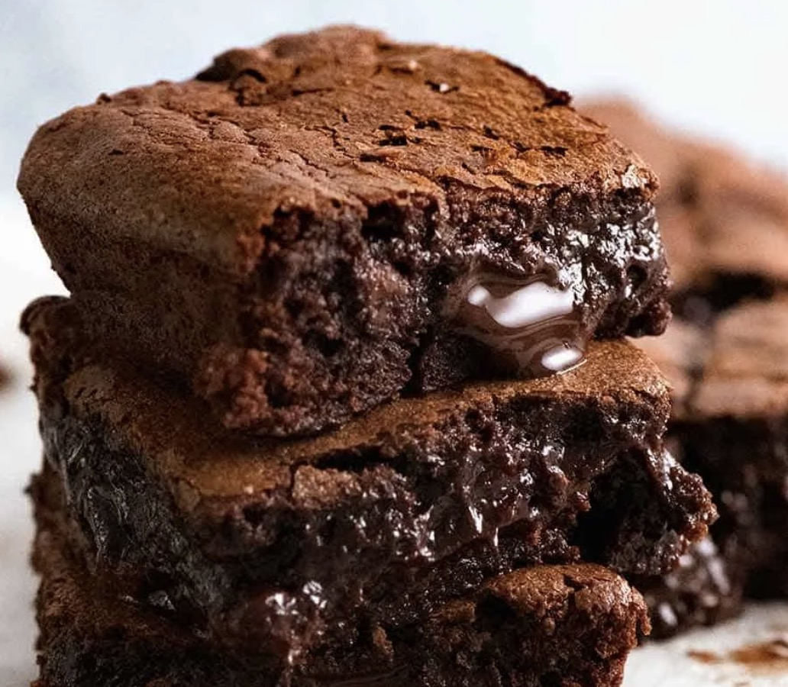

# Pudding

## White Chocolate & Raspberry Cheese

#### Serves 10 - 1 hr

**Biscuit Base**

- 300 g digestives
- 150 g unsalted butter

**Cheesecake Filling**

- 250 g white chocolate
- 500 g full fat cream cheese
- 100 g icing sugar
- 1 tsp vanilla extract
- 300 ml double cream
- 250 g fresh raspberries

**Decoration**

- 2 tbsp icing sugar
- 100 g white chocolate
- 200g fresh raspberries

#### Directions

**For the Biscuit Base**

- Blitz the biscuits in a food processor to a small crumb, and add the melted butter – then pulse in the food processor a few times until the mixture is combined.

- Tip the biscuit mixture into a 8″/20cm deep springform tin and press down firmly (I use a flat potato masher with small holes).

#### For the Cheesecake Filling

- Melt the chocolate in a bowl in the microwave on short bursts until full melted (use the defrost setting) – leave to cool whilst doing the rest.

- Clean the food processor, and change it to use the dough hook instead of a blade. Add in the cream cheese, icing sugar and vanilla, and process until smooth. Pour in the double cream and process on low in 5-10 second bursts until thick! Test with a teaspoon that it doesn't easily run off it.

- Once completed, pour in the cooled white chocolate, and pulse briefly to combine, and then fold through the fresh raspberries (do not pulse or the mixture will turn pink).

- Spread the mix over the biscuit base, smooth over, then drizzle over the melted white chocolate, add the fresh raspberries in concentric circles, then dust with icing sugar. (I don't do the whipped cream).

- Chill in the fridge for at least an hour, preferably overnight so it will definitely be set.

## Nutella Ice Cream

#### Serves 4 - Overnight

- 600ml double cream

- 1 tin condensed milk

- 1 300ml jar of Nutella

#### Directions

- Mix together in food processor with dough hook then pour out into a container and freeze overnight.

## Chocolate Brownies

#### Serves 10 - 1 hr

- 200g salted butter
- 400g dark chocolate
- 175g brown sugar
- 3 eggs
- 1 tsp vanilla extract
- 75g plain flour
- 30g cocoa powder

#### Directions

1. Preheat oven to 180°C/160°C fan.

2. Break up half of the chocolate - 200g - and place it in a heatproof bowl (my mixing bowl works fine), in the microwave for 30 second bursts (takes me 4) until melted, stirring after each burst.

3. While melting, chop up the rest of the chocolate into small chunks by chopping the bar diagonally.

4. Add the sugar and vanilla, mix to a paste, then add eggs and mix well until smooth and molten, then add the flour, cocoa and stir until smooth. Stir in chopped chocolate, pour into pan lined with banking paper.

5. Bake 28 minutes, then check with a knife, and if it needs more do so in two minute intervals.

6. Rest for 10 minutes before lifting out of the pan. Allow to cool for at least 20 minutes before cutting.
