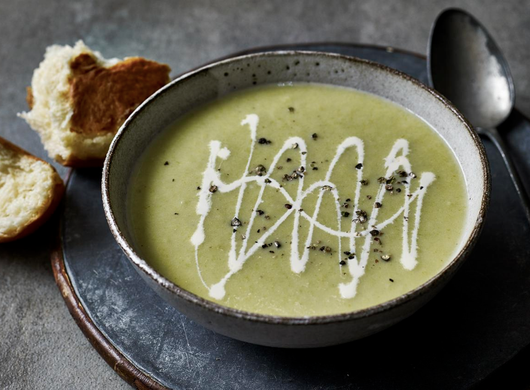

# Soups

## Smoked Haddock Chowder

#### Serves 4  - 30 mins

- 25g butter

- 2 leeks, sliced into half moons approx 1cm thick

- 2 tbsp plain flour

- 500ml fish stock

- 600ml full-fat milk

- 50-100ml double cream (optional)

- 2 carrots, peeled and cut into quarters

- 2 potatoes, peeled and cut into small chunks

- 1 can of sweetcorn (drained)

- Pack of asparagus (chopped into small sections) / green beans (chopped into 3)

- 250-500g smoked haddock, skin removed and cut into chunks

- 3/4 tsp salt

- 1/4 tsp black pepper

- 1 tbsp snipped chives to garnish

- Sour dough / crusty bread to serve

#### Directions

1. Melt the butter in a saucepan, chop the leeks, add them and stir over a high heat for 2-3 minutes. Sprinkle in the flour and cook for 30 seconds, stirring. Add the stock, then the milk, stir, and bring to the boil.
2. Add the carrots, potato, green beans (if using), and sweetcorn, then season with salt and pepper. Bring back up to the boil, then cover with a lid, reduce the heat to low and simmer for 10 mins, stirring occasionally, until the vegetables are tender. If using, add the asparagus, salt and pepper, and simmer for a further 3 mins.
3. Add the haddock and stir for 4 minutes until just cooked. Add the double cream,  stir, and serve with chives on top and sour dough bread on the side.

## Leek and Potato

#### Serves 4 - 30 mins

- 2 tbsp (30g) butter
- 2 garlic cloves, large, finely minced
- 3 leeks, sliced into 2cm thick half moons
- 1 kg potatoes (Sebago/Russet/Maris Piper), peeled a diced into 2.5cm cubes
- 1 litre (4 cups) chicken stock (3 cubes)
- 125 ml (1/2 cup) double cream
- 0.5-1 tsp salt
- 1/2 tsp black pepper
- Optional: grated parmesan
- Optional garnish: chives, finely chopped; extra cream; croutons / crusty bread

#### Directions

1. Chop the leeks.

2. Melt butter in a large pot over medium heat. Add garlic and leek and sauté with the lid on, stirring occasionally for 7 minutes until soft. Meanwhile put the stock water on to boil, and peel the potatoes.

3. Add potatoes and stock. Turn heat up and bring to simmer, then place lid on and lower heat so it's simmering gently. Simmer for 25 minutes or until potato is very soft and almost falling apart. 

4. Turn the stove off and half puree with a stick blender to desired chunkiness.

5. Add the salt, pepper, maybe some aji no moto, optional parmesan, and then stir through cream.

6. Serve, drizzled with cream and sprinkled with chives, extra pepper ,and croutons.

## Cream of Vegetable Noodle Soup

#### Serves 4 - 40 mins

- 50g butter
- 2 garlic cloves, minced, or 1 tsp paste
- 1 onion, finely chopped
- 2 carrots, diced
- 2 celery sticks, diced
- 1 red bell pepper, diced
- 70g flour
- 500 ml chicken stock
- 4 tsp vegetable stock powder in 500ml water
- 750 ml milk
- 1 tsp thyme
- 1/4 tsp salt
- 1/3 tsp white pepper
- 1 cup sweetcorn
- 1 cup frozen peas
- 200g linguine, broken into 4 pieces

#### Directions

1. Melt the butter in a large pot over medium high heat. Add the garlic and onion, cook for 2 minutes. Add the carrot and celery, cook for a further 2 minutes. Add the pepper and cook for another 1 minute. Add the flour and mix, cook for 1 minute.
2. Add about half the chicken stock and mix. Once the flour is incorporated into the stock, add remaining stock, vegetable stock, milk, dried thyme, salt, pepper, corn and peas.
3. Bring to simmer then lower heat slightly.
4. Break the pasta into 4 pieces and add into pot. Cook for 10 minutes or until the pasta is just cooked. If the soup gets too thick, add some more water 1 cup at a time.
