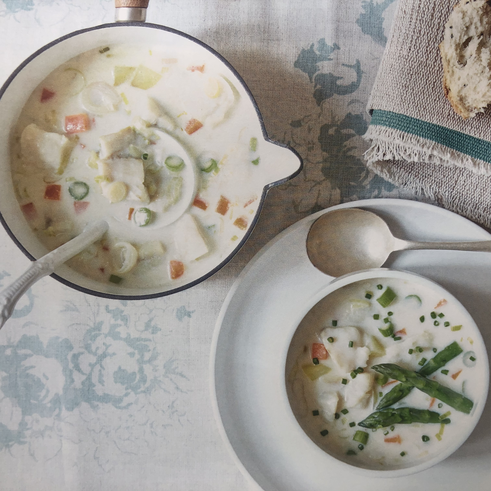

# Soups

## Smoked Haddock Chowder

#### SERVES 4  - 30 mins

- 18 fine asparagus spears (optional)

- 25g butter

- 2 small leeks, sliced into half moons approx 1cm thick

- 2 tbsp plain flour

- 450ml fish stock

- 600ml full-fat milk

- 50-100ml double cream (optional)

- 2 small carrots, peeled and cut into small chunks

- 1 large potato, peeled and cut into small chunks

- 1 can of sweetcorn (drained)

- 500g smoked haddock, skin removed and cut into chunks

- Salt (~1/2 tsp) and freshly ground black pepper

- FOR THE GARNISH 1 tbsp snipped chives

#### Directions

1. Cut off the tips of the asparagus spears, about chop the rest of the 5cm (2in) long, and finely spears. Chop all the other vegetables.
2. Melt the butter in a saucepan, add the leeks and stir over a high heat for 2-3 minutes. Sprinkle in the flour and cook for 30 seconds, stirring. Blend in first the stock and then the milk, stirring until smooth, and bring to the boil.
3. Add the carrots, potato, and sweetcorn, then season with salt and pepper. Bring back up to the boil, then cover with a lid, reduce the heat to low and simmer for 15 minutes, stirring occasionally, until the vegetables are tender.
4. Optionally: Meanwhile, cook the asparagus (the tips and chopped pieces) in boiling salted water for 2 minutes, drain and refresh in cold water.
5. Add the haddock to the hot soup and stir for 3-4 minutes until just cooked (don't over-stir as it will break up the chunks). Add the (optional) chopped asparagus and (optional) double cream, saving the tips for garnishing later, and stir.
6. Spoon into warmed bowls, top with the chopped chives and 3 asparagus tips per bowl. Serve with crusty bread.
