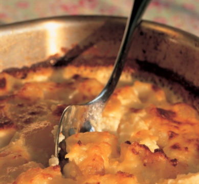
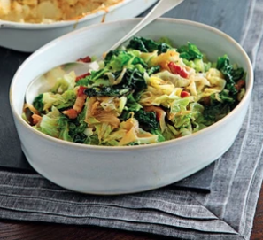
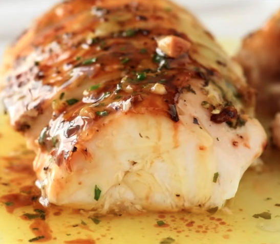
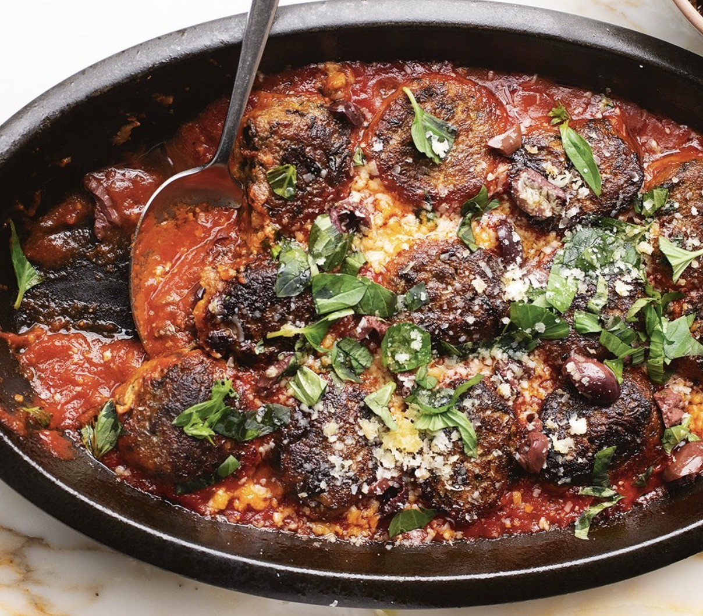

# Sunday

## Slow Roast Pork, Potato Gratin, and Bacon Cabbage

### Slow Roast Pork

Untested: [Easy Fall-Apart Roasted Pork Shoulder Recipe &mdash; The Mom 100](https://themom100.com/recipe/fall-apart-roasted-pork-shoulder-rosemary-mustard-garlic/)

### Potato Gratin

**Serves 5**

- 2 kilograms floury potatoes (such as King Edward or Maris Piper) peeled and cut into 1cm thick slices
- 600 millilitres full fat milk
- 600 millilitres double cream
- 1 onion (peeled)
- 2 cloves garlic (minced)
- 1 tablespoon soft sea salt flakes
- approx. 50 grams butter

#### Method

1. Preheat the oven to 240°C/220°C Fan/gas mark 8/450ºF.
2. Put the sliced potatoes into a large saucepan with the milk, cream, onion, minced garlic and salt. Bring to the boil and cook at a robust simmer or gentle boil (however you like to think of it) until verging on tender, but not dissolving into mush.
3. Use some of the butter to grease a large roasting tin (37 x 30cm / 15 x 12 inches) and then, after removing the onion, pour the almost sludgy milk and potato mixture into it. Dot with remaining butter and cook in the oven for 15 minutes or until the potato is bubbly and browned on top.

### Bacon Cabbage

**Serves 5**

- 200g smoked lardon, or diced bacon
- 50g butter
- 1 onion, diced
- 2 garlic cloves, minced 
- 1 cabbage, cut in half, then down the middle, and across in 1cm strips 
- 150ml boiling water
- 1 tbsp soy sauce

Fry the bacon and cook on medium-high until browned. Add the onion, garlic, and butter, cooking for a further 2-3 mins until the onion softens.

Stir in the cabbage, boiling water, and soy sauce to deglaze the bacon fond. Cook for 2 mins over a medium heat until wilted, then cover, turn the heat to low and cook for another 5 mins.

Uncover and stir well; the cabbage should have a little colour. If not, increase the heat and cook for a few moments more. Season to taste.

## Slow-roast shoulder of lamb boulangère

##### Serves 5 - 3hrs+

##### Ingredients

- Salt & freshly ground black pepper

- 1.3 - 1.6kg floury potatoes such as Maris Piper, **not** peeled, cut into 5mm slices (do not cut in half, cut whole rings of the potato)

- 2 onions, peeled, halved, and sliced

- 1 sprig of fresh rosemary chopped (sub 1 tsp dried), and 3 sprigs for the lamb

- 2.7 - 3.2kg shoulder of lamb, on the bone, (knuckle left on)

- 5-6 anchovies

- 4 cloves of garlic, quartered lengthways into small spears

- 2 cloves of garlic finely chopped

- a large knob of butter, melted

- 300ml lamb or chicken stock (2 cubes)

- Greens (peas / broccoli etc)

- Beef gravy granules and mint sauce and/or redcurrant jelly to serve

##### Directions

- Preheat the oven to 200°C. Butter a roasting tin or baking dish large enough for the lamb to sit happily nestled amongst the potatoes.

- Chop the potatoes (cut by hand as food processor usually not big enough for entire potato), onions, 2 cloves of garlic and sprig of rosemary, then pour them into the buttered baking dish, season them with ½ a teaspoon of salt and some black pepper and mix well.

- Stab the lamb on both sides at random intervals every 2cm and stuff with bits of garlic, roughly torn anchovy, and sections of rosemary sprig.

- Nestle the lamb into the potatoes. Pour on the melted butter and season with salt and freshly ground black pepper.

- Pour the hot stock into the dish and cook for an hour.

- After the first hour, take it out of the oven, put the lamb on the plate, and turn over the potatoes to get them all moist again and prevent them from trying out too early. If they seem to have absorbed all the liquid, make 150ml more stock (1/2 a cube) and add. Nestle the lamb back in and cook for another hour.

- After the second hour, if the lamb and top layer of potatoes are deep golden brown and crispy, turn the oven down to 190°C and loosely lie a sheet of tin foil over the top for the rest of the cooking time. Cook for another hour.

- Put on the greens in the last 10 minutes, then use the water from the greens to make about 700ml of thick beef gravy

- Serve with greens, sauces, and gravy.

## Roast Chicken

##### Serves 3-4 - 1hr 45mins

##### Ingredients

**Butter**

- 100g butter, melted
- 3 large garlic cloves, minced
- 2 tsp rosemary, finely chopped
- 1 tbsp parsley, finely chopped
- 1/2 tsp each salt and black pepper
- 1 tbsp of lemon juice (half a lemon)

**Chicken**

- 1.75 - 2kg whole chicken , patted dry
- Salt and pepper
- 2 tsp olive oil
- 1/2 lemon, quartered
- 3 rosemary sprigs
- 250 ml dry white wine
- 1 onion, quartered
- 6 garlic cloves, cut in half lengthways and crushed

##### Directions

1. Take the chicken out of the fridge 30 minutes before cooking.
2. Preheat oven to 200C fan (220 no fan). Put shelf in the middle.
3. Mix together Butter ingredients (melt butter first in microwave).
4. Place chicken in a roasting pan. Use a dessert spoon to loosen skin from the chicken breast.
5. Prop chicken upright, drizzle butter under skin with a spoon, using all of the garlic/herb sludge, but saving a bit of butter only for the skin. Drizzle / smear remaining butter all over surface of the chicken. Get as little of the sludge on as possible, as the garlic will burn if on the outside of the chicken.
6. Stuff used lemon wedges and rosemary inside chicken, tie drumstick ends with string and tuck wing tips under the chicken, Sprinkle all over with salt and pepper.
7. Place onion and garlic in the pan, place chicken on top. Pour wine around, drizzle chicken with oil.
8. Transfer to oven. Roast for 10 minutes, then turn oven down to 180C (all oven types). Roast for a further 1 hr, or until juices run clear when pierced at the join between the drumstick and the body. Baste twice (20 min then 40 mins), spooning pan juices over skin.
9. Rest for 15 minutes – don’t cover, skin becomes wet.
10. Discard the garlic and onion, and add the juices and some water to a pan, adding gravy granules to make a gravy.
11. Cut the wings and legs off, as well as the whole breast. Slice breasts horizontally (see this video [RecipieTin Eats Roast Chicken - YouTube](https://www.youtube.com/watch?v=GiyOpq_C7fw&t=81s) to see how to carve easily)

## Bang Bang Chicken

## Aubergine Dumpling Parmigiana

#### Serves 4 - 2 hrs

- 1¼ cups (90 g) dried breadcrumbs
- 4 eggplants (~1 kg), cut into 1-inch cubes
- ½ cup + 2 tbsp (150 ml) olive oil
- salt and black pepper
- 6 tbsp (100 g) ricotta
- 2.5 oz (75 g) grated parmesan cheese, plus more to serve
- 1 large egg
- 1 large egg yolk
- 4.5 tsp all purpose flour
- 6 garlic cloves, grated
- ¾ cup (15 g) basil leaves, roughly chopped
- 28 oz cans whole peeled tomatoes, blitzed until smooth
- 1½ tsp tomato paste
- 1½ tsp sugar
- ¼ tsp red pepper flakes
- ¾ tsp paprika
- 1 tsp dried oregano
- 1⅔ cups (400 ml) water

#### Directions

1. Heat oven to 450F.
2. Line a large baking sheet with parchment paper. Add the chopped eggplant to the pan and toss with 5 tbsp olive oil, ½ tsp salt, and black pepper to taste. Spread out into as even a layer as possible and place in the oven. Bake for 30 minutes, tossing halfway through.
3. Remove the eggplants from the oven and chop until they break down and form a chunky mash. Scoop into a large bowl and refrigerate for 10-15 minutes or until cooled to at least room temperature.
4. Once cool, add the ricotta, parmesan, egg, egg yolk, flour, breadcrumbs, a third of the garlic, ½ cup of the basil, ¼ tsp salt, and black pepper to the bowl. Mix well. Season to taste with more salt, if needed.
5. Grease your hands and then scoop the eggplant mixture into sixteen golf-ball sized dumplings.
6. Heat 2 tbsp of olive oil in a large nonstick pan over medium-high heat. Add half of the dumplings to the pan and fry for 3-4 minutes or until golden and crispy all over. Transfer to a plate. Add another tbsp of oil to the pan and repeat with the remaining dumplings. Set aside.
7. Heat oven to 400F.
8. To make the sauce, put the remaining 2 tbsp of olive oil into a large pan over medium-high heat. Add the remaining garlic to the pan and saute until fragrant, about 1 minute. Add in the tomatoes, tomato paste, sugar, chile flakes, paprika, oregano, 1 tsp salt, and black pepper. Cook for 8 minutes, or until thickened. Pour in the water. Bring to a simmer, then lower to medium and simmer for 10 more minutes.
9. Pour the sauce into a 9x13-inch baking dish in an even layer. Top with the dumplings, nestling them into the sauce as needed. Place in the oven and bake for 20 minutes, or until the sauce is bubbling. Remove from the oven and sprinkle with basil and more parmesan cheese just before serving.

## Tartiflette

#### Serves 5

- 2 kilograms floury potatoes (such as King Edward or Maris Piper) peeled and cut into 1cm thick slices
- 600 millilitres full fat milk
- 600 millilitres double cream
- 1 onion (peeled)
- 2 onions (sliced thinly)
- 1 pack of streaky bacon (diced)
- 1 Reblochon (or camenbert) sliced
- 2 cloves garlic (minced)
- 1 tablespoon soft sea salt flakes
- approx. 50 grams butter

#### Directions

1. Preheat the oven to 240°C/220°C Fan/gas mark 8/450ºF.
2. Put the sliced potatoes into a large saucepan with the milk, cream, onion, minced garlic and salt. Bring to the boil and cook at a robust simmer or gentle boil (however you like to think of it) until verging on tender, but not dissolving into mush.
3. Meanwhile, put the fry the diced bacon until it has some browning on it, then add the sliced onion and fry until soft
4. Use some of the butter to grease a large roasting tin (37 x 30cm / 15 x 12 inches) and then, after removing the onion, pour the almost sludgy milk and potato mixture into it. Add the fried bacon and onion. Dot with remaining butter, lay Reblochon slices on top, and cook in the oven for 15 minutes or until the potato is bubbly and browned on top.
