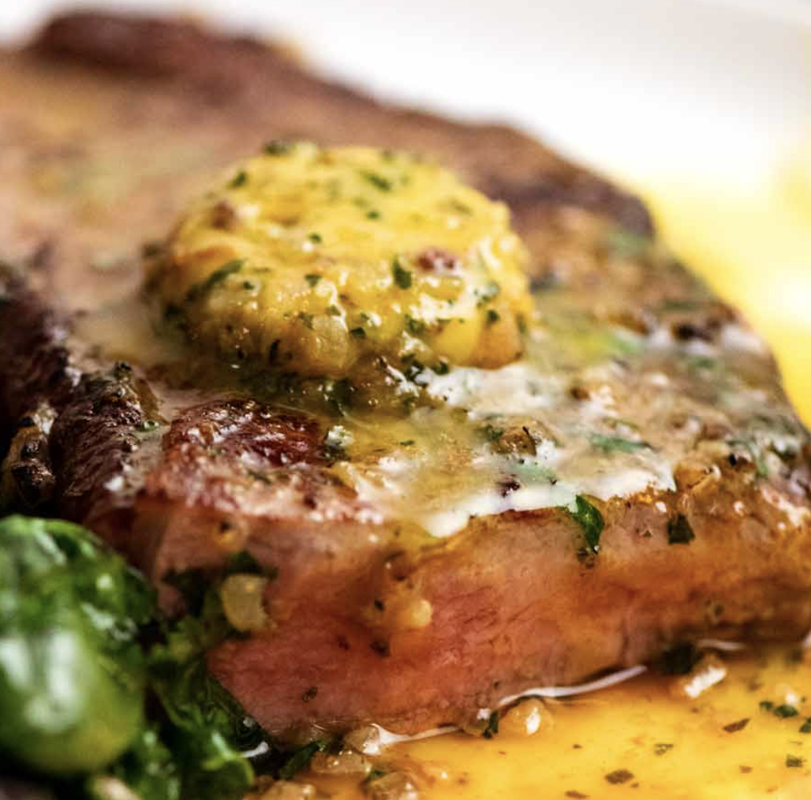

# Traditional

## Sausage & Red Wine Casserole

#### Serves 3 - 30 mins

- 12 chipolatas

- 2 red onions, sliced lengthways 2-3 times then sliced horizontally

- 2 large sprigs of rosemary, chopped

- 250g chestnut mushrooms, thickly sliced

- 3 cloves garlic, chopped

- 2 courgettes, cut into 2cm chunks

- 200ml red wine

- 200ml chicken stock (400ml?)

- 1 tbsp of Worcestershire sauce

- 4 large handfuls of kale, stalks removed

- 250g ready-to-eat lentils (preferably dark) (more if you want the recipe to go further)

#### Directions

1. Heat oil on medium high in a large skillet and brown the sausages all over then remove them to a plate.

2. Add the onions and rosemary to the skillet frying for 3 minutes, or until the onion is beginning to soften, then add the mushrooms, garlic, and courgettes with a good pinch of salt, fry for a further 3 minutes.

3. Reduce heat to medium, return the sausages to the pan, pour in the red wine and reduce by a third. Add the chicken stock and Worcestershire sauce with a good pinch of salt and generous grinds of pepper. Simmer for 3 minutes.

4. Add the lentils and kale, and simmer for a further 3 minutes. Serve.

## Fish Pie

#### Serves 4, time 45 mins

- large knob of butter

- 1 onion, diced

- ¼ tsp ground mace

- 1 bay leaf

- 180g skinless smoked haddock, cut into 3cm chunks

- 200ml fish stock (1 stock cube)

- 75ml double cream

- 400g skinless salmon or cod, cut into 3cm chunks

- 180g raw king prawns, peeled

- 50g parmesan, grated

- ½ bunch of parsley,

- 8 large potatoes

- steamed greens or salad, to serve

#### Directions

1. Peel and cut potatoes, and put them on the boil for 15-20 mins.

2. Melt the butter in a saucepan over medium to high heat and when bubbling, add the onion and cook for 3 minutes, or until the onion is beginning to soften. Increase the heat to maximum and add the mace, bay leaf haddock chunks. Fry the whole lot and together for 1 minute and then pour in the stock. Bring to the boil and simmer for 1 minute, then add the double cream and bring to a simmer one last time before turning off the heat.

3. Add the salmon, prawns, parmesan and parsley and gently stir to combine everything. Tip the whole lot into the baking dish. Make the mashed potato, and then spread on top of the fish mixture. Slide the fish pie into the grill until there is good colour on top. Serve with steamed greens or a simple salad.

## Coq au Stock

#### Serves 2 - 1 hr

- Knob of butter

- 1 tbsp olive oil

- 6 chicken leg portions, bone-in and skin-on

- onion, diced

- 6 rashers of streaky bacon, cut into 1cm slices

- 4 cloves garlic, chopped

- 200g mushrooms, roughly chopped

- salt and pepper

- 250ml chicken stock (1 cube)

- 175g green beans, trimmed

- 100g crème fraiche

- To serve ½ bunch of chives, finely chopped

- Mashed potato

#### Directions

Melt the butter and oil in a very large frying pan over a medium to high heat. When the butter is bubbling, lay the chicken portions into the pan to brown, skin-side down. Aim for a deep golden brown all over - this should take about 8 minutes. When the legs are brown, transfer them onto a plate.

Scrape the chopped onion and bacon slices into the pan and fry over a medium to high heat for about 4 minutes, or until the onion starts to soften. Add the garlic and mushrooms along with a good pinch of salt and pepper and continue stir-frying for a further 2 minutes.

Lay the chicken pieces back into the pan, skin-side down, and pour in the chicken stock. Crank up the heat and bring the liquid to the boil, then lower the heat to a simmer. Place a lid on top and leave the chicken to cook for 25 minutes.

After 20 minutes, carefully remove the lid and scatter the green beans over the top, then place the lid back on and cook for a further 5 minutes, until the chicken is fully cooked.

Stir in the crème fraiche and bring the sauce to the boil one last time. Scatter with the chopped chives and serve.

## Chicken, Sausage, and Fennel Tray Bake

#### Serves 4 - 1 hr

- ½ tbsp light oil

- 4 chicken thighs, bone-in and skin-on

- salt and pepper

- 12 sausages

- 1 red onion, cut into 8 wedges

- 2 fennel bulbs, outer layer removed, cut into 8 wedges each

- 4 cloves garlic, bashed and left whole

- 2 courgettes, cut into 2cm chunks

- 4 sprigs of thyme

- 180g halloumi, cut into 2cm chunks

- 16 cherry tomatoes, on the vine if possible

#### Directions

Preheat your oven to 190°C (fan 170°C/gas mark 5). Dollop the oil onto a roasting tray and slide it into the oven to heat for 10 minutes.

Season chicken thighs all over with salt and pepper. Carefully slide the tray out and lay the chicken thighs in, skin-side down. Place the sausages, fennel, and courgettes around the thighs. **Make sure that the tray isn't crowded** and is only one layer. Slide the tray back into the oven and roast the meat for 15 minutes.

Take the tray out of the oven and flip over the sausages, keeping the chicken thighs cooking skin-side down. Scatter over the red onion, and chuck in the garlic, thyme sprigs, and chunks of halloumi. Give the mixture a rough stir around, being careful not to turn the thighs. Slide the tray back into the oven and continue to roast for 25 minutes.

Remove the tray from the oven again and give everything good stir. Flip over the chicken thighs. Plonk the a cherry tomatoes on top and slide the tray back into the oven for a final 10-minute blast.

## Crunchy Sausage Casserole

#### Serves 3 - 30 mins

- 12 chipolata sausages

- 1 tbsp olive oil

- 2 shallots, roughly diced

- 2 cloves garlic

- 2 fennel bulbs, roughly diced

- 2 celery sticks, roughly diced

- 1 courgette, roughly diced

- 1 tin of chopped tomatoes

- 1.5 tbsp tomato puree

- 250ml chicken stock (1 cube)

- Fresh pasta

- S&P

#### Directions

Chop the shallots, garlic, fennel, celery and courgette. Line up your chipolatas on the grill pan and grill for about 5 minutes on each side until well browned and cooked through. When the sausages are in, stir-fry all chopped veg for 2 minutes or until just starting to soften. Add the tinned tomatoes and the tomato puree, and a good pinch of s&p, then keep stirring for another minute. Pour in the chicken to a stock and bring to the boil, then reduce simmer. Put on the pasta water. Cut the cooked chipolatas in half and put them into the pan and let the whole lot bubble away for 5 minutes or so. Put the pasta on. Serve when pasta done.

## Tartiflette

#### Serves 5

- 2 kilograms floury potatoes (such as King Edward or Maris Piper) peeled and cut into 1cm thick slices
- 600 millilitres full fat milk
- 600 millilitres double cream
- 1 onion (peeled)
- 2 onions (sliced thinly)
- 1 pack of streaky bacon (diced)
- 1 Reblochon (or camenbert) sliced
- 2 cloves garlic (minced)
- 1 tablespoon soft sea salt flakes
- approx. 50 grams butter

#### Directions

1. Preheat the oven to 240°C/220°C Fan/gas mark 8/450ºF.
2. Put the sliced potatoes into a large saucepan with the milk, cream, onion, minced garlic and salt. Bring to the boil and cook at a robust simmer or gentle boil (however you like to think of it) until verging on tender, but not dissolving into mush.
3. Meanwhile, put the fry the diced bacon until it has some browning on it, then add the sliced onion and fry until soft
4. Use some of the butter to grease a large roasting tin (37 x 30cm / 15 x 12 inches) and then, after removing the onion, pour the almost sludgy milk and potato mixture into it. Add the fried bacon and onion. Dot with remaining butter, lay Reblochon slices on top, and cook in the oven for 15 minutes or until the potato is bubbly and browned on top.

## Chorizo Goulash

#### Serves 3

- 1 tbsp olive oil

- knob of butter

- ~600g stewing beef

- Half a spicy chorizo sausage (~150g), chopped into half moons

- 2 onions, diced

- 1 garlic clove (chopped)

- 2 tbsp plain flour

- 1 tbsp smoked paprika

- 1 red chilli finely chopped

- 1 red pepper sliced

- 300ml beef stock

- 175ml sour cream

- 1 tbsp chopped fresh parsley

- cooked long-grain rice

#### Directions

Tip: chop the chorizo first, get it in the pan, then chop the rest.

1. Heat the oil and butter in a large ovenproof frying pan and fry the beef and chorizo for 5-7 minutes, or until browned all over.

2. Lower the heat, and fry the onions and garlic in the same pan for 3-4 minutes, or until softened. Stir in the flour and cook for a further 2-3 minutes.

3. Add the paprika, chillies and pepper and stir until well combined. Pour in the beef stock, and stew for 30-35 minutes (or until the rice is done). Add another tablespoon of flour if not thick enough.

4. Put on the rice

5. Add S&P. Stir in the soured cream and parsley until well combined.

6. Serve the goulash with long-grain rice

## Chicken Pie

#### Serves 4

- 2 large knobs of butter

- 1 large leek, washed and chopped into 2cm pieces

- 200g mushrooms, roughly chopped

- 4 x 250g chicken breast fillets, cut into bite-sized pieces

- 250ml chicken stock (1 cube)

- 1 tbsp cornflour

- 100ml double cream

- 2 large handfuls of baby spinach leaves

- About 6 sheets of filo pastry

- Drizzle of olive oil

- Peas, salad, and/or mash to serve
1. Preheat your oven to 190°C (fan 170°C). Heat the butter in a large frying pan over a medium to high heat. Add the leek and mushrooms and fry for 2–3 minutes until they just start to soften. Crank up the heat to high, add the chicken pieces and fry for a further 2 minutes – the chicken won’t be cooked through at this point – then pour in the chicken stock and let it come to a simmer.

2. Meanwhile, mix the cornflour with 2 tablespoons of water until smooth, then pour into the pan, along with the cream. Bring back to the boil, stirring gently, and cook until the sauce thickens. Remove from the heat and stir in the spinach, then tip the whole lot into a pie dish about 28cm x 15cm. Set aside to cool a little.

3. Take a sheet of filo and roughly crumple it in your hands – there is no right or wrong to this method! Place the crumpled filo on top of the chicken filling in the pie dish and repeat with the remaining filo sheets.

4. Drizzle the pastry with olive oil, then bake the pie for about 20 minutes, by which time the filo will have crisped up and turned golden brown in places. Serve up your pie with fresh salad or some vegetables.

## Beef and Mushroom Pie

#### Serves 4

- 2 tbsp coconut oil  

- 1.25kg rump steak, chopped into large chunks  

- 1 tsp butter  

- 1 onion, diced  

- 2 celery sticks, diced  

- 1 carrot, diced  

- 12 mushrooms, roughly chopped  

- 2 sprigs of thyme  

- 1 bay leaf  

- 1½ tbsp tomato puree  

- 3 tbsp Worcestershire sauce  

- 600ml beef stock  - 2 cubes

- 1 tbsp cornflour  

- large handful of parsley, roughly chopped  

- 4 sheets of filo pastry drizzle of olive oil  

- steamed greens, to serve

#### Directions

1. Preheat the oven to 190°C (fan 170°C, gas mark 5).  Add oil to large pan or casserole dish over a high heat. Add the meat to the pan, brown it all over.

2. Dollop the butter into the same pan and melt it over a medium to high heat. When bubbling, add the onion, celery, carrot and mushrooms and fry, stirring occasionally, for about 5 minutes. Drop in the thyme and bay leaf and continue to fry for another minute.  

3. Squeeze in the tomato puree. Stir-fry for 1 minute and then pour in the Worcestershire sauce and stock. Bring to a gentle simmer.  

4. Mix the cornflour with 1 tablespoon of water and then stir it into the beef mixture. It should thicken pretty quickly. Transfer to a baking dish and leave to cool for 10 minutes.  

5. Take the filo pastry out of the fridge, crumple the individual sheets into loose balls and place straight on top of the cooling stew so that it is entirely covered.  

6. Drizzle the pastry with olive oil and then bake in the oven for 20 minutes, or until the pastry is browned and crisp. Serve with mounds of steamed green veg.

## Beef Stroganoff

#### Serves 4 - 30 mins

- 600 g rump steak (2 steaks) cut into strips
- 2 tbsp vegetable oil , divided
- 1 large onion (or 2 small onions), cut into eights and then sliced thinly
- 300g mushrooms , sliced (not too thin)
- 4 garlic cloves, minced
- 40 g / 2 tbsp butter
- 2 tbsp flour
- 300 ml beef stock (1 cube)
- 100 ml dry white wine
- 1 tbsp Dijon mustard (grainy is better)
- 2 tsp Worcestershire sauce
- 200g cream cheese (changed from 150ml sour cream)
- Salt and pepper
- Chives / parsley chopped to garnish
- Mash, pasta, or rice to serve

#### Directions

1. Chop the onions and mushrooms. Chop beef and sprinkle with a pinch of salt and pepper. Press the garlic.

2. Heat 1 tbsp oil in a large skillet over high heat. Scatter the beef in the skillet, QUICKLY spread it with tongs. Leave untouched for 30 seconds until browned. Turn beef quickly (as best you can!). Leave untouched for 30 seconds to brown. Immediately remove onto a plate.

3. Turn heat down to medium high. Add butter with the onions, cook for 3-5 minutes, then add mushrooms and cook for a further 5 minutes. Once the onions are soft, add the garlic and saute for 1 minute.

4. Reduce the heat to medium. Add the flour, stirring, for 1 minute to remove the flour flavour, then add the wine to deglaze, scraping off the brown bits, cooking for ~3 minutes.

5. Add the stock and Worcestershire sauce, cooking for a further 3 minutes, then add the cream cheese and mustard, stirring for another 3-5 minutes until it thickens to the consistency of pouring cream. Add more water if too thick.

6. Add beef back in (including plate juices), and add salt and pepper to taste. Simmer for 1 minute, then remove from stove immediately.

7. Serve over pasta or mash. Garnish with chives / parsley

## Pheasant Stew

- 6 pheasant breasts
- 2 tbsp oil
- 100g smoked streaky bacon, cut into small pieces
- 1 onion, roughly chopped (not diced)
- 2 sticks celery, sliced thinly on the diagonal
- 25g plain flour
- 300ml apple juice
- 300ml chicken stock
- 1 tbsp fruit jelly, such as redcurrant or quince jelly
- 2 tbsp Worcestershire sauce
- 3 bay leaves
- 250g button mushrooms, halved
- gravy browning (optional)
- mashed potato, to serve
- salt and freshly ground black pepper

#### Directions

1. Preheat the oven 160C/140C Fan/Gas 3.

2. To prepare the meat, remove the breast meat and legs from the birds. Set aside the carcasses to make stock for another time. Remove the skin from all the meat and cut the the breast meat into 3cm/1¼in cubes. Season the breast meat and legs with salt and pepper.

3. Heat 1 tablespoon of the oil in a casserole dish placed over a medium heat. Add the meat and fry until brown all over. Remove with a slotted spoon and set aside.

4. Add the remaining oil and fry the bacon for a few minutes until crisp. Add the onion and celery, and fry over a high heat for few minutes until softened.

5. Sprinkle in the flour and stir. Gradually pour in the apple juice and stock and bring to the boil. Add the redcurrant jelly, Worcestershire sauce and bay leaves and return the meat to the pan.

6. Bring everything back to the boil, stirring. Season with salt and pepper and a few drops of gravy browning, if using. Cover and cook in the oven for about 1–1½ hours, or until tender. Add the mushrooms and cook for a further 30 minutes.

7. Remove the bay leaves and serve piping hot with mashed potato.

## Chicken Fricassee

#### Serves 4-5 - Time 1hr

- 4 chicken drumsticks (good size)
- 4 chicken thighs, skin-on and bone-in (good size)
- 1 tsp salt (cooking / kosher salt)
- 1/2 tsp black pepper
- 60g butter (quarter of 250g pack)
- 300g mushrooms, halved if small, or cut in 4 to 6 if large
- 2 medium brown onions, sliced 0.6cm wide
- 1 bay leaf , fresh (sub dried)
- 3 generous thyme sprigs (or 1/2 tsp dried thyme)
- 2 garlic cloves, finely minced
- 30 g plain flour (2 heaped tbsp)
- 750 ml chicken stock (4 cubes)
- 125 ml white wine
- 1/4 tsp flake salt
- 1/4 tsp black pepper
- 2 tbsp parsley, chopped
- 185 ml double cream
- Gravy browning
- Rice / mash / pasta to serve

#### Directions

- Pat the chicken thighs dry with paper towels then season well with salt and pepper.
- Brown thighs: Melt all butter over medium-high heat (6-7) in a large skillet or heavy based pot with a lid. Add chicken thighs, skin side down, and cook for 4 to 5 minutes until golden brown. Turn and cook the other side for 1 minute then remove to a plate.
- Do the same for drumsticks, but 3 sides, about 2 minutes each. Then remove from skillet.
- Add mushrooms, onion, bay leave and thyme. Cook for 5 minutes until mushroom is lightly golden – they won't go deep golden brown.
- Add garlic and stir for 30 seconds. (Add flour and cook for 1 minute, or until the flour is slightly brown. This is critical to making the sauce brown)?.
- Add wine and chicken stock. Stir, scraping the base of the pot to dissolve the brown residue stuck to the pan ("fond") into the sauce, then return chicken to sauce, skin side up.
- Simmer covered for 10 minutes bubbling constantly but not rapidly (6), and if using rice, put it on now as soon as you can.
- Remove lid and let it simmer for a further 20 minutes.
- Add cream and stir. Once it comes up to a simmer, taste sauce, and add more salt / msg if desired, and gravy browning to get it to a good color.
- Plate up with with rice / mash / pasta and sprinkle with parsley

## Creamy salmon, leek & potato traybake

#### Serves 4 - 45 mins

- 500g baby potatoes , thickly sliced
- 4 tbsp olive oil
- 4 medium leeks , halved, washed and sliced
- 4 garlic clove, minced
- 250ml double cream
- 3 tbsp capers , plus extra to serve
- 2 tbsp chives , plus extra to serve
- 500g salmon fillets
- Salt and Pepper
- mixed rocket salad , to serve (optional)

#### Directions

- Heat the oven to 200C/180C fan. Bring a medium pan of water to the boil. Add the potatoes and cook for 8 mins. Drain and leave to steam-dry in a colander for a few minutes. Toss the potatoes with ½ of the oil and plenty of seasoning in a [baking tray](https://www.bbcgoodfood.com/content/kimberley-wilsons-top-5-baking-trays). Put in the oven for 20 mins, tossing halfway through the cooking time.

- Meanwhile, heat the remaining oil in a frying pan over a medium heat. Add the leek and fry for 5 mins, or until beginning to soften. Stir through the garlic for 1 min, then add the cream, capers and 140ml hot water, then bring to the boil. Stir through the chives.

- Heat the grill to high. Pour the creamy leek mixture over the potatoes, then sit the salmon fillets on top. Grill for 7-8 mins, or until just cooked through. Serve topped with extra chives and capers and a salad on the side, if you like.

## Creamy Dijon Chicken

#### Serves 4 - 45 mins

**The Chicken**

- ~500g boneless, skinless chicken thigh or breast cut into slices about the size of one mouthful
- Salt & Pepper
- 150g bacon (diced)

**The Sauce**

- 2 tablespoons butter
- 1 onion, diced
- 4 cloves garlic, minced
- 1 tablespoon fresh chopped parsley (optional)
- 1 teaspoon each of thyme and rosemary (be generous)
- 100ml dry white wine (Pinot Grigio/Gris, Sauv Blanc, Riesling)
- 350ml double cream
- 2 tablespoons Dijon mustard
- 1 chicken stock cube
- 1/2 teaspoon freshly ground black pepper, to taste
- 100g grated Parmesan cheese
- 2 good handfuls of baby spinach leaves

**To Serve**

- Greens

- Mash

#### Directions

1. Heat 1 tablespoon of oil a large pan or skillet over high heat, add the chicken, season it with a pinch of salt and a generous amount of freshly cracked pepper, and cook until browned, about 2 minutes each side. Transfer to a plate; set aside.

2. To the same pan or skillet, reduce heat to medium-high (prevents fond from burning), and add the bacon, frying until crispy. Transfer to plate, set aside. At this point there should be a good layer of brown fond on the bottom of the pan.

3. Reduce heat to medium. Heat butter in the pan and sauté onion until transparent. Sauté garlic, thyme, and rosemary for about 1 minute until fragrant.

4. Add in the white wine to deglaze the pan while scraping up any bits from the bottom of the pan. Also add the stock cube. Simmer for ~2 minutes or until wine has reduced by half.

5. Reduce heat to medium low, important as the cream will split if boiled. Pour in the Dijon mustard first to cool down the mixture, then add the cream, and mix through heating gently for a further minute to allow the sauce to thicken.

6. Add the Parmesan and half of the bacon (all if you can't be bothered with it as a topping), and allow to melt through the sauce. Season with a generous amount of pepper.

7. Add the spinach and allow to wilt. Return chicken to the skillet and reheat. Add some water if too thick.

8. Top with the crispy bacon if you didn't add all of it already. Sprinkle with extra herbs if desired. Serve immediately.

## Honey Garlic Pork

#### Serves 4 - 30 mins

**Sauce**

- 3 good size tbsp honey

- 2 tbsp rice wine vinegar (not mirin)

- 60 ml of water

- 1/2 stock cube

**Pork**

- 4 pork chops / loins

- Salt and Pepper

- Garlic Powder

- 2 tbsp vegetable oil

- 1 tbsp butter

- 6 Garlic cloves (minced)

- Handful of chopped parsley

- Rice / veg / mash to serve

#### Directions

1. Put the rice on

2. Boil the water then mix it with the stock cube, honey, and rice wine vinegar

3. Season chops with salt, pepper and a light dusting of garlic powder.

4. Heat oil in a pan or skillet over medium high heat (7/8). Sear chops on both sides until golden and cooked through (about 4-5 minutes each side). Transfer to a plate; set aside.

5. Reduce heat to medium. Melt butter in the same pan, scraping up any browned bits from the bottom of the pan. Sauté garlic until fragrant (about 30 seconds).

6. Add the honey, water and vinegar. Increase heat to medium-high and continue to cook until the sauce reduces down and thickens slightly (about 3-4 minutes), while stirring occasionally.

7. Add pork back into the pan, baste generously with the sauce and broil/grill for 1-2 minutes, or until edges are slightly charred.

8. Garnish with parsley and serve over vegetables, rice, pasta or with a salad.

## Café de Paris butter

#### Serves 4 - 6 Steaks - 30 mins

- 100g butter, softened
- 1 shallot,  very finely chopped
- 2 garlic cloves, minced
- 3 salted anchovy fillets, finely chopped
- 1 tsp lemon juice
- 1 tsp Worcestershire sauce
- 1 tsp Dijon mustard
- 1 tsp curry powder (mild)
- 1/2 tsp paprika (plain or sweet, not smoked or spicy)
- 1 tsp kosher / cooking salt
- 2 tsp tarragon , finely chopped
- 2 tsp parsley , finely chopped

#### Directions

1. Place ingredients in a bowl and mix to combine.

2. Place on cling wrap and roughly shape into a 20cm sausage using spatulas

3. Roll up, then twist ends tightly. As you tighten the ends, the butter will shape into a neat, firm sausage

4. Tie ends if needed to keep the shape. Refrigerate for 3 hours or until firm.

5. **To use –** Slice into 0.7cm slices, then let them soften to room temperature (so they melt easier). Place on hot steak so it melts – I use 2 slices each steak. **Leftovers** – fridge 3 days or freeze 2 months (pre sliced for ease of use).

## Shepherds / Cottage Pie

#### Serves 5 - 1.5 hrs

**Mince**

- 1 1/2 tbsp olive oil
- 2 garlic cloves, minced
- 1 onion, finely chopped
- 1 carrot, finely chopped
- 1 celery stick, finely chopped
- 3/4 tsp each dried thyme and rosemary (or 2 sprigs fresh thyme + 1 sprig rosemary)
- 750g minced lamb (shepherds) OR beef (cottage)
- 1/4 cup (35g) flour , plain/all purpose
- 1/4 cup (55g) tomato paste
- 2 cups (500ml) beef stock (**3** cubes)
- 1/2 cup (125ml) red wine (or water)
- 1.5 tbsp Worcestershire sauce
- 2 dried bay leaves
- Salt, pepper, and sriracha (optional)
- 1 cup frozen peas

**Mash**

- 1 kg potatoes, peeled and chopped
- 2/3 cup (165 ml) milk (whole or low fat)
- 2 tbsp (30g) butter

**Crust**

- 2 – 3 tbsp grated parmesan , optional
- Chopped chives to garnish

#### Directions

1. Heat oil in a large skillet over medium high heat. Add onion and garlic, cook for 1 minute. Then add carrots, celery, thyme and rosemary. Cook for 3 minutes or until softened and sweet.
2. Turn heat up to high. Add lamb/beef and cook, breaking it up as you go, until browned.
3. Add flour and mix in. Add tomato paste, stock, red wine, Worcestershire sauce and bay leaves. Bring to simmer, then turn down heat so it is simmering rapidly - I have it on medium. Cook for 30 minutes, stirring occasionally, until it reduces down to a thick gravy consistency.
4. Once the mince is simmering, put water on to boil, chop the potatoes. When the water is boiling preheat oven to 180C/350F and and then cook the potatoes in boiling water for 15-20 minutes or until soft. Drain then return to pot on turned off stove. Allow to steam dry for 30 seconds or so (prevents it making the mince watery). Add butter, milk, and salt, and mash until a spreadable consistency.
5. When mince has finished simmering, adjust salt and pepper to taste (add a small amount of sriracha for an almost undetectable hum), then transfer to 1.5 litre baking dish (could try doing it in the pan the mince is currently in if it is large). Stir through peas.
6. Spread mash onto pie, use a fork to draw squiggles over the surface. Sprinkle with parmesan.
7. Bake for 30 - 40 minutes or until deep golden on top and bubbling on the edges. Stick a knife into the middle to ensure it is piping hot. Garnished with chives if desired and serve.

## Toad in the Hole with Onion Gravy

#### Serves 4 - 45 mins

**Toad**

- 100g plain flour

- 1/2 tsp salt

- 2 eggs, whisked

- 150ml each of water and milk mixed

- Vegetable oil or lard

- 12 chipolatas

**Gravy**

- 2 red onions, sliced 0.5cm thick

- 1 tbsp of good quality red onion marmalade (usually use stokes made with balsamic vinegar and black treacle

- 100ml of red wine

- 400ml of water

- Beef gravy granules

**To Serve**

- Mashed Potato

- Peas

#### Directions

1. Put 1 tbsp of oil into a medium sized ceramic or enameled roasting tray, add the sausages and cook at 200 degrees for 15 min (until browned).

2. Meanwhile, add the flour and salt into a mixing bowl, make a hole in the middle and slowly add the eggs with a bit of the milk and water mixture, mixing into a paste. Slowly add the rest of the water and milk mixture, beating well until you have the consistency of double cream.

3. Once the sausages are done, take them out and pour in the batter on top of them, making sure the sausages are evenly spaced, then return to the oven and cook for another 20-30mins until risen and golden brown.

4. While the toad is cooking, add 1 tbsp of vegetable oil to a small saucepan on medium head, then add the onions, put the lid back on and sweat them until softened. Add the onion marmalade and wine, boiling to reduce by half (about 5 mins). Add the water, and slowly add the gravy granules until the desired consistency is reached.

5. Serve when the toad is done with mash and peas.

## Aubergine Dumpling Parmigiana

- 1¼ cups (90 g) dried breadcrumbs
- 4 eggplants (~1 kg), cut into 1-inch cubes
- ½ cup + 2 tbsp (150 ml) olive oil
- salt and black pepper
- 6 tbsp (100 g) ricotta
- 2.5 oz (75 g) grated parmesan cheese, plus more to serve
- 1 large egg
- 1 large egg yolk
- 4.5 tsp all purpose flour
- 6 garlic cloves, grated
- ¾ cup (15 g) basil leaves, roughly chopped
- 28 oz cans whole peeled tomatoes, blitzed until smooth
- 1½ tsp tomato paste
- 1½ tsp sugar
- ¼ tsp red pepper flakes
- ¾ tsp paprika
- 1 tsp dried oregano
- 1⅔ cups (400 ml) water
1. Heat oven to 450F.
2. Line a large baking sheet with parchment paper. Add the chopped eggplant to the pan and toss with 5 tbsp olive oil, ½ tsp salt, and black pepper to taste. Spread out into as even a layer as possible and place in the oven. Bake for 30 minutes, tossing halfway through.
3. Remove the eggplants from the oven and chop until they break down and form a chunky mash. Scoop into a large bowl and refrigerate for 10-15 minutes or until cooled to at least room temperature.
4. Once cool, add the ricotta, parmesan, egg, egg yolk, flour, breadcrumbs, a third of the garlic, ½ cup of the basil, ¼ tsp salt, and black pepper to the bowl. Mix well. Season to taste with more salt, if needed.
5. Grease your hands and then scoop the eggplant mixture into sixteen golf-ball sized dumplings.
6. Heat 2 tbsp of olive oil in a large nonstick pan over medium-high heat. Add half of the dumplings to the pan and fry for 3-4 minutes or until golden and crispy all over. Transfer to a plate. Add another tbsp of oil to the pan and repeat with the remaining dumplings. Set aside.
7. Heat oven to 400F.
8. To make the sauce, put the remaining 2 tbsp of olive oil into a large pan over medium-high heat. Add the remaining garlic to the pan and saute until fragrant, about 1 minute. Add in the tomatoes, tomato paste, sugar, chile flakes, paprika, oregano, 1 tsp salt, and black pepper. Cook for 8 minutes, or until thickened. Pour in the water. Bring to a simmer, then lower to medium and simmer for 10 more minutes.
9. Pour the sauce into a 9x13-inch baking dish in an even layer. Top with the dumplings, nestling them into the sauce as needed. Place in the oven and bake for 20 minutes, or until the sauce is bubbling. Remove from the oven and sprinkle with basil and more parmesan cheese just before serving.
